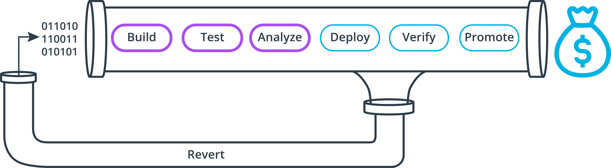
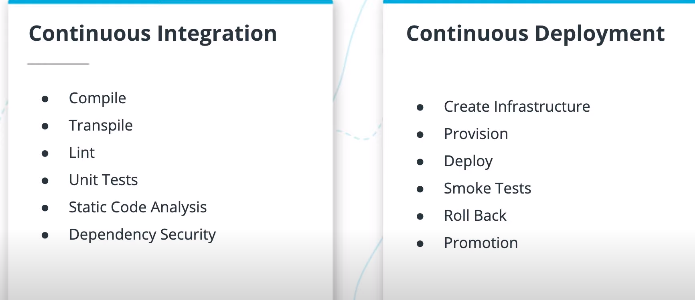
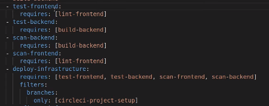
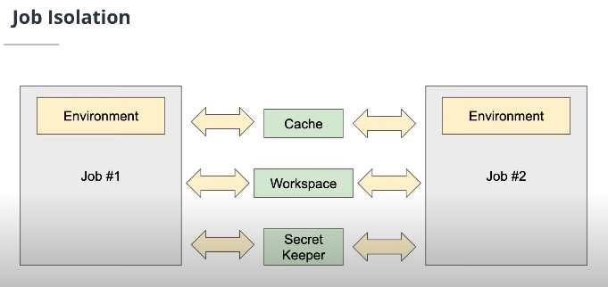
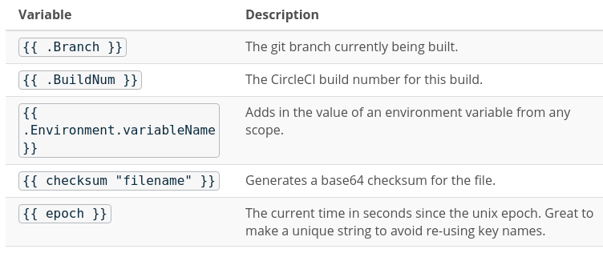
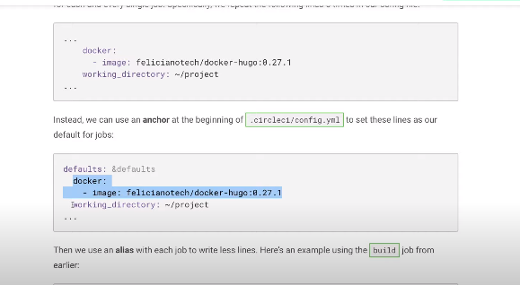
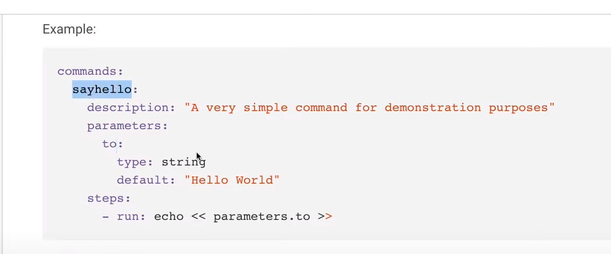
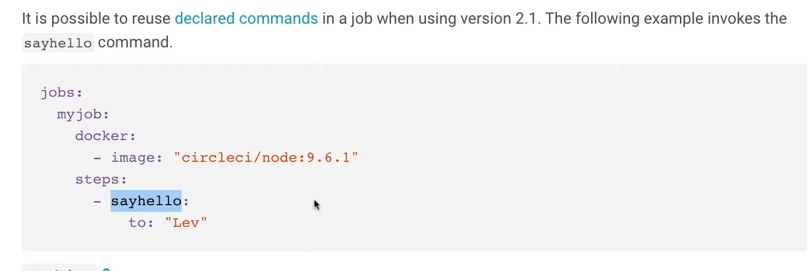
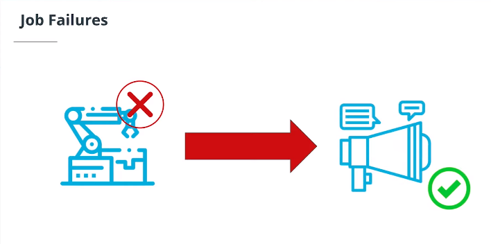
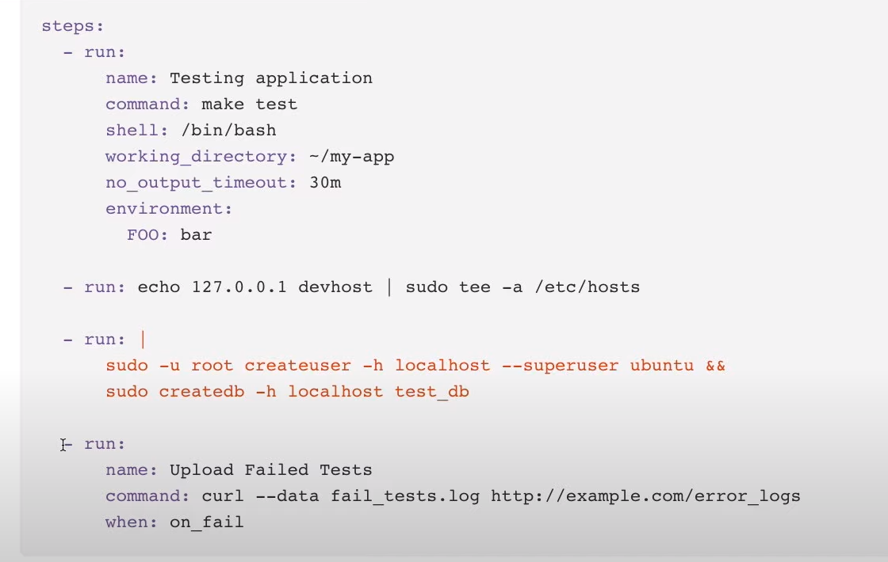

# Building Continuous Integration Pipeline






### Characteristics of Healthy CI Pipelines ###

We want to create healthy, consistent pipelines in order to create a better build process!

- Highest Priority When the Build is Broken
- Trusted Members of the Team
- Have the Same Abilities as any Member of the Team
- Enforce Team Quality Rules
- Communicate Useful Information
- Shorten Feedback Loops
- Don't Require Stacks of Documentation
- Automated to the End!

## Creating Pipelines ##




**Pipelines** have **workflows** that have **jobs** that have **steps**.


## Creating Jobs ##

*Anatomy of a Job*

Remember that a job is where we define the work that needs to get done.

| Job Option  | Description                                                              |
| -           | -                                                                        |
| <job_name>  | The name of the job which shows up in the Circle CI web app.             |
| environment | Map of environment variables.                                            |
| docker      | Docker image in which to run the job.                                    |
| branches    | Rules to decide when to run this job by branch exclusions or inclusions. |
| steps       | Instructions to execute in the job.                                      |

### Docker Images
When you are designing your jobs, you'll need to think about what docker image you want to use each time. If you're like me, you will have a handful of favorites. Each docker image comes pre-loaded with utilities and packages you need for different situations.

| Image             | Use                                                   |
| -                 | -                                                     |
| circleci/node     | For Node.JS server-side and networking applications.  |
| circleci/postgres | For tasks that require PostgreSQL database functions. |
| circleci/python   | For job that need to run Python or pip.               |
| alpine:latest     | A lightweight container for simple tasks.             |
| amazon/aws-cli    | For tasks that require the AWS CLI and related tools. |

### Types of Steps
Think of the steps in a job as a task list. Each step will perform some instructions and then we move on to the next step until they've all been executed. Each step has a type that defines how it will be run or represents an alias that points to another set of steps.

| Step Type                                 | Description                                                                                                        |
| -                                         | -                                                                                                                  |
| checkout                                  | Checks out the source code. Common to have this in all jobs in CI.                                                 |
| run                                       | Runs a shell command. Can name the step or simply execute a script.                                                |
| when                                      | A conditional step that has its own steps that are run if the condition is true.                                   |
| save_cache and restore_cache              | Save and restore files or folders. Cleaned up after pipeline finishes.                                             |
| persist_to_workspace and attach_workspace | Like a cache, but files are available for 15 days after pipeline.                                                  |
| add_ssh_keys                              | Adding some additional ssh keys to the job for a tool that needs them (i.e. Ansible).                              |
| store_artifacts                           | Makes an artifact, or file, available for download via CircleCI web app or API.                                    |
| store_test_results                        | Stores test results from test runner so that results are visible in Circle CI web app in the Test Summary section. |
| "Orbs"                                    | Orbs, which we talked about already, are used like step types.                                                     |


## Environment Variables


### Pipeline Values
Circle CI has a handful of values that might come in handy.

| Value                    | Description                                                  |
| -                        | -                                                            |
| pipeline.id              | The ID of the currently running pipeline                     |
| pipeline.number          | An alternative numeric ID for the currently running pipeline |
| pipeline.project.git_url | The URL of the triggering git event (ex: pull request URL)   |
| pipeline.project.type    | Example: “github”                                            |
| pipeline.git.branch      | The branch triggering the pipeline                           |

You can use them almost anywhere in your jobs with a simple syntax:

`My pipeline id is << pipeline.id >> and my git branch is << pipeline.git.branch >>.`

Note: Pipeline values cannot be used outside the job context. For example, you cannot use these in a shell script.

Further Reading:
- [Pipeline Values Documentation](https://circleci.com/docs/2.0/pipeline-variables/#pipeline-values)


And, of course, we can use environment variables throughout the system as well. Some env vars are defined by us, others are built-in to the circle ci environment. All env vars are bound to a scope.

### Environment Variable Scopes
| Scope        | Description                                                                                                                                                                        |
| -            | -                                                                                                                                                                                  |
| Organization | Organizations contain projects, so env vars set at this level will be available to all child projects. Great for organization-wide keys, for example.                              |
| Project      | Projects contain pipeline jobs, so env vars set the project level are available to all jobs in the project but are not to jobs that belong to other projects.                      |
| Job          | Environment variables that are set inside the job are only available to that job. You can either set env vars using the environment map or by exporting them using shell commands. |

### Built-In Environment Variables

Circle CI comes loaded with many built-in environment variables that can be almost anywhere. Some built-in env vars are equal to or very similar to the pipeline above. But there are many more that go beyond just pipeline values.

| Environment Variable | Description                                                      |
| -                    | -                                                                |
| CIRCLE_BRANCH        | The name of the Git branch currently being built                 |
| CIRCLE_WORKFLOW_ID   | A unique identifier for the workflow instance of the current job |
| CIRCLE_BUILD_NUM     | The number of the CircleCI build                                 |
| CIRCLE_PR_NUMBER     | The number of the associated GitHub or Bitbucket pull request    |
| CIRCLE_SHA1          | The SHA1 hash of the last commit of the current build            |


## Triggering ##


Builds in continuous integration can't start on their own. They need something to trigger them to start running pipelines. Here are a few common ways to trigger a CI pipeline:

| Trigger                                                                                                        | Description                                                                                                        |
| -                                                                                                              | -                                                                                                                  |
| Git Branch Commit                                                                                              | Commit or merge to a branch-like master and push changes to the branch in central repository to start a new build. |
| New Pull/Merge Request                                                                                         | Make changes in a branch or fork and create a pull/merge request to trigger a build.                               |
| API                                                                                                            | Make a POST or GET request to an API endpoint to kick off a new build.                                             |
| Schedule                                                                                                       | Run a pipeline at a certain time each day or week based on a schedule.                                             |
| Other Pipelines                                                                                                | Another pipeline might finish a job and then trigger another pipeline.                                             |
| Chat Message	        Using a chat tool, post a message containing special text in order to trigger a build. |                                                                                                                    |
| Command-Line Tool                                                                                              | Use a command-line tool to configure and start a new build.                                                        |

Of all the triggers listed, the first two are the most common since the most logical time to run a new build is when new changes have been introduced.


## Sharing Information ##





### Cache ###


The cache only remembers  your files during the execution of the pipeline. 

Cache is immutable. You can't modify the value of a cache key after it's created. Circle ci will not throw and error 

When forming the key name, you can use a few template variables such as:




In one job:

```
...
      - save_cache:
          key: v1-my-project-{{ checksum "project.clj" }}
          paths:
            - ~/.m2
...
```

In another job:

```
...
      - restore_cache:
          keys:
            - v1-my-project-{{ checksum "project.clj" }}
            - v1-my-project-
...
```


### Workspaces ###


- There's no key.
- You have equal access to all the files in the workspace without the need for a key to retrive them.
- Workspace files stick around for 15 days.
- The workspace is mutable.


In one job:

```
...
      - persist_to_workspace:
          root: /tmp/workspace
          paths:
            - target/application.jar
            - build/*
...
```
In another job:

```
...

      - attach_workspace:
          at: /tmp/workspace
...
```

### 3rd Party Secret Keeprs ###

| Option   | Description                                                                                                                                                                                                                                                                                                            | Website         |   
| -        | -                                                                                                                                                                                                                                                                                                                      | -               |   
| Vault    | Vault is a tool created by Hashicorp. It is a web service and a command line tool that work together to give you the ability to save bits of information securely and then retrieve it later. Since the service is not dependent on the job or pipeline, your jobs can reliably save and retrieve information at will. | vaultproject.io |   
| MemStash | A simple web service that takes your key-value pairs and stores securely them for a short period of time. It's a great, low-ceremony way to store quick values and get them back out, no matter which job you're running. Just use curl to save and retrieve your information. MemStash is free to use.                | memstash.io     |   


## Sharing Files ##


### Solution

```yaml
version: 2.1

jobs:
  save_hello_world_output:
    docker:
      - image: circleci/node:13.8.0
    steps:
      - run: echo "hello world" > ~/output.txt
      - persist_to_workspace:
          root: ~/
          paths:
            - output.txt

  print_output_file:
    docker:
      - image: circleci/node:13.8.0
    steps:
      - attach_workspace:
          at: ~/
      - run: cat ~/output.txt

workflows:
  my_workflow:
    jobs:
      - save_hello_world_output
      - print_output_file:
          requires:
            - save_hello_world_output
```


## Reusable Code ##


Common Reuse Scenarios:
- Common Defaults
- Rollback
- Compile Code
- Deploy


### Ways to Reuse Code in Circle CI
- Anchors and Aliases
- Commands

### Key Terms
| Key Term | Description                                                                                                    |
| -        | -                                                                                                              |
| Anchor   | Defines a section of yaml to be reused. Uses a & symbol to signal that an anchor is being defined.             |
| Alias    | Refers to a section of yaml previously defined by an anchor. Uses the * to signal that an alias is being used. |
| Command  | A predefined parameterized sequence of steps to be executed in a job.                                          |
| DRY      | Stands for "Don't Repeat Yourself".                                                                            |





### Further Reading:
- Learn about commands in [CircleCI docs.](https://circleci.com/docs/2.0/writing-yaml/#anchors-and-aliases)
- [Anchors and Aliases by Circle CI.](https://circleci.com/blog/circleci-hacks-reuse-yaml-in-your-circleci-config-with-yaml/)


Anchors and Aliases don't allow you to reuse multiple steps with one reusable line. But **commands** do. 






## Reusable Job Code ##


### Solution


```yaml
version: 2.1

commands:
  print_pipeline_id:
    steps:
      - run: echo ${CIRCLE_WORKFLOW_ID}

jobs:
  my_job:
    docker:
      - image: circleci/node:13.8.0
    steps:
      - print_pipeline_id

workflows:
  my_workflow:
    jobs:
      - my_job
```


Let's say I rather pass that workflow id into my command as a parameters.

```yaml
version: 2.1

commands:
  print_pipeline_id:
    parameters:
      id:
        type: string
    steps:
      - run: echo << parameters.id >>

jobs:
  my_job:
    docker:
      - image: circleci/node:13.8.0
    steps:
      - print_pipeline_id:
        id: << pipeline.id >>

workflows:
  my_workflow:
    jobs:
      - my_job
```


So now, uses a parameterizes command, which put the pipeline id using pipelines variables instead of environment variables into the command so they can be used there.


## Job Failures ##



What about when we want to run some code when a job fails.


### Non-Zero Exit Codes
If anything in your job throws a non-zero exit code, it will cause the job to fail and stop. But, if you want to respond with more than just a big red "X" on your build, you can use Circle CI's when: on_fail directive! Some things you could do in response might include:

- Run a cleanup command/job
- Send a special message
- Alert another service
- Make a red fire engine light go off in your office (not even kidding... seen it happen)





### Further reading:
- Read more about `when: on_fail` in the [Circle CI docs.](https://circleci.com/docs/2.0/configuration-reference/#example)


## Job Failures ##

Job failures are good. They are the all point of CI. 


```yaml
version: 2.1

jobs:
  my_job:
    docker:
      - image: circleci/node:13.8.0
    steps:
      - run: return 1
      - run:
          name: on error
          command: echo "Hello Error!"
          when: on_fail

workflows:
  my_workflow:
    jobs:
      - my_job
```


## Creating a CI Pipeline ##


```yaml
version: 2.1

jobs:
  build:
    docker:
      - image: circleci/node:13.8.0
    steps:
      - checkout
      - run: npm i
      - run: npm run lint
  test:
    docker:
      - image: circleci/node:13.8.0
    steps:
      - checkout
      - run: npm i
      - run: npm run test
  analyze:
    docker:
      - image: circleci/node:13.8.0
    steps:
      - checkout
      - run: npm audit

workflows:
  my_workflow:
    jobs:
      - build
      - test:
          requires:
            - build
      - analyze:
          requires:
            - test
```

