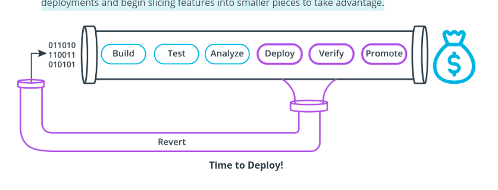
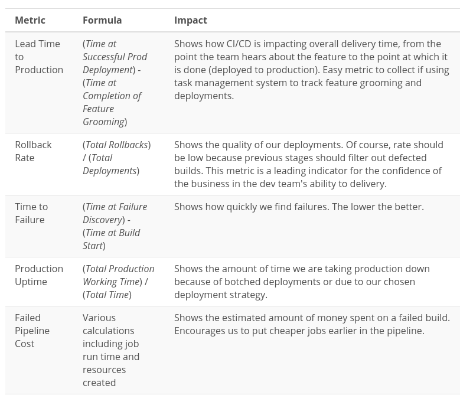
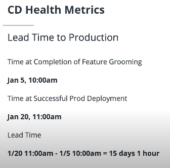
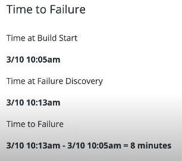
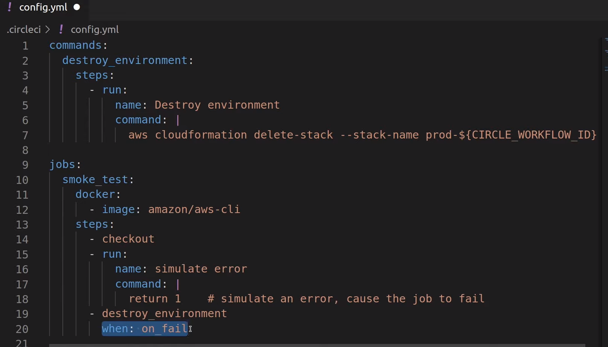

# Enabling Continuous Delivery with Deployment Pipelines


In this Lesson, We Will...
- Learn what Configuration Management Tools are and How to Use Them
- Design an Ansible Playbook
- Control a Remote Machine with an Ansible Playbook
- Build an Ansible Inventory File
- Make Various Types of CD Jobs in our CI/CD Pipeline
  - Create Infrastructure
  - Configure Infrastructure
  - Deploy Production Artifacts
  - Smoke Testing
  - Rollback
  - Promoting to Production


### Where does CD fit in the SDLC?
- While CI is all about code, CD is all about the deployment of the artifact.
- CI produces the artifact, whether it's a docker image, a zip file, or an executable.
- CD Validates the artifact, builds the infrastructure needed to run it, and sets the artifact in motion.
- CD affects earlier stages of development over time because team members see quick deployments and begin slicing features into smaller pieces to take advantage.






### Lead Time To Production




### Rollback Rate

Rollbacks / Deployments = rollback rate

### Time to Failure

How quickly we find failures. The earlier the better. 



Then, we do that for every failure so we can get an average to improve on.


### Production Uptime

Minutes in time prod in up / total number of minutes.

e.g. 

| 10080 minutes in 7 days     | Total Time              |
| -                           | -                       |
| 10045 uptime un last 7 days | Total Production Uptime |
| 10045 / 10080               | 99.7 %                  |
  
  
### Failed Pipeline Cost

Show the estimated amount of money spent on failed builds. This encourages us to put cheaper jobs earlier in the pipeline and to fail as quickly as possible. 


For example, the instance that runs the **Unit Test** cost $ 0.10 per minute. Suppose you need 3 minutes to run the unit test so the cost is $ 0.30 

Failed pipelines represent some cost. You can sum those cost to see some trends to get the **Total Failure cost**


Characteristics of a CI/CD Pipeline
- Cheapest, Fastest First
- Fails Quickly and Loudly
- Builds Confidence in Production Deployment
- Rolls Back Changes Quickly on Failure


**Configuration Management Tools** should start their job after an EC2 instance is already created.

This is the same for CloudFormation templates. Even though it's technically possible to run CloudFormation templates using a Configuration Management Tool, it's not the best idea. Configuration Management Tools should start their job after infrastructure is created. 

So, this are the things a **configuration management tool** should do:
- Configure Environment Variables
- Install Dependencies
- Start/Stop Services
- Deploy Applications


## Design an Ansible Playbook


**Playbook possibilities**
- Update the Web Server
- Migrate the Database
- Install Dependencies 

**Playbook Needs**
- SSH Access to instance
- Target instance
- Roles (actions to be performed, is a way to divided up your configuration code into more smaller chunks)


Example of a Playbook:

```yaml
---
- hosts: web
  user: ec2-user
  become: true
  roles:
    - prometheus
```


In the inventory we have: [^playbook]

[^playbook]:A Playbook is a set of instructions that Ansible uses to configure a machine. An inventory file is the list of machines on which to perform those instructions.

```
# inventory.txt
  [web]
  ec2-3-83-227-84.compute-1.amazonaws.com
```
Every host name or address that comes below the web heading is going to be grouped into the web group. So if we have multiple host names or ip addresses, it'll run this ansible playbook agains all of them, simultaneously. 


the roles prometheus correponds no a name on a folder. So, if we go to the folder we have

- `/roles/prometheus/files`
- `/roles/prometheus/tasks`

So, there's a file inside the tasks folder named `main.yml`. 


Our main.yml file:


```yaml
---
- name: "configuration play."
  hosts: web
  user: ubuntu
  gather_facts: false
  vars:
    - ansible_python_interpreter: /usr/bin/python3
    - ansible_host_key_checking: false
    - ansible_stdout_callback: yaml

  pre_tasks:
    - name: "wait 600 seconds for target connection to become reachable/usable."
      wait_for_connection:

    - name: "install python for Ansible."
      become: true
      raw: test -e /usr/bin/python3 || (apt -y update && apt install -y python3)
      changed_when: false

    - setup:
  roles:
    - configure-prometheus-node-exporter
    - configure-server1
```

### Authentication
Remember that Ansible is just executing bash commands over SSH, so whatever you need to log in to your instance manually, you will also need for Ansible.

There are two things we need to authenticate:

1. username
2. ssh key

The first component of authentication is the "username" of the user we will log in as. In most cases, you will use the default user for the EC2 instance. For example, if your instance was created using the Ubuntu AMI, then your default username is "ubuntu" according to this page.

  `user: ubuntu`
  
The second component of authentication is the SSH key, also known as the key pair or the PEM file. The SSH key would have been associated with our default user already. We need a copy of the SSH key in the form of a PEM file. We will refer to this PEM file when executing the playbook.

### Targets
You can target one or more machines with just one Ansible playlist. Each play in a Playbook should have a hosts section where you can select machines that you want to configure. You can specify one hostname, a group name, or use a pattern to select multiple hosts from an inventory list.

  `hosts: web`
  
An inventory file can be very powerful and complex, but it can also be extremely simple. On the easy extreme, the inventory file is just a list of DNS hostnames or IP addresses in a group labeled by a `["group_name"]` in typical INI style. This is what it looks like.

```
[web]
ec2-50-16-166-50.compute-1.amazonaws.com
```

Note that the `web` group name is being referred to in the Playbook `host` line.

### Roles
In Ansible, roles are a great way to clean up your Ansible code and make it more maintainable. We can build roles by using Ansible's expected folder/file structure.

```
main.yml
roles/
    configure-prometheus-node-exporter/
        tasks/
            main.yml
        files/
            main.yml
    configure-server/
        tasks/
            main.yml
```

Here we have two roles, `configure-prometheus-node-exporter` and `configure-server`.

The sub-folders in each role folder represent a different function in the role:

| Role Component | Description                                             |
| -              | -                                                       |
| tasks          | Main list of tasks that the role executes               |
| files          | Files that the role deploys                             |
| handlers       | Handlers, which may be used within or outside this role |
| library        | Modules, which may be used within this role             |
| defaults       | Default variables for the role                          |
| vars           | Other variables for the role                            |
| templates      | Templates that the role deploys                         |
| meta           | Metadata for the role, including role dependencies      |

According to Ansible's rules, each sub-folder of each role must have a `main.yml` file in it, which is how it is able to discover and incorporate the role functionality.

We're going to mostly use `tasks` and `files`. If you want to know more about how to use the other components of Ansible roles, you should check out the docs.

Let's take a look at my task code.

Our `main.yml` File (Playbook):

```
---
- name: "configuration play."
  hosts: web
  user: ubuntu
  gather_facts: false
  vars:
    - ansible_python_interpreter: /usr/bin/python3
    - ansible_host_key_checking: false
    - ansible_stdout_callback: yaml

  pre_tasks:
    - name: "wait 600 seconds for target connection to become reachable/usable."
      wait_for_connection:

    - name: "install python for Ansible."
      become: true
      raw: test -e /usr/bin/python3 || (apt -y update && apt install -y python3)
      changed_when: false

    - setup:
  roles:
    - configure-prometheus-node-exporter
    - configure-server1
```

Our `roles/configure-server/tasks/main.yml` File (Roles):

```
---
- name: "upgrade packages."
  become: true
  apt:
    upgrade: "yes"

- name: "install dependencies."
  become: true
  apt:
    name: ["nodejs", "npm"]
    state: latest
    update_cache: yes

- name: "install pm2"
  become: true
  npm:
    name: pm2
    global: yes
    production: yes
    state: present
```

In my code, you'll notice a few things:

- The playbook is the entry point
- The playbook delegates to roles by name
- The role does the actual work. You can probably guess what it's doing without much explanation.
- Each task is using become: yes to escalate to root user (like adding sudo before bash commands).

Read more about Ansible roles in [the docs.](https://docs.ansible.com/ansible/latest/user_guide/playbooks_reuse_roles.html)

### Modules
| Module    | Description                                               |
| -         | -                                                         |
| shell     | How you execute shell commands and scripts                |
| apt       | Manage apt packages                                       |
| npm       | Manage nodejs packages                                    |
| file      | Set attributes of files and directories as well as remove |
| git       | Push and pull code and files from git                     |
| script    | Execute a shell script                                    |
| copy      | Copy files                                                |
| unarchive | Unpack an archive file                                    |
| systemd   | Manage services                                           |


### Further Reading:
- Read more about how to target different hosts [in the docs.](https://docs.ansible.com/ansible/latest/user_guide/intro_patterns.html)
- Read more about how to build an inventory file [in the docs.](https://docs.ansible.com/ansible/latest/user_guide/intro_inventory.html)
- You can see a list of all the modules in [the Ansible docs.](https://docs.ansible.com/ansible/latest/modules/list_of_all_modules.html)


## Build an Inventory File


### Script to Create the Initial Inventory File
`echo "[all]" > inventory`

### Script to Query EC2 for Instances and Output to File
```
aws ec2 describe-instances \
   --query 'Reservations[*].Instances[*].PublicIpAddress' \
   --output text >> inventory
```

Here, we called the output file `inventory`. But you could call it anything at all as long as you use the same name when running your Ansible Playbook later on.

Also, in the first script, we use `>` because we are creating a new file. Then, in the second script, we are using `>>` because we want to append the output to the file, not overwrite it (since it has our `[all]` header).


## Exercise: Build Ansible Inventory File
We are going to generate an Ansible inventory file using the AWS CLI. So that we can easily reference devices and machines from our Ansible Playbook, we need to list those devices in an inventory file. Instead of creating it manually, we're going to use AWS to list the EC2 instance hostnames and then we will pipe that to an inventory file automatically.

## Instructions:
1. Create an EC2 instance in your AWS account for testing (micro/free tier is fine). Add a memorable tag like Project:udacity to the instance. Please remember the tag name you're adding.
2. If you don't have AWS CLI installed and configured, please do that now.
3. Create a "starter" inventory file called inventory with which we're going to add the value of all using the bash command echo [all] > inventory.
4. Run the following CLI command to list the EC2 instances:

```
aws ec2 describe-instances \
\
        --query 'Reservations[*].Instances[*].PublicIpAddress' \
      --filters "Name=tag:Project,Values=udacity" \
      --output text >> inventory
```
5. This will append the "udacity" instance IP addresses to our inventory file and should look something like this:

```
[all]
169.254.123.12
```

`XX.XXX.XXX.XX` will be the public IP of your udacity-tagged instance.

6. Terminate any test EC2 instances you created for this exercise to clean up.

### For Some Extra Challenge
Try wrapping this script in a Circle CI job and save the inventory file to the cache or workspace. You'll have to do this later in your project, but it might help to try it now to get a head start!


## Exercise: Remote Control Using Ansible


### Instructions:
1. If you don't have a key pair already created in your AWS Console, you should do that now! Follow these instructions to create the key pair and save a copy to your computer in a file named udacity.pem. We suggest using "udacity" as the key pair name so that it's easier to follow future instructions.
2. Create a new EC2 instance with a tag like "udacity". As you are creating the instance, be sure to assign the "udacity" key pair. Also, be sure to open up port 3000 for incoming traffic since that's what our web server will use.
3. Generate an inventory file using the method you learned from the previous exercise. The public IP of our test EC2 instance should be in the file under the line [all].
4. Create a new Playbook file named main-remote.yml with the following contents:

```yaml
---
- name: Exercise for setting up a web server in an EC2
  hosts: all
  user: ubuntu
  roles:
  - setup
```

Notice the reference to all here. That refers to the [all] we added to the top of the inventory file in the previous exercise.

5. Create a role for setup. Remember how to do that? Your folder structure should be named after the role and should contain a tasks folder and a files folder. Just in case you need a reminder, your folder structure should look like this:

```yaml
  /main-remote.yml
  /roles
  /roles/setup
  /roles/setup/tasks
  /roles/setup/files
```

6. Create a simple web server in NodeJS named index.js. Add it to the files folder so that we can copy it later. That file should have the following code:

```yaml
var http = require("http");
var server = http.createServer(function (req, res) {
res.writeHead(200);
res.end("Hello world!");
});
server.listen(3000);
```
7. Add a new task file to your setup role called main.yml. Can you guess where to put that?

8. This task file should contain instructions to handle each one of the manual steps from the [manual instructions](https://www.howtoforge.com/tutorial/nodejs-ubuntu-getting-started/) we provided (Hello World on NodeJS). As a hint, the file should start by updating and upgrading the packages in the Ubuntu server like this:

```yaml
---
- name: "update apt packages."
  become: yes
  apt:
    update_cache: yes

- name: "upgrade packages"
  become: tyes
  apt:
    upgrade: yes
```
You'll need several other tasks to fully configure the instance. Some will need `become: yes` [^become] and others will not depending on if you need privilege escalation.

[^become]:This will make the required privileges. Become is like to enable sudo.


9. Now let's run the Playbook using your inventory file and udacity.pem file: `ansible-playbook main-remote.yml -i inventory --private-key udacity.pem`

10. After running all the plays, Ansible should give you a successful message.
11. You should be able to navigate to the hostname:port (e.g. `3000`) of the instance and view your Hello World message.
12. Terminate any test EC2 instances you created for this exercise to clean up.


## Infrastructure Creation Jobs

### Let's Create Some Infrastructure
Ideally, when you are running a Blue Green Deployment, you are creating new infrastructure for each CI/CD run. In other words, each time you run a CI/CD build, you will be using an "Infrastructure as Code" tool like CloudFormation to build up the needed AWS instances and resources for a fresh deployment.

### What is Needed in This Job?
1. AWS credentials saved in your project environment variables so they are available to the AWS CLI (Instructions).
2. An image that has AWS CLI pre-installed. (Docker image with AWS CLI)
3. A filter to only run this job on the master branch.
4. To check out the code.
5. A step that executes CloudFormation with our template.


## Exercise: Infrastructure Creation
Write a job that creates your infrastructure.

### Instructions:
1. If you don't have a key pair created already in your AWS Console, you should do that now. Folllow these instructions to create the key pair and save a copy to your computer in a file named udacity.pem. We suggest using "udacity" as the key pair name so that it's easier to follow future instructions.
2. To use the AWS CLI in your jobs you'll need to add some environment variables to the Project Settings in Circle CI. You should already have an IAM account with programmatic access from previous exercises. Let's add those credentials as environment variables with these name:

- AWS_ACCESS_KEY_ID
- AWS_SECRET_ACCESS_KEY
- AWS_DEFAULT_REGION (ex: us-west-1)

3. Create a simple CloudFormation template named template.yml that will create some infrastructure. This should be checked into your git repo. You can use your own from previous lessons or you can try this example:

```yaml
Resources:
Ec2Instance:
 Type: 'AWS::EC2::Instance'
 Properties:
   SecurityGroups:
     - !Ref InstanceSecurityGroup
   KeyName: udacity
   ImageId: 'ami-068663a3c619dd892' # you may need to find out what instance types are available in your region - use https://cloud-images.ubuntu.com/locator/ec2/
InstanceSecurityGroup:
 Type: 'AWS::EC2::SecurityGroup'
 Properties:
   GroupDescription: Enable SSH access via port 22
   SecurityGroupIngress:
     - IpProtocol: tcp
       FromPort: '22'
       ToPort: '22'
       CidrIp: 0.0.0.0/0
```

Notice we are using the udacity as the KeyName. That refers to the key pair we created before.

4. Create a job in your Circle CI config file named create_infrastructure. It should use a docker image that has AWS CLI installed already. This one is perfect: amazon/aws-cli. The job should execute your CloudFormation template to create the infrastructure.

5. Define a workflow that uses the job.
6. Run the job in Circle CI by committing your changes.
7. Once the job has run successfully, check for your new stack in CloudFormation in the AWS Console to see if it was created.
8. Remove the stack manually from Cloudformation in the AWS Console to clean up.


## Solution

Your `config.yml` should look something like this:


```yaml
version: 2.1

jobs:
  create_infrastructure:
    docker:
      - image: amazon/aws-cli
    steps:
      - checkout
      - run:
          name: Ensure backend infrastructure exist
          command: |
            aws cloudformation deploy \
              --template-file template.yml \
              --stack-name my-stack
workflows:
  my_workflow:
    jobs:
      - create_infrastructure
```

## Configuration and Deployment Jobs


### What is Needed In This Job?
1. An image that gets us ready to run Ansible.
2. A filter to only run this job on master branch.
3. Our ssh keys/key pair for our EC2 instance.
4. Install the Ansible CLI in the job.
5. An inventory file with the hostname or IP address of our EC2 instance in it.
6. An Ansible playbook that configures the instance and copies files.
7. A step that executes Ansible.
8. A dependency in our workflow to make sure the infrastructure creation job finishes before this job runs.

In case you haven't added your SSH keys to Circle CI yet, check out [these instructions](https://circleci.com/docs/2.0/add-ssh-key) in the doc to do that now.


Further Reading:
- [Sequential Job Execution](https://circleci.com/docs/2.0/workflows/#sequential-job-execution-example)


## Exercise: Configuration and Deployment
Write a job that uses Ansible to configure an EC2 instance and copy production files.

### Instructions:
1. If you don't have a key pair created already in your AWS Console, you should do that now. Folllow these instructions to create the key pair and save a copy to your computer in a file named udacity.pem. We suggest using "udacity" as the key pair name so that it's easier to follow future instructions.
2. Add the contents of your PEM file to the SSH keys in your Circle CI account so that Ansible will have the creds it needs to access the EC2 instance. You can follow [these instructions](https://circleci.com/docs/2.0/add-ssh-key/) for help doing this. Since you already have SSH keys from your EC2 instance, you can skip step 1.
3. Manually create an EC2 instance and note it's public IP address for later. Micro/free tier is fine. We suggest ubuntu for better compatibility with the exercise. Be sure to use your "udacity" key pair.
4. You created the Ansible Playbook to configure infrastructure and copy production files. If it's not already present in your repo, bring in that Playbook now.
5. Create a job to execute your Playbook.
  - It should use a docker image that has the necessary settings and dependencies to install Ansible. The docker image `python:3.7-alpine3.11` seems to work well.
  - You need to give your job access to your SSH keys saved in your Circle CI account. To do this, follow [these instructions](https://circleci.com/docs/2.0/add-ssh-key/#adding-ssh-keys-to-a-job) to add a section to `add_ssh_keys` to your job.
  - Manually add the public IP address of your EC2 instance to the inventory file underneath [all] (not automating this since we're not automating the creation of the EC2 instance in this exercise).
6. Define a workflow that uses the job.
7. After your pipeline executes successfully in Circle CI, verify the instance was properly configured.
8. Clean up your EC2 instance by terminating it.

## Solution: Config and Deployment


Your `config.yml` should look something like this:

```yaml
version: 2.1

jobs:
  configure_infrastructure:
    docker:
      - image: python:3.7-alpine3.11
    steps:
      - checkout
      - add_ssh_keys:
          fingerprints: ["06:7c:db:71:49:2f:03:36:60:08:d2:fd:33:6f:17:d3"] # You can get this ID in the section where you registered the SSH Key
      - run:
          name: Install dependencies
          command: |
            apk add --update ansible # install the dependencies needed for your playbook
      - run:
          name: Configure server
          command: |
            ansible-playbook -i inventory.txt playbook.yml

workflows:
  my_workflow:
    jobs:
      - configure_infrastructure
```


## Smoke Testing Jobs

### Smoke Tests Build Confidence

If you hope to get any closer to true Continuous Delivery, you need to focus on building confidence in your stakeholders. In a manual deployment scenario, humans will often "kick the tires" on a new deployment and, if everything is working as expected, give their stamp of approval to go ahead and complete the deployment. Many times, those human smoke tests can be replaced by automated smoke tests and still provide the same level of confidence that comes from a manual test.


There's a pattern in our CI/CD Jobs:
- Docker image where the job will run. 
- SSH keys if needed.
- Script
- Workflow


One common path to smoke testing is detecting if a website is responding to request or not. If it's not responding, we want that pipeline to stop. (fail as soon as possible)


### What Do We Need to Pull this Job Off?
1. An entry in the workflow that requires the previous job.
2. A very lightweight image like alpine:latest.
3. For my test, I'm going to simply use curl, so I need to install it in the job. You can do this with a normal testing tool if you want, but curl works for simple tests.
4. A simple script to verify some condition is true.
5. Exit with non-zero if the test fails.
You can use a simple command like this to see if a website is responding to requests:

`curl -s --head "https://google.com"`

You can put that curl command in bash conditional structure to do or return something:

```
if curl -s --head "https://google.com" 
then
  echo "It worked!"
else
  echo "It failed"
fi
```


## Create a Smoke Test

Your `smoke_test` job should be something like this:

```yaml
version: 2.1

jobs:
  smoke_test:
      docker:
        - image: alpine:latest
      steps:
        - run: apk add --update curl
        - run:
            name: smoke test.
            command: |
              URL="https://blog.udacity.com/"
              if curl -s --head ${URL} # test if blog.udacity. com exists
              then
               return 0
              else
               return 1
              fi

workflows:
  my_workflow:
    jobs:
      - smoke_test:
          requires:
            - configure_infrastructure
```


## Rollback Jobs ##

### When the Smoke Tests Fail

Dare I mention confidence again? If smoke tests are about building confidence, rollbacks are about preserving it! Rollback jobs are an essential part of any mature CI/CD pipeline. Rollbacks give you the ability to hit CTRL-Z on all the changes you made during CI/CD and protect your stakeholders' confidence by failing gracefully.

### What Do I Need for This Job?

1. A reusable command to handle the work of destroying the green infrastructure.
2. In the command, a step to delete the stack using whatever name we defined when creating the stack.
3. A job with an image that can handle AWS CLI commands.
4. A step that simulates a failed smoke test or any other failure (exit with non-zero).
5. A step that uses our reusable command with a condition to run only when something failed.
6. A workflow that runs our job.




## Exercise: Rollback

Write a reusable command that rolls back changes.

### Instructions:
1. Create a simple CloudFormation template named template.yml that will create some infrastructure. This should be checked into your git repo. You can use your own from previous lessons or you can try this example:

```yaml
Resources:
  Ec2Instance:
    Type: 'AWS::EC2::Instance'
    Properties:
      SecurityGroups:
        - !Ref InstanceSecurityGroup
      KeyName: udacity
      ImageId: 'ami-068663a3c619dd892'
  InstanceSecurityGroup:
    Type: 'AWS::EC2::SecurityGroup'
    Properties:
      GroupDescription: Enable SSH access via port 22
      SecurityGroupIngress:
        - IpProtocol: tcp
          FromPort: '22'
          ToPort: '22'
          CidrIp: 0.0.0.0/0
```

Notice we are using the udacity as the KeyName. That refers to the key pair we created before.

2. Write a job that creates a new stack using the template you just created. Feel free to copy/paste any job from a previous exercise where you did this already. Name this job `create_infrastructure`

3. There may be many places where we want to rollback your changes. That means we need a command so that we can reuse the code. Add a command to your Circle CI config file called `destroy_environments`. This command should use cloudformation delete-stack to delete the stack that the job previously created.

4. Make your job fail (intentionally) after CloudFormation creates the stack. You can simply add a step that says `return 1` to simulate an error.

Add a step to the job that only executes if the job fails. Call your `destroy_environments` command.

Define a workflow that uses the `create_infrastructure` job.

After your pipeline executes successfully, you should be able to verify the stack was created and then deleted. In the end, you should have no additional stacks in your AWS CloudFormation console.


## Solution
The `config.yml` file should look like:

```yaml
version: 2.1

commands:
  destroy_environment:
    steps:
      - run:
          name: Destroy environment
          command: |
            aws cloudformation delete-stack --stack-name prod-${CIRCLE_WORKFLOW_ID}

jobs:
  create_infrastructure:
    docker:
      - image: amazon/aws-cli
    steps:
      - checkout
      - run:
          name: Create Stack
          command: |
            aws cloudformation deploy \
              --template-file template.yml \
              --stack-name prod-${CIRCLE_WORKFLOW_ID}
      - run: return 1
      - destroy_environment
        when: on_fail

workflows:
  my_workflow:
    jobs:
      - build
```

## Production Candidate Promotion Jobs

We need to notify the router which is the green version.

### Promoting to Production
Promoting a new version in a Blue Green Deployment is the same as "switching the router" from the old to the new version. In some cases, the switch is fairly straightforward. In other cases, you might need to have some extra information about the old and new deployments so that you can inform the router of properly. In the case of my examples, we need the S3 Bucket's name so that we can configure CloudFront with a new ["origin".](https://docs.aws.amazon.com/cloudfront/latest/APIReference/API_Origin.html)


This is it! We've got our green production version humming, smoke tests have passed, confidence is high... it's time to make the switch!

### What Do I Need for This Job?
1. A previous job named resources with the workflow ID so that it's easy to refer to them later. For example, if we want to create an S3 bucket:
```yaml
aws cloudformation deploy \
  --template-file bucket.yml \
  --stack-name "${CIRCLE_WORKFLOW_ID}" \
  --parameter-overrides NAME="${CIRCLE_WORKFLOW_ID}"
```

And copy the web files to the bucket:

`run: aws s3 sync . s3://"${CIRCLE_WORKFLOW_ID}" --delete`
1. An image that can handle AWS CLI.
2. An existing CloudFront distribution, created by CloudFormation so that it has a stack. The origin should be the old production version S3 Bucket.
3. A CloudFormation template that can update an existing CloudFront stack with a new "origin".
4. A job to execute the CloudFormation template to switch from blue to green, like this:

```yaml
aws cloudformation deploy \
--template-file cloudfront.yml \
--stack-name cloudfront \
--parameter-overrides PipelineID="${CIRCLE_WORKFLOW_ID}"
```


## Promote to Production ##


Write a set of jobs that promotes a new environment to production and decommissions the old environment in an automated process.

Instructions:
There are a few manual steps we need to take to "prime the pump". These manual steps enable steps that will be automated later.

### Manual Steps
- Create an S3 Bucket manually. If you need help with this, follow the instructions found in the documentation.
- Make the bucket public. Follow these steps if you need help.
- Create a simple home page (version 1) in html and name it index.html. It could be as simple as:

```
<html>
<body>
  <h1>Hello World version 1</h1>
</body>
</html>
```

- Add your home page to your bucket. Follow [these steps](https://docs.aws.amazon.com/AmazonS3/latest/dev/website-hosting-custom-domain-walkthrough.html#upload-website-content) if you need help. Make sure you can browse to the home page.

- We want to use CloudFormation to modify a [CloudFront Distribution](https://docs.aws.amazon.com/AWSCloudFormation/latest/UserGuide/aws-resource-cloudfront-distribution.html) later on. It will be MUCH easier to do this if CloudFormation was responsible for creating the distribution in the first place, thus creating a "stack" that can be easily accessed. Create a CloudFormation template file named cloudfront.yml with the following contents and execute it:

```yaml
Parameters:
  PipelineID:
    Description: Unique identifier.
    Type: String

Resources:

  CloudFrontOriginAccessIdentity:
    Type: "AWS::CloudFront::CloudFrontOriginAccessIdentity"
    Properties:
      CloudFrontOriginAccessIdentityConfig:
        Comment: Origin Access Identity for Serverless Static Website

  WebpageCDN:
    Type: AWS::CloudFront::Distribution
    Properties:
      DistributionConfig:
        Origins:
          - DomainName: !Sub "${PipelineID}.s3.amazonaws.com"
            Id: webpage
            S3OriginConfig:
              OriginAccessIdentity: !Sub "origin-access-identity/cloudfront/${CloudFrontOriginAccessIdentity}"
        Enabled: True
        DefaultRootObject: index.html
        DefaultCacheBehavior:
          ForwardedValues:
            QueryString: False
          TargetOriginId: webpage
          ViewerProtocolPolicy: allow-all

Outputs:
  PipelineID:
    Value: !Sub ${PipelineID}
    Export:
      Name: PipelineID
      
```

Save that file to your repo as you will need it in the automation steps later.

- Execute the template with the following command:

```yaml
aws cloudformation deploy \
--template-file cloudfront.yml \
--stack-name production-distro \
--parameter-overrides PipelineID="${S3_BUCKET_NAME}" \ # Name of the S3 bucket you created manually.
--tags project=udapeople &
```

### Automation Instructions
- Create a CloudFormation template named bucket.yml that will create a new S3 bucket and copy production files every time we deploy to production. You can use the following template:

```yaml
Parameters:
NAME:
  Type: String
Resources:
WebsiteBucket:
  Type: AWS::S3::Bucket
  Properties:
    BucketName: !Sub "${NAME}"
    AccessControl: PublicRead
    WebsiteConfiguration:
      IndexDocument: index.html
      ErrorDocument: 404.html
WebsiteBucketPolicy:
  Type: AWS::S3::BucketPolicy
  Properties:
    Bucket: !Ref 'WebsiteBucket'
    PolicyDocument:
      Statement:
      - Sid: PublicReadForGetBucketObjects
        Effect: Allow
        Principal: '*'
        Action: s3:GetObject
        Resource: !Join ['', ['arn:aws:s3:::', !Ref 'WebsiteBucket', /*]]
```

- Write a job named create_and_deploy_front_end that executes the bucket.yml template. Your CloudFormation command should look like this:

```yaml
aws cloudformation deploy \
--template-file bucket.yml \
--stack-name "${CIRCLE_WORKFLOW_ID:0:7}" \ # ${CIRCLE_WORKFLOW_ID:0:7} takes the first 7 chars of the variable CIRCLE_CI_WORKFLOW_ID
--parameter-overrides PipelineID="${CIRCLE_WORKFLOW_ID:0:7}"
```

Notice we are passing in the CIRCLE_WORKFLOW_ID to help form the name of our bucket. This helps us to reference the bucket later, if needed.

- For cleanup after promotion, we need to know which pipeline ID was responsible for the last successful production release. For this, we can query CloudFormation for the information. Write a CircleCI job named `get_last_deployment_id` that performs the query and saves the id to a file that we can persist to the workspace. For convenience, here's the command that you can use:

```yaml
aws cloudformation \
list-exports --query "Exports[?Name==\`PipelineID\`].Value" \
--no-paginate --output text
```

Save that ID to a file and persist the file to the workspace for other jobs to access.

- Write a job named `promote_to_production` that executes our `cloudfront.yml` CloudFormation template used in the manual steps. Here's the command to execute the template:

```yaml
aws cloudformation deploy \
--template-file cloudfront.yml \
--stack-name production-distro \
--parameter-overrides PipelineID="${CIRCLE_WORKFLOW_ID}"
```

Notice here we use the stack name `production-distro` which is the same name we used in the throw-away CloudFormation template above. Also, as you have seen before, we are passing in the Pipeline Id as a parameter.

- Write a Job Named `clean_up_old_front_end` that uses the pipeline ID to destroy the previous production version's S3 bucket and CloudFormation stack. To achieve this, you need to retrieve from the workspace the file where the previous Pipeline ID was stored. Once you have the Pipeline ID, use the following commands to clean up:

```yaml
aws s3 rm "s3://${OldPipelineID}" --recursive
aws cloudformation delete-stack --stack-name "${PreviousPipelineID}"
```

- Define a Workflow that puts these jobs in order.
- Run the pipeline successfully.
- Verify version 2 is browsable using CloudFront URL.


## Solutiono

The Circle CI config should look like this:

```yaml
version: 2.1
jobs:
  create_and_deploy_front_end:
    docker:
      - image: amazon/aws-cli
    steps:
      - checkout
      - run: |
          aws cloudformation deploy \
            --template-file bucket.yml \
            --stack-name "${CIRCLE_WORKFLOW_ID}" \
            --parameter-overrides NAME="${CIRCLE_WORKFLOW_ID}"
      - run: aws s3 sync . s3://"${CIRCLE_WORKFLOW_ID}" --delete

  promote_to_production:
    docker:
      - image: amazon/aws-cli
    steps:
      - checkout
      - run: |
          aws cloudformation deploy \
            --template-file cloudformation.yml \
            --stack-name cloudfront \
            --parameter-overrides PipelineID="${CIRCLE_WORKFLOW_ID}"


  workflows:
    default:
      jobs:
        - create_and_deploy_front_end
        - promote_to_production
            requires: [create_and_deploy_front_end]
```

`run: aws s3 sync . s3://"${CIRCLE_WORKFLOW_ID}" --delete` synchronize between s3 and the local.
