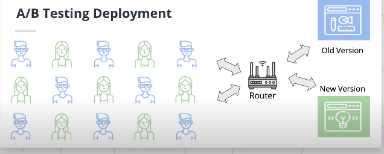
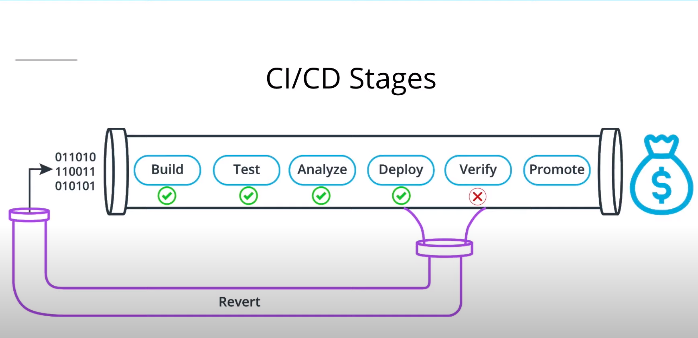
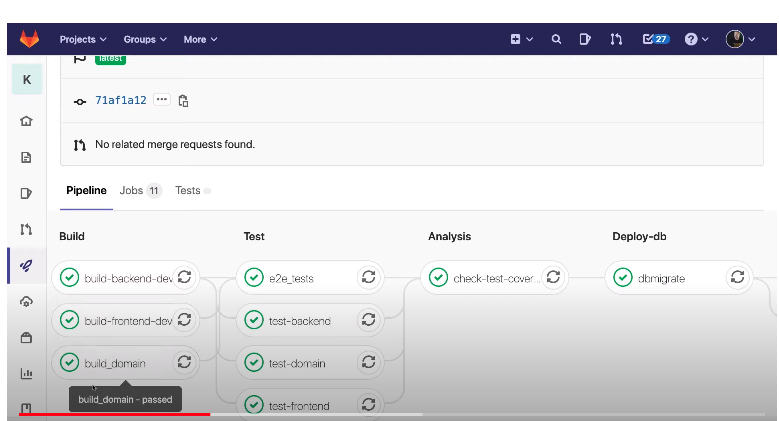

# 
# Introduction to CI/CD 

- Exercises to Build Confidence and Move Closer to Continuous Delivery
- Expect collaborative, comprehensive grooming of features that include team and stakeholders
- Ruthless slicing of features to smallest valuable increments
- Build team-wide, deep understanding of each feature's requirements and characteristics before coding starts
- Write comprehensive automated unit tests in front-end and back-end layers
- Shoot for high coverage from automated back-end integration tests
- Shoot for high feature critical-path coverage from end-to-end UI tests
- Include automated smoke tests that can be run on production-candidates
- Ensure all post-commit tasks and hand-offs must be automated in CI/CD
- Strive for quick, reliable rollback if smoke tests fail

### 8 Principles of Continuous Delivery

- Repeatable Reliable Process
- Automate Everything
- Version Control Everything
- Bring the Pain Forward
- Build-in Quality
- "Done" Means Released
- Everyone is Responsible
- Continuous Improvement

## Continuous Integration
The practice of merging all developers' working copies to a shared mainline several times a day. It's the process of "Making". Everything related to the code fits here, and it all culminates in the ultimate goal of CI: a high quality, deployable artifact! Some common CI-related phases might include:

- Compile
- Unit Test
- Static Analysis
- Dependency vulnerability testing
- Store artifact

## Continuous Deployment
A software engineering approach in which the value is delivered frequently through automated deployments. Everything related to deploying the artifact fits here. It's the process of "Moving" the artifact from the shelf to the spotlight. Some common CD-related phases might include:

- Creating infrastructure
- Provisioning servers
- Copying files
- Promoting to production
- Smoke Testing (aka Verify)
- Rollbacks

| Technical Language                              | Value            | Translation                                               |
| -                                               | -                | -                                                         |
| Catch Compile Errors After Merge                | Reduce Cost      | Less developer time on issues from new developer code     |
| Catch Unit Test Failures                        | Avoid Cost       | Less bugs in production and less time in testing          |
| Detect Security Vulnerabilities                 | Avoid Cost       | Prevent embarrassing or costly security holes             |
| Automate Infrastructure Creation                | Avoid Cost       | Less human error, Faster deployments                      |
| Automate Infrastructure Cleanup                 | Reduce Cost      | Less infrastructure costs from unused resources           |
| Faster and More Frequent Production Deployments | Increase Revenue | New value-generating features released more quickly       |
| Deploy to Production Without Manual Checks      | Increase Revenue | Less time to market                                       |
| Automated Smoke Tests                           | Protect Revenue  | Reduced downtime from a deploy-related crash or major bug |
| Automated Rollback Triggered by Job Failure     | Protect Revenue  | Quick undo to return production to working state          |

## Best Practices for CI/CD:

### Fail Fast
Set up your CI/CD pipeline to find and reveal failures as fast as possible. The faster you can bring your code failures to light, the faster you can fix them.

### Measure Quality
Measure your code quality so that you can see the positive effects of your improvement work (or the negative effects of technical debt).

### Only Road to Production
Once CI/CD is deploying to production on your behalf, **it must be the only way to deploy**. Any other person or process that meddles with production after CI/CD is running will inevitably cause CI/CD to become inconsistent and fail.

### Maximum Automation
If it can be automated, automate it. This will only improve your process!

### Config in Code
All configuration code must be in code and versioned alongside your production code. This includes the CI/CD configuration files!

## Deployment Strategies

| Deployment Strategy | Description                                                                                                                                                                                                                                                  |
| -                   | -                                                                                                                                                                                                                                                            |
| Big-Bang            | Replace A with B all at once.                                                                                                                                                                                                                                |
| Blue Green          | Two versions of production: Blue or previous version and Green or new version. Traffic can still be routed to blue while testing green. Switching to the new version is done by simply shifting traffic from blue to green.                                  |
| Canary              | Aka Rolling Update, After deploying the new version, start routing traffic to new version little by little until all traffic is hitting the new production. Both versions coexist for a period of time.                                                      |
| A/B Testing         | Similar to Canary, but instead of routing traffic to new version to accomplish a full deployment, you are testing your new version with a subset of users for feedback. You might end up routing all traffic to the new version, but that's always the goal. |

**Blue Green**

Pros:
- Allows you to test a new production deployment **without disturbing the old one**
- If it doesn't work you can do a **fast rollback**
Cons:
- More **costly infrastructure** with two prod versions running.

**Canary**
Pros:
- If there's a problem, you can **stop the roll out** and you've only **affected a small portion of users.**
Cons:
- **More costly than Big Bang** because you will have two prod versions running for a period of time. 
- **Quite a bit more difficult** to set up.

**A/B testing** is similar to Canary. 

The pros:
- **Get feedback** from users on new version.
Cons:
- Potentially **costly method of AUT testing**
- **More difficult to est up** than Canary.

## Blue Green Deployment ##

Common Jobs

| Step                             | Description                                                              |
| -                                | -                                                                        |
| Integrate Code in a Build        | Compile and create artifact                                              |
| Run Tests                        | Run unit and/or integration tests                                        |
| Ensure Infrastructure is Present | Create green infrastructure                                              |
| Provision the Environment        | Configure green instance, migrate DB, etc                                |
| Deploy Artifact                  | Copy artifact files to instance                                          |
| Run Smoke Tests                  | Run a few tests that don't impact the prod server                        |
| Perform Rollback if Failure      | Rollback here is more of a cleanup of green                              |
| Switch Router                    | Redirect traffic to new version                                          |
| Run Sanity Test                  | Run a few tests that don't impact the prod server                        |
| Perform Rollback If Failure      | Rollback here is switching the router back to blue and cleaning up green |
| Destroy Old Release Environment? | Clean up blue env (optional)                                             |
| Notify The Team (Successful)     | Celebrate!                                                               |

The best sequence for a Blue Green Deployment

Compile, Unit Tests, Provision, Deploy, Smoke Tests, Switch the Router, Sanity Test, Destroy Old Environment, Notify Team of Success

## Pipeline Building Blocks 

In analyze step make some kind of mutation testing.[^MutationTest]

[^MutationTest]:**Mutation Testing** is a type of software testing in which certain statements of the source code are changed/mutated to check if the test cases are able to find errors in source code. The goal of Mutation Testing is ensuring the quality of test cases in terms of robustness that it should fail the mutated source code.

In the **verify stage** is where we are going to do some automated **smoke tests** just to make sure everything works fine. If not, we revert our changes. 

If the verification passes, we can promote, this is were we can finally replace the old version of the production with the new version. 

The stages are **build**, **test**, **analysis**, etc.

The jobs are: **build-backend-dev**, **build-frontend-dev**, **test-backend**.

### Jobs and Steps

**Jobs** are what actually do the work of CI/CD. Each job has a name and defines a set of instructions to run and an environment in which to run those instructions. The instructions are called **steps**. Each step has a name and a bit of instructions to carry out a script to execute or a task to complete.

This is one example.

## CI/CD Tools ##

| Feature                      | Comments                                                                                                                                                                                                |
| -                            | -                                                                                                                                                                                                       |
| Scoped Environment Variables | These are Environment variables that are built-in or defined at various scope levels including account, project, pipeline and job.                                                                      |
| Steps                        | A step is an instruction that should be run during a job in order to accomplish a single goal.                                                                                                          |
| Jobs                         | A job is made up of a group of steps that should run in a specific order.                                                                                                                               |
| Job Images                   | Jobs can take advantage of various pre-existing Docker images that provide an environment in which to run steps.                                                                                        |
| Agents                       | An agent is a machine, either physical or virtual, that responds to the CI/CD system to run jobs on-demand.                                                                                             |
| Pipelines                    | A pipeline is a set of instructions to run a group of jobs in parallel or sequentially and according to a pre-determined dependency tree.                                                               |
| File Sharing                 | File sharing in the CI/CD context is the ability to share files between jobs, even though the jobs might be run on completely different images or agents.                                               |
| Code-Based Configuration     | Code-based configuration enables engineers to build configuration files that define and control CI/CD pipelines. These files can be saved to disk, shared with others, and versioned in source control. |
| Failure Branching            | Failure branching allows engineers to write instructions that should be run only in the event of a job failure.                                                                                         |

### Installable/On-Prem ###
Your team may prefer an on-prem CI/CD server running closer to the development team. There are a lot of great options with varying pricing models. One major benefit to an on-prem CI/CD server is a high degree of control. On the other hand, an on-prem CI/CD server requires time from someone in the team to maintain. The list below has a few options, but certainly not all!

| Tool                         | Creator/Maintainer   | Differentiators                                                                |
| -                            | -                    | -                                                                              |
| Jenkins                      | Various Contributors | Vibrant open-source communbity, 100% free                                      |
| Gitlab Community             | Gitlab               | Open-source, installable version of the popular cloud-based service, 100% free |
| Team City                    | JetBrains            | Very mature, JetBrains support                                                 |
| Team Foundation Server (TFS) | Microsoft            | Seemless integration with Microsoft products, Microsoft support                |

### Cloud-Based ###
Some teams prefer to use cloud-based services since they require mush less time to maintain and configure. The list below is far from exhaustive. There are many many options out there. These are just a few of our favorites.

| Tool      | Creator/Maintainer       | Differentiators                                                                                                                                   |
| -         | -                        | -                                                                                                                                                 |
| Bamboo    | Atlassian                | Integrates well with other Atlassian products like Stride and Jira.                                                                               |
| Circle CI | Circle Internet Services | Free for limited use, personal or business. Boasts of faster builds.                                                                              |
| Travis CI | Travis CI                | Extremely simple CI/CD orchestration tool. Some specialty features for libraries and packages. Free for open-source projects.                     |
| GitLab    | GitLab                   | Complete set of development tools including git repositories and built-in, integrated CI/CD pipelines. 2000 free minutes of CI/CD jobs per month. |

In This Course
Throughout this course, we will be using Circle CI because of the following reasons:

Circle CI's features are fairly universal
Since it's a cloud-based tool, Circle CI will not require much configuration
Circle CI has a free tier that is fairly generous

