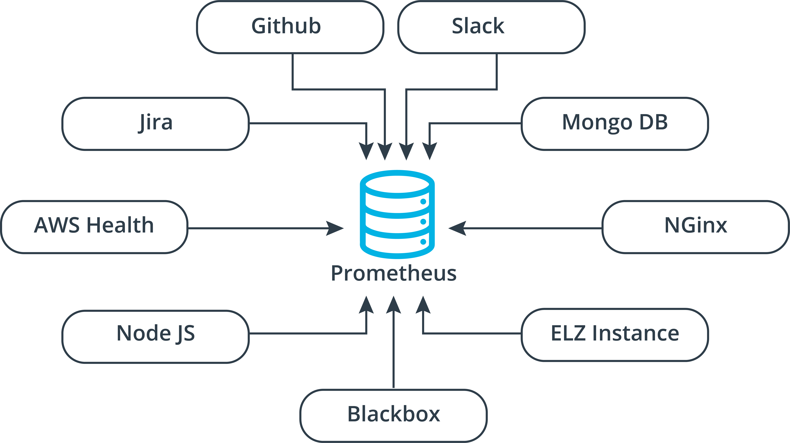
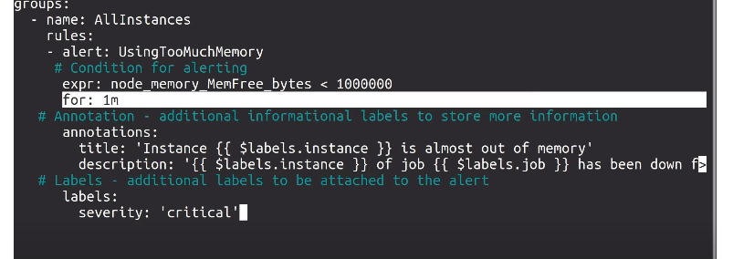
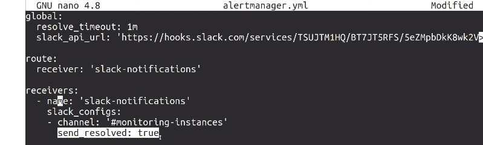

# Monitoring Environments


## Monitoring Tools
### Any Complete Monitoring System will be Composed of:

1. Time-Series Data
Time-series data is data that is in a series of time intervals. Some examples include:

- Blood-sugar level checked at the top of every hour
- Daily closing value of Microsoft stock
- Monthly rainfall by city
- Available disk space by the minute
- Another way I like to describe time-series data is "anything with a timestamp and at least 10 data points." Therefore, data collected from your monitoring system is time-series data!

2. Data Aggregator
A data aggregator is a system that collects and groups data by type or data source. One way to think of data aggregators is like a database with extra tooling to aid in data collection.

3. Data Visualizer
A data visualizer takes copious amounts of seemingly unintelligible data from the data aggregator and produces useful charts and graphs.


## Set Up Prometheus

Setting Up Prometheus
1. Launch a new instance in EC2 with port 9090 open to the public.
2. Log into the instance via SSH.
3. Download and extract the Prometheus server files.
4. Start Prometheus.
5. Open the instance's hostname or IP address in your browser with port 9090.
6. Profit!


To start prometheus we:
1. `wget https://github.com/prometheus/prometheus/releases/download/v2.27.1/prometheus-2.27.1.linux-amd64.tar.gz` 
2. `tar xvfz prometheus-2.27.1.linux-amd64.tar.gz`
3. `cd prometheus-2.27.1.linux-amd64.tar.gz`
4. `./prometheus --config.file=./prometheus.yml`
5. Go to server dns in port 9090.

## Exporters



Data is pulled from various data sources using lightweight agents called an Exporters that are installed on or attached to the data sources themselves. Once it knows about an exporter, Prometheus "scrapes" data from those exporters every few seconds. No matter how many exporters you have providing data, Prometheus can scrape them all and happily collect your monitoring data in near real-time.


There's a lot of exporters. Check out [here.](https://github.com/prometheus/docs/blob/master/content/docs/instrumenting/exporters.md)

- Node/system metrics exporter provide a metrics regarding the cpu usage, memory, etc.
- Blackbox exporter (http and https, if you want to analyze uptime).


## Exercise: Configuring Node Exporter
Configure a simple "exporter" in an EC2 instance so that its data and metrics are available to Prometheus. Also, configure Prometheus to auto-detect EC2 instances with built-in Service Discovery so that the new instance don't need to be added manually.

### Instructions:
1. Create a new EC2 instance for testing.
2. SSH into and configure the EC2 instance with `node_exporter` using the instructions in [this tutorial.](https://codewizardly.com/prometheus-on-aws-ec2-part2/)
3. Connect again via SSH to your Prometheus server in EC2.
4. Configure Prometheus to discover EC2 instances automatically following [this tutorial.](https://codewizardly.com/prometheus-on-aws-ec2-part3/)
5. View the test EC2 instance in Prometheus.

**Consider how you might do this using a configuration tool like Puppet or Ansible (might be useful later, hint hint).**


> Lo que se hace es: tienes dos ec2, una en donde corre el exporter y en la otra tienes prometheus. Descargas el node exporter en ec2_exporter. Luego, `./node_exporter` Luego, configuras `prometheus.yml`

> Agregas:
```
- job_name: 'node'
  static_configs:
  - targets: ['ec2-10adksfñak.compute-1.amazonaws.com:9100']
```
En el servidor de prometheus, no en el exporter y luego:

`./prometheus --config.file=./prometheus.yml`


El problema con esto es que tenemos que especificar esto muy bien para cada prueba. Por lo que para pruebas se puede: [^Pruebas]

[^Pruebas]:Sólo es para pruebas, en producción hacer el proceso anterior.

```
- job_name: 'node'
  ec2_sd_configs:
    - region: eu-west-1
      access_key: ñladkjfñlkja
      secret_key: ñladkjfñlkajdf
      port: 9100
```

ec2_sd_configs stands for ec2 service discovery configs. 


## Sending Alert Messages

### Alerting in Prometheus
Alerts are not available in the core installation of Prometheus. We have to install a utility called Alertmanager alongside Prometheus and configure them to talk to one another. Then, we can create alerting rules that decide when to send out alerts and to whom.

Alerting rules actually use the same PromQL expressions that saw in the Expression Browser.



Know go to the prometheus configuration file and go to:

```yaml
rule_files:
  - "rules.yml"
```

Now, we can install an alert manager so it knows what to do with this alerts. 


1. ssh into the server
2. `mkdir alertmanager`
3. `cd alertmanager`
4. `wget path/to/alertmanager`
5. `tar xvfz aletermanager`
6. `./altermanager --config.file=alertmanager.yml`
7. Go to prometheus.yml
8. Uncomment alertmanager conf. If they are in the same machine they can communicate via localhost. 
9. `./prometheus.yml --config.file=prometheus.yml`




### Exercise: Sending Alert Messages
Configure AlertManager to notify of a critical error.

### Instructions:
1. Open port 9093 to traffic in the security groups of your EC2 instance.
2. SSH into your Prometheus server (EC2 instance from the previous exercise)
3. Follow the instructions in [this tutorial](https://codewizardly.com/prometheus-on-aws-ec2-part4/) to set up Alertmanager and alerting rules for Prometheus.
4. Set up a "receiver" for Slack, Pager Duty, or email using Gmail (or your own SMTP server).
5. Restart the server and you should see an alert!
