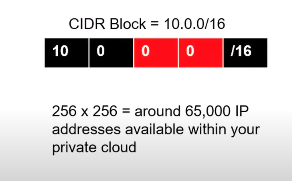
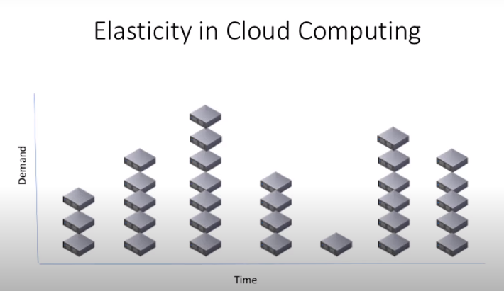

# Infrastructure Diagrams #

**Best Practices**

Choose to have more than one availability zone to avoid a single point of failure.
Include more than one availability zone to design for high availability, .
You may choose to reduce to one AZ, possibly for prototyping and design for low cost. But it is not recommended for production environments.

## Virtual Private Cloud ##

**Virtual Private Cloud (VPC):** A virtual private cloud is a pool of networked cloud resources. It can span more than one availability zone.
The equivalent of this would be a data center. However, thanks to availability zones, VPCs can span more than one physical building. This is an amazing feature that protects against real world disasters like electrical failures, fires and similar events.

An IPv4 address is made up of four octets.

## Subnets ##
Is a small subset of all those 65,000 IP addresses available in our example. What's the  purpose?
- Creates logical separation between resources
- Block or Allow access to/from groups of resources
- Provide services to a specific set of resources 

## Public vs Private Subnets ##

The goal is to use the IP addresses in this subnets as our key for routing traffic. 

| Application                       | Subnet Restriction |
| -                                 | -                  |
| Public-facing Web Server          | Public             |
| Database                          | Private            |
| Load Balancer to your web servers | Public             |
| Back-end application server       | Private            |

**Subnets**
A subnet is a subset of the overall VPC network and it only exists in a single availability zone, unlike its parent network, the VPC.

A subnet contains resources, and can be assigned access rights that apply to all resources within that subnet.

Subnets can be public or private. Public subnets are accessible to external users. Private subnets are only accessed internally by other resources within your cloud container.

**Use IP addresses for routing traffic**

Use IP addresses as the “keys” for routing traffic. We can route traffic to stay within the VPC, or within a particular subnet, for security reasons.
For example, a database or any sensitive data will be placed in a private subnet. A public server, like a web server, can be placed in a public subnet. Routing rules applied to a subnet allow us to define access to all resources placed inside that subnet.

## IGW Internet Gateway ##

It provides inbound and outbound traffic to your VPC. 

What if we have something we don't want to share with others? You could do it and you could probably have a VPN connection or a Direct Connect connection into your cloud. 

When troubleshooting a *"no internet access"* you have to remember that when you create a VPC and you want to provide internet access to it, you should make sure to:
- Create a route to the IGW and associate it with your subnets
- Create and IGW
- Attach the IGW to your VPC

**Software Defined Networking**
What we have created here it's called Software Defined Networking. That is, using APIs and already-existing physical infrastructure to create our own networking layer on top, with our own privacy rules, our own routing and our own Private IP Space.

**VPN or Virtual Private Network**
It is a type of encrypted connectivity that You can setup between your on-premise data center and your Virtual Private Cloud. This allows access in and out of your AWS VPC in a secure manner, across the internet and using internal, Private IP addresses.

**DirectConnect**
It is a DirectConnect is a physical data line that you can purchase directly from AWS or through a telecommunication service provider to access your AWS Cloud without moving your data traffic across the public internet.

**Internet Gateway**
An internet gateway is a resource that enables inbound and outbound traffic from the internet to your VPC.
An internet gateway allows external users access to communicate with parts of your VPC.
If you create a private VPC for an application that is internal to your company, you will not need an internet gateway.

## Network Address Translation ##

In translates incoming public traffic, into private traffic. Because it needs to have public access itself, you need to place it in a public subnet.

It provides outbound-only internet gateway for private services to access the internet. This keeps the private service protected from inbound connections, but allows it to connect to the internet in order to perform functions such as downloading software updates. The NAT gateway serves as an intermediary to take a private resource’s request, connect to the internet, and then relay the response back to the private resource without exposing that private resource’s IP address to the public.

Note: Place NAT Gateways inside the public subnets and not the private subnets. NAT gateways need to be in the public subnet so that they can communicate with the public internet, and handle requests from resources that are in a private subnet.

## Autoscaling Groups ##
In the diagram, if one server shuts down, another instance is going to be deployed. 

**Autoscaling group:** It is a coherent group of Virtual Machines (EC2 instances) that allows running the exact number of VMs that are required to meet the demand/specification. The autoscaling group can automatically start or stop the servers (EC2 instances) according to the amount of incoming traffic. This behavior of the autoscaling group helps in two ways:

- The consumer pays for the only duration of the servers when they were active.
- The consumer doesn't have to worry about horizontal scaling of servers for a sudden peak in incoming traffic.
**Best Practice**
- It is recommended that an autoscaling group spans more than one availability zone, for reliability.
- If we set the autoscaling group to run one resource, it will run that one resource in one of the availability zones.
- If there is a failure of that resource, the autoscaling group will shut it down in that availability zone and start that same resource in the other availability zone.

You can spin more servers based on demand. The scaling up and down criteria can be anything (orders, images, web requests, etc).

## Load Balancers ##

A load balancer can be associated not only with servers specifically but also with **Auto-Scaling groups**. The load balancer will know about the auto-scaling groups and send traffic as needed. 

Another benefit from load balancers is health-checks of your servers. 

A load balancer takes incoming traffic and distributes it to two or more resources. For example, it can take inbound user requests to access your website, and it can distribute the requests evenly among two or more servers.
Without a load balancer, having public-facing servers in more than one AZ would mean that users would have to use a different URL to reach each of the AZs. This can be impractical compared to just a single URL.
Good practice - Assume we have a set of web-servers in private subnet(s). Then, we must have a Load Balancer that would access our web-servers. These web-servers, in turn, would access the backend database.
AWS - Elastic Load Balancing
We recommend you to read about three types of load balancing offered by AWS at different layers of networking protocol:

## Security Group ##
Is a way to manage traffic. Is at the level of the server or services.

**Example**: you provide a web server and this web server only needs to be open on port 80 because that's the http port  where traffic is coming in inbound. So you use that security group to deny traffic everywhere else. 

- Security groups manage traffic at the server level (the resource level). Security Groups aren’t for managing higher-level groups such as subnets, VPC, or user accounts.
- The same security group can be assigned to multiple resources that require the same security access settings defined by that security group.

**Recommended Read**
[Read more about Security Groups](https://docs.aws.amazon.com/vpc/latest/userguide/VPC_SecurityGroups.html)

A security group is a collection of networking rules for:
- Inbound traffic.

While you could certainly specify just one type of traffic, it's common practice to include rules for both inbound and outbound in a single Security group.

A security group can be assigned to any instance (or same level) in the current VPC.
You can assign an SG (firewall rule) either to an instance, load balancer, or database, etc., in your VPC. However, each SG can scope to one or more IP address anywhere on the Internet (such as giving access to yourself, allowing the entire network 0.0.0.0/0 )

## Routing Table ##

- A set of entries or rules associated with one or more of your sublets inside your VPC.
- These rules allow or deny traffic to/from the address ranges that you specify.
- Rules can be as open as the entire world or restricted to a single IP address.

The entries in a routing table are about information regarding how to "move traffic" not about allowing or denying traffic. A routing table defines the rules, meaning if a packet arrives for a particular destination, then it should be moved towards the defined target.

- **To allow/deny traffic at the network/subnetwork level you have ACLs!.**
- **To allow/deny traffic at an instance level, you have security groups.**

See the snapshots below to understand the difference between the three:

So, if we want to make the private subnets to be able to reach out the internet, how do we do that? We associate those two private subnets to a routing table and we're going to specify a 2 routing rule in there. 
1. Default: All inbound and outbound traffic is allowed unrestricted provided it is within the isolated VPC cloud. 
2. If we're going to the internet, we're going to allow outbound traffic only for the private subnets, so we're going to route internet traffic from the private subnets from any server in there, going through the NATS. [^nats]

[^nats]:If your are going to reach any address that is not within the VPC, you should go from private traffic to the public subnets that has NAT service and control that traffic flow from there. 

This doesn't apply to the public subnet. The rule is that any traffic you can send it directly to the internet gateway. We don't have a problem wether is inbound or outbound. 

## S3 ##
- An S3 bucket is a public service for users to upload or download files.
- Place the S3 service outside of your VPC.

In the following quiz you’ll see an option for Log files as one of the possible answers, please keep in mind that this means sanitized logs, which means: with all sensitive information removed, such as passwords, credit card numbers or similar info.

## Reviewing Our Diagram ##

About the Load Balancer, is a single component but is going to require you to have more that 1 subnet. [See documentation](https://docs.aws.amazon.com/AWSCloudFormation/latest/UserGuide/aws-resource-elasticloadbalancingv2-loadbalancer.html#cfn-elasticloadbalancingv2-loadbalancer-subnets)

**Review the AWS Reference Architecture Page**

Visit the [AWS Reference Architecture Page](https://aws.amazon.com/architecture/) and study some of the diagrams. As a case-study, pay particular attention to [WordPress Architecture](https://github.com/aws-samples/aws-refarch-wordpress), which is the CMS software that runs on nearly 60% of all sites on the internet.

WordPress is a great example to help you understand how auto-scaling servers keep track of non-database data, such as images, config files, and similar objects, in this particular case by means of external storage (EFS) mounted to the EC2 Servers -- much like the way you would have your personal files and photos in an external USB drive that you can connect to any computer when you need to access them.

## Create a diagram to represent a corporate-only cloud ##
There is one more real-world scenario that is very popular, but not covered in this course. And that is the “extension of the on-premises network”.

In this case, you’d have a network that only contains private subnets, and does not have NAT Gateways. These components get replaced by a VGW (Virtual Gateway) and a VPN Connection. You’ll also need a CGW (Customer Gateway), which represents the on-premises side of the VPN Connection.

[Check the answer](https://github.com/udacity/nd9991-c2-Infrastructure-as-Code-v1-Exercises_Solution/blob/master/lesson-2-Infrastructure%20as%20Code/Diagram%20Exercise%20Solution.jpeg)
