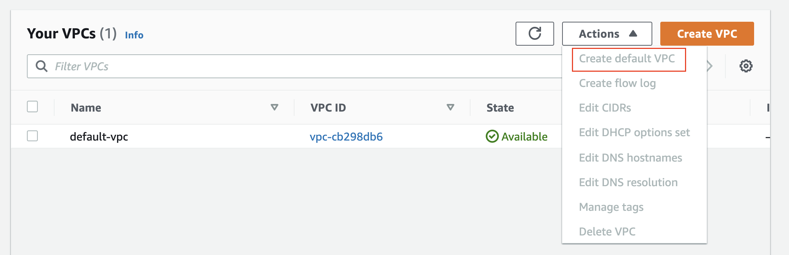
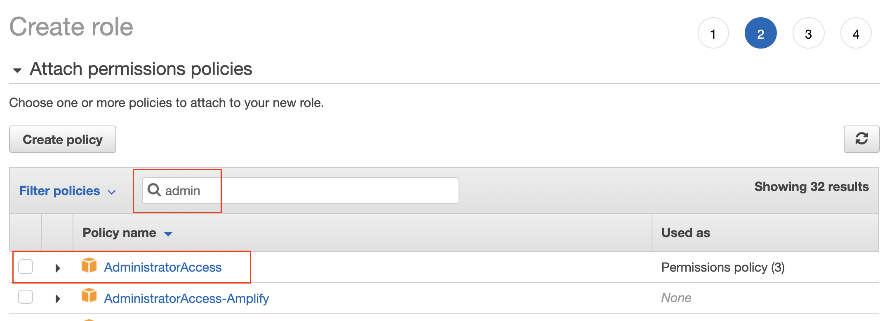
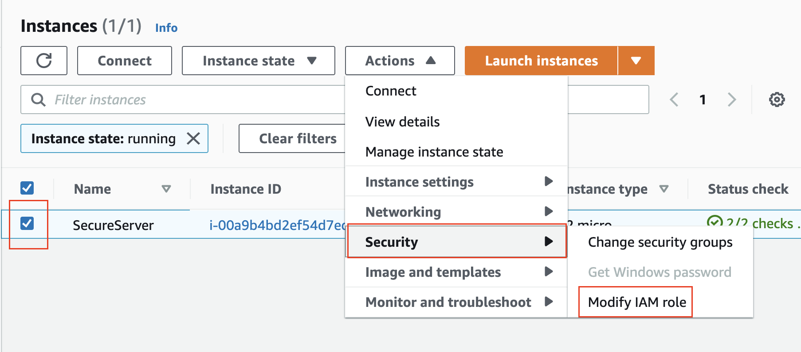

# Getting Started with Cloud Formation #


DevOps is the combination of industry best practices, and set of tools that improve an organization’s ability to:

Increase the speed of software delivery
Increases the speed of software evolution
Have better reliability of the software
Have scalability using automation,
Improved collaboration among teams.


Issues that DevOps tries to solve:
- Unpredictable deployments
- Mismatched environments (development doesn’t match production)
- Configuration Drift


## Getting Started With CloudFormation Script ##


If you have several types of IT experts across your company, how would you group the resources you are creating in CloudFormation in order to make it easy for everyone to have their expert input on them?  **Type of Resource**

Having scripts specific for networking and other scripts specific to EC2 Servers or Databases keep your scripts small, and easily shared across teams with different skill sets, such as database administrators and network experts.


### YAML and JSON
YAML and JSON file formats are both supported in CloudFormation, but YAML is the industry preferred version that’s used for AWS and other cloud providers (Azure, Google Cloud Platform).

An important note about YAML files: the whitespace indentation matters! We recommend that you use four white spaces for each indentation.

### Glossary in CloudFormation scripts ###
- **Name**: A name you want to give to the resource (does this have to be unique across all resource types?)
- **Type**: Specifies the actual hardware resource that you’re deploying.
- **Properties:** Specifies configuration options for your resource. Think of these as all the drop-down menus and checkbox options that you would see in the AWS console if you were to request the resource manually.
**Stack:** A stack is a group of resources. These are the resources that you want to deploy, and that are specified in the YAML file.

**Best practices**
Create separate files to organize your code. You can either create separate files for similar resources (logic, one for servers and one for developers) or create files for each developer who uses those resources.


**How do I find the syntax for a particular resource?**

You don't need to memorize the code that you need for each resource. You can find sample code in the [AWS CloudFormation - Resource and property types](https://docs.aws.amazon.com/AWSCloudFormation/latest/UserGuide/aws-template-resource-type-ref.html) documentation for each AWS Service, such as EC2. Then, you can select the particular resource within the selected service, such as AWS::EC2::VPC in the list.


## Create a VPC: Automated ##


### Create a Stack ###

Create the template file: Use the following code for your first test file: testcfn.yml (or choose any other name). Be careful about the indentation while you paste/write the same code in your editor.

```yaml
AWSTemplateFormatVersion: 2010-09-09
Description: Carlos Rivas / Udacity - This template deploys a VPC
Resources:
UdacityVPC:
  Type: 'AWS::EC2::VPC'
  Properties:
    CidrBlock: 10.0.0.0/16
    EnableDnsHostnames: 'true'
    Tags:
    - Key: name
      Value: myfirsttestvpc
```

- Run the aws command : Run the following command in the terminal, from the same directory where you've placed your testcfn.yml file. We are assuming that your stack name is myFirstTest (or choose any other name).
`aws cloudformation create-stack  --stack-name myFirstTest --region us-east-1 --template-body file://testcfn.yml`

- Alternate method - Shell Script: You can write a shell script (.sh) file as:
`aws cloudformation create-stack --stack-name $1 --template-body file://$2  --parameters file://$3 --capabilities "CAPABILITY_IAM" "CAPABILITY_NAMED_IAM" --region=us-west-2`
were `$1`, `$2`, and `$3` can be replaced with the actual values passed as command-line arguments. Note the `--parameters` and `--capabilities` options that we will learn in the upcoming lesson.


- Alternate method - Batch Script You can also try a batch script (.bat) with a similar syntax, except that the actual values can be written as `%1` instead as$1.


- Reference: The create-stack command has many options that you can refer to in the [documentation here.](https://docs.aws.amazon.com/cli/latest/reference/cloudformation/create-stack.html)


### Update stack

You may also want to use update-stack when you want to update an existing stack instead of destroying your stack and creating a new one. The syntax is similar to before:
`aws cloudformation update-stack  --stack-name myFirstTest --region us-east-1 --template-body file://testcfn.yml`

The command above will update the existing stack based on the YAML script you've written.

- Reference: update-stack [documentation.](https://docs.aws.amazon.com/cli/latest/reference/cloudformation/update-stack.html)

### Describe stack
- Once a stack is created successfully, you can verify by either going to the web console or running the following command, which will display all the details the stack.
`aws cloudformation describe-stacks --stack-name myFirstTest`

- You can describe the details of multiple stacks in one command. If no stack name is specified, then it will return the description for all the stacks created in your account.

- Reference: [describe-stacks documentation](https://docs.aws.amazon.com/cli/latest/reference/cloudformation/describe-stacks.html)
- [List of all possible aws cloudformation commands](https://docs.aws.amazon.com/cli/latest/reference/cloudformation/index.html#cli-aws-cloudformation)

**More about Templates**
- AWS documentation on template basics


## EC2 Instance with an Admin Role ##


**Brief Introduction**
You will create an EC2 Instance based on Amazon Linux AMI that you can connect via SSH. While provisioning the instance, you will make sure to limit access to your IP address only, using Security Groups. The instance will already have the CLI installed by default. You just need to assign permissions to this instance.

Once the instance is running, create an IAM role with admin access to your account. Then, attach the role to your EC2. In this case, the CLI tool will pick up the credentials from the role and won’t need hard-coded credentials.

Let's do this exercise to make your learning fun.

**Exercise objectives**
By the end of this exercise, you will be able to:

- Launch a secure EC2 instance
- Create IAM role with admin privileges
- Attach the IAM role to the EC2 instance created earlier
- Connect to your EC2 instance via SSH
- Use CLI tool in the EC2 instance

### Step 1. Create a default VPC
It is possible that you already have a default VPC created in your account. If not, go to the VPC dashboard and create a default VPC.



### Step 2. Launch an EC2 instance

- Navigate to the EC2 dashboard, and select the Instances services in the left-hand navigation pane.
- Use the Launch Instance wizard to launch an instance with the following configuration, and leave the remaining values as the defaults:

| Stage | Configuration              | Value                                     |
| --    | --                         | --                                        |
| 1.    | Amazon Machine Image (AMI) | Amazon Linux 2 AMI (HVM), SSD Volume Type |
| 2.    | Instance Type              | t2.micro                                  |
| 3.    | Configure Instance Details |                                           |
||a. Number of Instances	|1|
|   | b. Network | Default Select the VPC that was created in the previous step |
||c. Subnet	|Default|
| 4. | Storage        | Default                                    |
| 5. | Tags           | Optional                                   |
| 6. | Security Group | New.  Limit access to your IP address only |

See a snapshot below:
        


- Download a new SSH Key if you don't have one already.
> Important: This key-pair will allow you to log into your instance, using SSH, from your local machine. Save the key-pair carefully, because the same private key cannot be re-generated.


- Verify that you should see the newly created EC2 instance in the Instances services. Check the instance state, it should say Running.


### Step 3. Create an IAM Role ###
- Navigate to the IAM dashboard, and select the Roles services in the left-hand navigation pane.
- Click on the Create role button, and provide the configuration details, as follows. 


- Select AWS service as the type of trusted entity, and choose EC2 service to assume the new role. It will allow the EC2 instance, to whom we will attach this role later, to be able to call any AWS service on your behalf.


In the Filter policies textbox, search for the "admin" policy. Select the AdministratorAccess policy to apply to the new role.




- Provide a name to the new role, such as VocareumSecureServerRole, or choose any other name of your choice.


### Step 4. Attach the Role to the EC2 Instance ###

- Go back to the EC2 dashboard, and view the list of the running instances.
- Select the checkbox against the recently launched (earlier in this exercise) EC2 instance, and click the Actions button on the top of the list. It will open up drop-down options, select the Security → Modify IAM role option. See the snapshot below.




- On the next window, select and apply the newly created VocareumSecureServerRole to your instance.


### Step 5. Connect to your EC2 instance ###
Connect to your EC2 instance using SSH. Follow the instructions, as shown in the snapshot below.


- After connecting to your instance, verify the existing installation of AWS CLI, and run any AWS command, such as aws iam list-users.
> Note: The AWS CLI tool will already be installed because we had chosen Amazon Linux AMI while provisioning. The CLI tool, in this case, will pick up the credentials from the role and won’t need hard-coded credentials


This is a convenient way to have a properly configured - and secure - server that you can use to test and not have to worry about credentials.


## Challenge 1 ##

The command with the files `challenge.yml` and `challenge-params.json` is:
`aws cloudformation create-stack  --stack-name challenge1 --region us-east-1 --template-body file://challenge1.yml --parameters file://challenge1-parameters.json`


