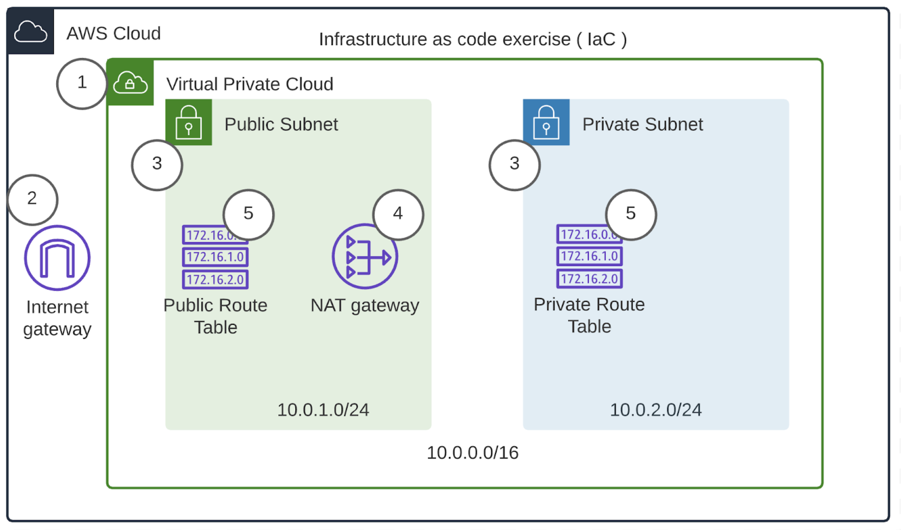

# Networking Infrastructure


Template anatomy

```yaml
---
AWSTemplateFormatVersion: "version date"

Description:
  String

Metadata:
  template metadata

Parameters:
  set of parameters

Rules:
  set of rules

Mappings:
  set of mappings

Conditions:
  set of conditions

Transform:
  set of transforms

Resources:
  set of resources

Outputs:
  set of outputs
```


**Learning about the YAML file**

The video above shows you the testcfn.yml file, which you'd have created in the previous lesson. In the upcoming video demos, you will have to create a new YAML file. Let's learn about the sections present the testcfn.yml file:

1. **Format version:** The `AWSTemplateFormatVersion` section is optional. The current valid value is 2010-09-09. You can add it to your file as:
`AWSTemplateFormatVersion: 2010-09-09`

2. **Description:** `TheDescription` field is also optional. Here we start by adding a short description of the project we are working on.
```yaml
AWSTemplateFormatVersion: 2010-09-09
Description: Carlos Rivas / Udacity - This template deploys a VPC
```

3. **Resources:** Although a description is optional, the Resources section is required. Remember to include at least one resource (e.g., a VPC, an EC2 instance, a database) in the CloudFormation template, otherwise, it will give an error when you try to run the script.

```yaml
AWSTemplateFormatVersion: 2010-09-09
Description: Carlos Rivas / Udacity - This template deploys a VPC
Resources:
UdacityVPC:
 Type: 'AWS::EC2::VPC'
 Properties:
   CidrBlock: 10.0.0.0/16
   EnableDnsHostnames: 'true'
```

Reference: [Template anatomy](https://docs.aws.amazon.com/AWSCloudFormation/latest/UserGuide/template-anatomy.html)

**AWS command in a Shell script**
As demonstrated in the video above, you can save your `aws cloudformation` command in a shell (.sh) script, so that you can run it multiple times easily. The instructor has created the following two shell scripts for the current course:

1. **create.sh:** This file contains the `create-stack` command, which expects three command-line arguments.
`aws cloudformation create-stack --stack-name $1 --template-body file://$2  --parameters file://$3 --region=us-east-1`
2. **update.sh:** This file contains the update-stack command, and this too expects three command-line arguments.

`aws cloudformation update-stack --stack-name $1 --template-body file://$2  --parameters file://$3 --region=us-east-1`

> Note: As stated earlier, you can choose either region, us-west-2 or us-east-1.

Moving forward, we will learn and add an additional option, `--capabilities "CAPABILITY_IAM" "CAPABILITY_NAMED_IAM"`, in these commands as:

`aws cloudformation create-stack --stack-name $1 --template-body file://$2  --parameters file://$3 --capabilities "CAPABILITY_IAM" "CAPABILITY_NAMED_IAM" --region=us-east-1`

**Practice Fixing Errors**
- Practice fixing errors, as this will help you prepare for real scenarios on the job.
- For instance, try altering correct, working YAML scripts to see if they generate an error.
- Practice reading error messages to understand what caused the error, and how to fix them.


## VPC and Internet Gateway ##


### Learning more bout a YAML file ###


1. **Description** - It presents a text description.

2. **Parameters** - It contains the list of parameters that are being used in the current CloudFormation template. Parameters should be declared above your Resources. Any value that you consider to change in the future, put it as a parameter instead of hard-coding it into your script. Note that each parameter is further defined with the following properties (or fields):

- Parameter Name - You can provide the name of your choice
- Description - A textual value
- Type - Identifies the data type of the parameter, such as String or a Number
- Default (optional) - Presents the default value of the parameter
- AllowedValues (optional) - Presents the list of all possible values.

For example, here we set the `EnvironmentName` parameter in our sample code from the video:
 
```YAML
Parameters:
 EnvironmentName:
     Description: An Environment name that will be prefixed to resources
     Type: String
```

You can also provide default values for parameters in case one was not passed in. In this example, you can see that VpcCIDR has a default value of 10.0.0.0/16.

```YAML
Parameters:
 EnvironmentName:
     Description: An Environment name that will be prefixed to resources
     Type: String

 VpcCIDR:
     Description: Please enter the IP range (CIDR notation) for this
     Type: String
     Default: 10.0.0.0/16
```

The use of parameters in the template makes your CloudFormation templates more reusable, by allowing you to input custom values to your template each time you create or update a stack. These custom values can be defined in a separate JSON file, as we will see later. These parameters are referenced in the `Resources` and `Outputs` section using a `!Ref` intrinsic function.

**Reference:** Refer to the [Parameters](https://docs.aws.amazon.com/AWSCloudFormation/latest/UserGuide/parameters-section-structure.html) documentation for learning more about !Ref intrinsic function and all possible properties of a parameter.


3. **Resources:** This (mandatory) section declares the AWS resources that you want to include in the stack, such as Servers, Gateways, VPN Connections, and more. We learned earlier that the `Resource` section is mandatory. You must include **at least one resource** (e.g., a VPC, and an internet gateway) in the CloudFormation template, otherwise, it will give an error when you try to run the script.

Each resource is defined with the help of fields, such as **Name, Resource type, and Resource properties.**

- **Name** - It is a string value representing the resource name. You can use a name of your choice.
- **Resource type** - The resource type identifies the type of resource that you are declaring. For example, Type: AWS::EC2::VPC creates a VPC. You can view the AWS resource and property types reference for a complete list of possible resources you can provision.
- **Resource properties** - The resource Properties field has further sub-fields that are specific to each type of resource. See an example below.

```yaml
Resources:
MyEC2Instance:
Type: "AWS::EC2::Instance"
Properties:
 ImageId: "ami-0ff8a91507f77f867"
```

Reference: Refer to the [Resources](https://docs.aws.amazon.com/AWSCloudFormation/latest/UserGuide/resources-section-structure.html) documentation for learning more about resource fields, and see more examples.


4. **Outputs**: This section declares output values for each resource that you can import into other stacks. For example, you can output the VPC ID for a stack to make it easier to find from another stack/template. You should not output any sensitive information, such as passwords or secrets. For each resource's output, you will have to provide the following:

- Description (optional) - A string
- Value (required) - The property returned by the aws cloudformation describe-stacks command.
- Export (optional) - The name of the resource output to be exported for a cross-stack reference.

Reference: Refer to the Outputs documentation for examples.


### Understanding the JSON (Parameters) file ###

- Why do we need a separate parameter file (JSON)?
The separate parameter file (JSON) file helps us to avoid hard-coding the parameters in the template (YAML) file.


- Any named parameters in the Parameters section of our CloudFormation template will need to have a matching value in a separate, Parameter file, which is in JSON format. The YAML format is not yet supported for the parameter file. A sample JSON-formatted Parameter file is:


```json
[
  {
      "ParameterKey": "EnvironmentName",
      "ParameterValue": "UdacityProject"
  }
]
```


Having this additional file with actual parameter values allows you to change data used by your CloudFormation template without the risk of modifying the template directly and possibly introducing a typo or some logical error.


### Creating CloudFormation Stack ###
- When calling AWS CloudFormation, you’ll pass in the name of the .yml file as well as the name of the parameter file as parameters to the CloudFormation call. For example:
`aws cloudformation create-stack --stack-name ourdemoinfra --template-body file://ourinfra.yml    --parameters file://ourinfra.json  --region=us-east-1`
> Note that CloudFormation creates the resources in order, based on their dependencies (VPC and InternetGateway, before creating the InternetGatewayAttachment).

### How to execute the Shell scripts?
- You can run either of the shell scripts (create.sh or update.sh) as:

`./<file_name> argument_1 argument_2 argument_3`

For example, you can run the following command:

`./create.sh ourdemoinfra ourinfra.yml ourinfra.json`

The command above is equivalent of running the following:

`aws cloudformation create-stack --stack-name ourdemoinfra --template-body file://ourinfra.yml    --parameters file://ourinfra.json  --region=us-east-1`

**Troubleshoot**

- While running the AWS commands using either create.sh or update.sh file, if you face permission denied error, then you will have to grant the execute permission to the owner (yourself) explicitly as:

`chmod +x update.sh`

`chmod +x create.sh`


### Connection VPC's and Internet Gateways ###

- Syntax of VPCGatewayAttachment resource: It's important to note when connecting an Internet Gateway to a VPC, we need to define an additional resource called InternetGatewayAttachment. This attachment references both the VPC and the InternetGateway. Here is the syntax for the following connection:

```yaml
Type: AWS::EC2::VPCGatewayAttachment
Properties: 
InternetGatewayId: String
VpcId: String
VpnGatewayId: String
```

> Note that you must specify either InternetGatewayId or VpnGatewayId, but not both.

- **Example:** See the VPCGatewayAttachment from the video above, referencing both the VPC and the InternetGateway defined above using a !Ref intrinsic function:

```yaml
Resources:
  VPC: 
      Type: AWS::EC2::VPC
      Properties:
          CidrBlock: !Ref VpcCIDR
          EnableDnsHostnames: true
          Tags: 
              - Key: Name 
                Value: !Ref EnvironmentName            
  InternetGateway:
      Type: AWS::EC2::InternetGateway
      Properties:
          Tags:
              - Key: Name
                Value: !Ref EnvironmentName

  InternetGatewayAttachment:
      Type: AWS::EC2::VPCGatewayAttachment
      Properties:
          InternetGatewayId: !Ref InternetGateway
          VpcId: !Ref VPC
```


### Subnets Syntax ###


- To specify a subnet for your VPC you can use the following syntax:

```yaml
Type: AWS::EC2::Subnet
Properties: 
  AssignIpv6AddressOnCreation: Boolean
  AvailabilityZone: String
  CidrBlock: String
  Ipv6CidrBlock: String
  MapPublicIpOnLaunch: Boolean
  Tags: 
    - Tag
  VpcId: String
```

- Reference - [AWS::EC2::Subnet resource documentation](https://docs.aws.amazon.com/AWSCloudFormation/latest/UserGuide/aws-resource-ec2-subnet.html)
-
**Adding Subnets to the VPC**
- Here is the actual setup of our 2 private subnets in different AZs:

```yaml
  PrivateSubnet1: 
      Type: AWS::EC2::Subnet
      Properties:
          VpcId: !Ref VPC
          AvailabilityZone: !Select [ 0, !GetAZs '' ]
          CidrBlock: !Ref PrivateSubnet1CIDR
          MapPublicIpOnLaunch: false
          Tags: 
              - Key: Name 
                Value: !Sub ${EnvironmentName} Private Subnet (AZ1)

  PrivateSubnet2: 
      Type: AWS::EC2::Subnet
      Properties:
          VpcId: !Ref VPC
          AvailabilityZone: !Select [ 1, !GetAZs '' ]
          CidrBlock: !Ref PrivateSubnet2CIDR
          MapPublicIpOnLaunch: false
          Tags: 
              - Key: Name 
                Value: !Sub ${EnvironmentName} Private Subnet (AZ2)
```

- Points to notice in the code above:

  - `!Ref VPC` is referencing to the VPC created earlier.


  - `!Ref PrivateSubnet1CIDR` is referencing to the PrivateSubnet1CIDR parameter. For this parameter, we have already defined the default value as `10.0.2.0/24`. Similarly, the PrivateSubnet2CIDR parameter is being used in the above code.


  - Notice that our private subnets are not sharing availability zones. We are keeping them separated as we displayed in our diagrams from the previous lesson. To do so, the `!GetAZs‘’` function fetches the list of AZs in your region which are indexed 0, 1, etc. Then, the `!select [0, !GetAZs‘’]` returns only the first AZ.


  - For PrivateSubnet1, the `!Select [ 0, !GetAZs '' ]` is returning the first AZ from the list of all AZs in your region. Similarly, for PrivateSubnet2, the `!Select [ 1, !GetAZs '' ]` will return the second AZ.


- Similar to the private subnets shown above, you will have to create two public subnets each in AZ0 and AZ1, except for the changed value in the field `MapPublicIpOnLaunch: true`. Marking this field as True will enable the Auto-assign public IP address field of the public subnet.


- **Tip** - Name your subnets using tags, to keep track when you create many subnets.


## NAT Gateways ##


Before you actually create a NAT gateway, make sure to understand the functionality and purpose of a NAT Gateway from [here.](https://docs.aws.amazon.com/vpc/latest/userguide/vpc-nat.html)

> Generally, we place a NAT gateway in a public subnet to enable the servers in a private subnet to connect to the Internet. And sometimes, we want to prevent the Internet from connecting to the servers in the private subnet.

- **Syntax** - You can use NAT Gateways in both your public and/or private subnets. The following code is the basic syntax for declaring a NAT Gateway:


```yaml
Type: AWS::EC2::NatGateway
Properties: 
AllocationId: String
SubnetId: String
Tags: 
  - Tag
```

- **Example** - The following declarations are from the sample code shown in the above video:

```yaml
Resources:
  NatGateway1EIP:
      Type: AWS::EC2::EIP
      DependsOn: InternetGatewayAttachment
      Properties: 
          Domain: vpc

  NatGateway2EIP:
      Type: AWS::EC2::EIP
      DependsOn: InternetGatewayAttachment
      Properties:
          Domain: vpc

  NatGateway1: 
      Type: AWS::EC2::NatGateway
      Properties: 
          AllocationId: !GetAtt NatGateway1EIP.AllocationId
          SubnetId: !Ref PublicSubnet1

  NatGateway2: 
      Type: AWS::EC2::NatGateway
      Properties:
          AllocationId: !GetAtt NatGateway2EIP.AllocationId
          SubnetId: !Ref PublicSubnet2
```

The code above will create two Elastic IPs and two NAT gateways.

- The EIP in AWS::EC2::EIP stands for Elastic IP. This will give us a known/constant IP address to use instead of a disposable or ever-changing IP address. This is important when you have applications that depend on a particular IP address. NatGateway1EIP uses this type for that very reason:

```yaml
NatGateway1EIP:
      Type: AWS::EC2::EIP
      DependsOn: InternetGatewayAttachment
      Properties: 
          Domain: vpc
```

- Tip - Use the DependsOn attribute to protect your dependencies from being created without the proper requirements. In the scenario above the EIP allocation will only happen after the InternetGatewayAttachment has completed. Read more about the DependsOn Attribute here.


- Reference: AWS::EC2::NatGateway resource documentation


## Routing ##


Rules to allow in and out traffic from our public subnets and rules to allow the traffic to flow outbound only on my private subnets. 


In fact, the private subnets are not going to go outside directly, they are going to hit the nat gateways and that's the only way they can reach the outside.


Before we proceed ahead, let's understand two terms:

- **Route table:** Routing is the action of applying (routing) rules to your network, in this case, to your VPC. A route table contains a set of rules. It blocks traffic from resources that do not follow the routing rule. It is represented as an AWS::EC2::RouteTable resource in CloudFormation terminology.
- **Rules:** Rules define (in a particular order of precedence) the network protocol, allowed IP addresses, and ports to allow the inbound and outbound traffic separately. A single rule is called an AWS::EC2::Route resource in CloudFormation terminology.

This section will create the following route tables (AWS::EC2::RouteTable) in our VPC and attach each of them to individual subnets, as mentioned below.

1. **PublicRouteTable** - This route table will have a default rule (AWS::EC2::Route) to allow all outbound traffic routed to the internet gateway. Next, we will attach this route table (AWS::EC2::SubnetRouteTableAssociation) to both our public subnets.
2. **PrivateRouteTable1** - This route table will have a default rule (AWS::EC2::Route) to route all outbound traffic to the NAT gateway **(NatGateway1)**. We will associate this route table to the **PrivateSubnet1**.
3. **PrivateRouteTable2** - This route table is similar in nature to **PrivateRouteTable1**, except that it is routing the traffic to the **NatGateway2**, and will be attached to the **PrivateSubnet2.**

> The flow of creating resources here will be: Create route tables →  Add routes →  Associate route table to subnets.


### Route Tables

First, create route tables in your VPC, and then add routes (rules) to each route table. Later, associate the route table with individual subnets. The following is the syntax used to define a route table:
```yaml
Type: AWS::EC2::RouteTable
Properties: 
Tags: 
  - Tag
VpcId: String
```

- Example - The only required property for setting up a RouteTable is the VpcId. Here is an example table from the video lesson:
```yaml
Resources:
  PublicRouteTable:
      Type: AWS::EC2::RouteTable
      Properties: 
          VpcId: !Ref VPC
          Tags: 
              - Key: Name 
                Value: !Sub ${EnvironmentName} Public Routes
```

- Create the PrivateRouteTable1 and PrivateRouteTable2 similar to the code shown above. There will not be any change except the name of the resource.
- Reference: AWS::EC2::RouteTable


### Routes
- The following is the syntax used to set up a route:
```yaml
Type: AWS::EC2::Route
Properties: 
DestinationCidrBlock: String
DestinationIpv6CidrBlock: String
EgressOnlyInternetGatewayId: String
GatewayId: String
InstanceId: String
NatGatewayId: String
NetworkInterfaceId: String
RouteTableId: String
VpcPeeringConnectionId: String
```

- In the syntax above, the DestinationCidrBlock property is used for destination matching and a wildcard address (0.0.0/0) to reference all traffic.
- The default public route: In the following example, when we use the wildcard address 0.0.0.0/0, we are saying for any address that is destined for any IP address in the world, send it to the referenced GatewayId

```yaml
DefaultPublicRoute: 
      Type: AWS::EC2::Route
      DependsOn: InternetGatewayAttachment
      Properties: 
          RouteTableId: !Ref PublicRouteTable
          DestinationCidrBlock: 0.0.0.0/0
          GatewayId: !Ref InternetGateway
```

- The default private route can be defined as:
```yaml
  DefaultPrivateRoute1:
      Type: AWS::EC2::Route
      Properties:
          RouteTableId: !Ref PrivateRouteTable1
          DestinationCidrBlock: 0.0.0.0/0
          NatGatewayId: !Ref NatGateway1
```

- The route above is attached to the `PrivateRouteTable1` and is routed via `NatGateway1`. Create the `DefaultPrivateRoute2` for `PrivateRouteTable2` similar to the code shown above.
- Reference: AWS::EC2::Route


**Routes goes from very specific to the least specific**


### Associate Route Tables to Subnets

DefaultPrivateRoute1: is stating that when you are routing traffic, you have to send it to the NatGateway1, I don't want it to exit to the outside. this will keep the traffic for the private subnets within the VPC.


The private VPC servers are not going to have a public address. Even when they place on the public subnets, there's no way to access them if they have no ip address.. 


The `PrivateRouteTable2` seems unnecessary  but its something that will help on future expansions. It seems unnecessary because we could use the same route and the same routing table and apply to both private subnets.  But `PrivateRouteTable2` is for future expansions when you have more subnets and more complex routes, you don't want to have single place when you put a route and you could affect break something else. 

### SubnetRouteTableAssociation
- In order to associate subnets with our route table, we will need to use a SubnetRouteTableAssociation resource using the following syntax:

```yaml
Type: AWS::EC2::SubnetRouteTableAssociation
Properties: 
RouteTableId: String
SubnetId: String
```

This only takes two properties, which are the id's used for our RouteTable and our Subnet. You can see references used in the example from our video lesson above.
- **Example** - Associate PublicSubnet1 with the PublicRouteTable

```yaml
PublicSubnet1RouteTableAssociation:
      Type: AWS::EC2::SubnetRouteTableAssociation
      Properties:
          RouteTableId: !Ref PublicRouteTable
          SubnetId: !Ref PublicSubnet1
```          

- Similarly, associate the rest of the three subnets to each of its intended route tables.
- Reference: AWS::EC2::SubnetRouteTableAssociation.
> **Important Note: Routes should be defined starting with the most specific rule and transitioning to the least specific rule.**


The private route is going to show the local and the nat gateway for outbound rule. 

The public route is going to show the local and the internet gateway (anything going to the wildcard). 

If your servers have no internet access it's probably because:
- You created the internet gateway but forgot to attach it to your VPC.


### Output section ###


We have a very large file and the want to send the resources of this file to another one via **variables**. 

`Outputs` are optional but are very useful if there are output values you need to:

- import into another stack
- return in a response
- view in AWS console

To declare an Output use the following syntax:
```yaml
Outputs:
  Logical ID:
    Description: Information about the value
    Value: Value to return
    Export:
      Name: Value to export
```

The Value is required but the Name is optional. In the following example we are returning the id of our VPC as well as our Environment's Name:

```yaml
VPC: 
        Description: A reference to the created VPC
        Value: !Ref VPC
        Export:
          Name: !Sub ${EnvironmentName}-VPCID
```


### Join Function
You can use the join function to combine a group of values. The syntax requires you provide a delimiter and a list of values you want appended.

Join function syntax:

`Fn::Join: [ delimiter, [ comma-delimited list of values ] ]`

In the following example we are using !Join to combine our subnets before returning their values:

```yaml
PublicSubnets:
        Description: A list of the public subnets
        Value: !Join [ ",", [ !Ref PublicSubnet1, !Ref PublicSubnet2 ]]
        Export:
          Name: !Sub ${EnvironmentName}-PUB-NETS
```

Resources
- [Outputs Documentation](https://docs.aws.amazon.com/AWSCloudFormation/latest/UserGuide/outputs-section-structure.html)
- [Join Function](https://docs.aws.amazon.com/AWSCloudFormation/latest/UserGuide/intrinsic-function-reference-join.html)
- [Substitutes](https://docs.aws.amazon.com/AWSCloudFormation/latest/UserGuide/intrinsic-function-reference-sub.html)


## Challenge 2 ##


Project Overview
You have been tasked with creating the required Infrastructure-as-code scripts for a new cloud environment in AWS. The Lead Solutions Architect for the project sends you the following diagram.


Write a CloudFormation script that:

1. Creates a VPC
  - It will accept the IP Range -also known as CIDR block- from an input parameter
2. Creates and attaches an Internet Gateway to the VPC
3. Creates Two Subnets within the VPC with Name Tags to call them “Public” and “Private”
  - These will also need input parameters for their ranges, just like the VPC.
4. The Subnet called “Public” needs to have a NAT Gateway deployed in it
  - This will require you to allocate an Elastic IP that you can then use to assign it to the NAT Gateway.
5. The Public Subnet needs to have the MapPublicIpOnLaunch property set to true. Use this reference for help.
6. The Private Subnet needs to have the MapPublicIpOnLaunch property set to false.
7. Both subnets need to be /24 in size.
  - If you need assistance with IP math, you can use a subnet calculator such as this one.
8. You will need 2 Routing Tables, one named Public and the other one Private
9. Assign the Public and Private Subnets to their corresponding Routing table
10. Create a Route in the Public Route Table to send default traffic ( 0.0.0.0/0 ) to the Internet Gateway you created
11. Create a Route in the Private Route Table to send default traffic ( 0.0.0.0/0 ) to the NAT Gateway
12. Finally, once you execute this CloudFormation script, you should be able to delete it and create it again, over and over in a predictable and repeatable manner, this is the true verification of working Infrastructure-as-Code


**Helpful hints:**
The numbers in the diagram below show the recommended sequence for resource creation. This is not required by CloudFormation but it helps to keep you on track and allows you to stop and verify as you go.



Create the resources in the order highlighted above.


2. Because NAT Gateways and Internet Gateway attachments aren’t automatic and take some time to provision, you may need the DependsOn attribute to wait for these events in your script.

This NAT Gateway example shows the use of “DependsOn” to wait for an Attachment to complete:

https://docs.aws.amazon.com/AWSCloudFormation/latest/UserGuide/aws-resource-ec2-natgateway.html

3. Finally: Divide and Conquer! For example: just write the script for the VPC and Internet Gateway and make sure it works, then move on to adding more resources, increasing complexity as you go.


### Expected Output ###


