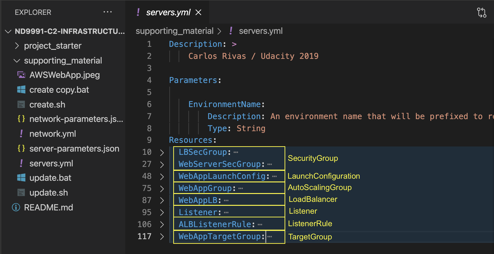
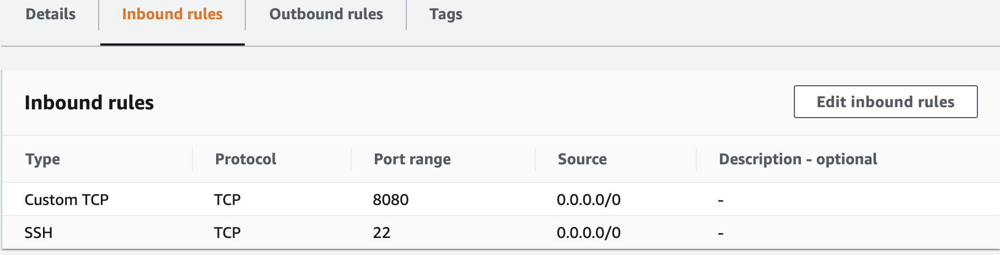
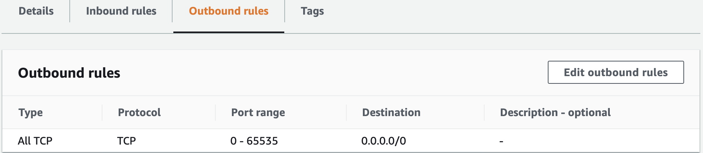
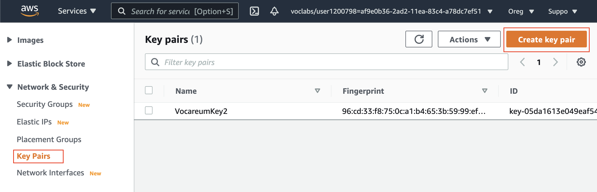
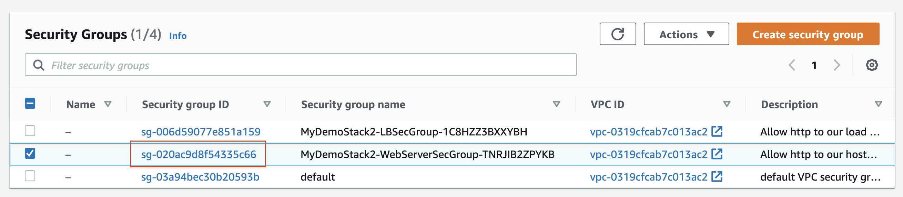
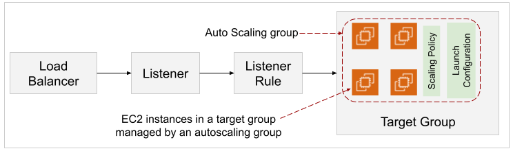
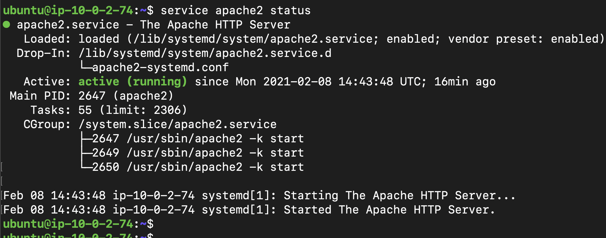
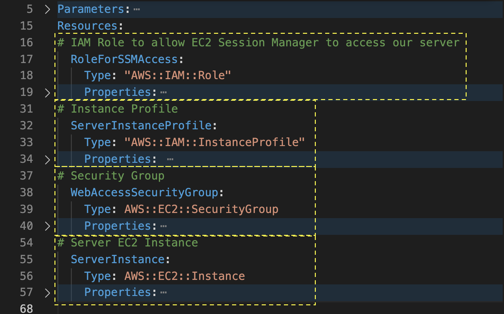

# Servers and Security Groups


In the current lesson, we will create a new stack demoserverstack, that will create servers and associated resources in the previously created VPC. **Yes, we will cross-reference the resources created in the previous stack in our new stack.**

In particular, we will create the following resources using the CloudFormation template:

- **Security groups** - Security group specify firewall rules. We will create two of them, one for a load-balancer and another for a web server.
- **AutoScaling group** - An autoscaling group ensures that a desired number of servers (EC2 instances) are always up and running. If an instance goes down due to any reason, such as bad health, a substitute instance with a similar configuration will spin up automatically.
- **Launch configuration** - The configuration of the EC2 instance that spins up automatically, if required, as a part of autoscaling group resides in a launch configuration.
- **Load balancer** - A load balancer distributes the incoming traffic uniformly across multiple servers (target group) within the same or different AZs. We will also create a listener and target group for the load balancer.


The `servers.yml` file defines various resources, such as security groups, an autoscaling group, launch configuration, target group, load balancer, and listener. Each type of resource has a different set of properties.





## Understanding Security Groups ##


**Security Groups** are specific to the resources that we are going to deploy, they are not tied to the subnets. 


> Recall that a security group defines the firewall rules, such as the protocol to open to network traffic and the set of valid IP addresses.

We will create two Security groups:

1. WebServerSecGroup for the webserver
2. LBSecGroup for a load balancer
 
### Security Group Syntax
- The following is the syntax required to create a SecurityGroup:

```yaml
Type: AWS::EC2::SecurityGroup
Properties: 
GroupDescription: String
GroupName: String
SecurityGroupEgress: 
  - Egress
SecurityGroupIngress: 
  - Ingress
Tags: 
  - Tag
VpcId: String
```

- In the SecurityGroup syntax shown above:
  - The only required (mandatory) property is GroupDescription. It is a String value up to 255 characters without quotes.

  - The GroupName is similar to GroupDescription, but it's not a required property.

  - The SecurityGroupEgress and SecurityGroupIngress property rules are the most critical as it defines where the traffic will go. The former defines outbound traffic, whereas the latter defines the inbound traffic.

  - The VpcId denotes the VPC ID in which you are creating the Security Group.

### Ingress rules and egress rules
- Ingress rules are for inbound traffic, and egress rules are for outbound traffic.
- Ingress rules restrict or allow traffic trying to reach our resources on specific ports.
- Egress rules restrict or allow traffic originating from our server -- typically we are ok allowing all outbound traffic without restrictions as this doesn’t pose a risk for a security breach.

Outbound is always allowed and Inbound is always denied unless specified. Keep in mind that this is when a resource, such as a Server, has a **security group** with defaults assigned to it. If a server doesn’t have a security group assigned to it at all, then it becomes isolated. Meaning that no traffic is allowed in or out.


### Example
- The security group below with ingress/egress rules allowing traffic on port 80 using TCP protocol from/to any location:

```yaml
InstanceSecurityGroup:
Type: AWS::EC2::SecurityGroup
Properties:
    GroupDescription: Allow http to client host
    VpcId:
       Ref: myVPC
    SecurityGroupIngress:
    - IpProtocol: tcp
      FromPort: 80
      ToPort: 80
      CidrIp: 0.0.0.0/0
    SecurityGroupEgress:
    - IpProtocol: tcp
      FromPort: 80
      ToPort: 80
      CidrIp: 0.0.0.0/0
```

In the code above, from port 80 to port 80 I want to traffic to and from anywhere. 


## Security Groups ##


Security groups are specific to individual resources (EC2 servers, databases) and not to subnets. There are few points that you must remember:

1. **Traffic is blocked by default**
In the cloud, traffic is completely blocked, so you have to explicitly open ports to allow traffic in and out. This is a general networking concept.
2. **Limit inbound traffic for security**
For ingress rules, we want to limit inbound traffic, for security, to a single port or just a handful of ports required by the application we are running. For example, if it’s a public web server, it will require port 80 open to the world ( World = 0.0.0.0/0 ). Should you need the SSH port open, restrict this port only to your specific IP address.
3. **For outbound traffic, give full access**
For egress rules, we want to give the resource full access to the internet, so we give egress access to all ports, from 0 all the way to 65535.


### AWS::EC2::SecurityGroup
Create the following two Security groups, as shown in the video above. You can refer to the AWS::EC2::SecurityGroup documentation if needed.

1. WebServerSecGroup for the webserver. The following code must fall under the Resources section in the template.

```yaml
WebServerSecGroup:
 Type: AWS::EC2::SecurityGroup
 Properties:
   GroupDescription: Allow http to our hosts and SSH from local only
   VpcId:
     Fn::ImportValue:
       !Sub "${EnvironmentName}-VPCID"
   SecurityGroupIngress:
   - IpProtocol: tcp
     FromPort: 8080
     ToPort: 8080
     CidrIp: 0.0.0.0/0
   - IpProtocol: tcp
     FromPort: 22
     ToPort: 22
     CidrIp: 0.0.0.0/0
   SecurityGroupEgress:
   - IpProtocol: tcp
     FromPort: 0
     ToPort: 65535
     CidrIp: 0.0.0.0/0
```

Ideally you would not have the 22 port open or any other port other than the service port for your application. 
The port 8080 would be the only one necessary. Once you know how everything works and everything is fine in your application, you'll need to come and close the ports.  

The `SecurityGroupEgress` from 0 to the end is ok because this is an outbound traffic rule.

For now, the **security groups** are not associated with any of the resources just yet. Once we attach to a server, the server will gain this ingress and egress rules.


After creation, the firewall rules for this will look like:



Inbound rules for the `WebServerSecGroup`

Outbound rules for the `WebServerSecGroup`

1. `LBSecGroup` for a load balancer. After creation, the firewall rules for this will look like:


> Did you notice the intrinsic function !Sub or !Ref in the code above? Let's learn about it.

### Intrinsic functions in the CloudFormation template
**AWS provides a few predefined functions that you can use in your template. These functions can assign values to properties that are not available until runtime.** Notice that there a few function-calls in the template (servers.yml) provided to you, such as

1. Fn::Sub: This function substitutes value to a property at runtime. You can use this function as `!Sub "$Value"`. For example, the `!Sub "${EnvironmentName}-VPCID"` will substitute the value of **EnvironmentName** parameter during runtime.


Exporting a value of a VPC ("${EnvironmentName}-VPCID") from the ourdemoinfra stack. Note that the value of EnvironmentName parameter will be substituted at runtime.

2. `Fn::GetAZs`: This function returns an array that lists Availability Zones for a specified region in alphabetical order. For example, we learned the following code in the last lesson where we are fetching the list of AZs.
```yaml
 PublicSubnet1: 
     Type: AWS::EC2::Subnet
     Properties:
         VpcId: !Ref VPC
         AvailabilityZone: !Select [ 0, !GetAZs '' ]
         CidrBlock: !Ref PublicSubnet1CIDR
         MapPublicIpOnLaunch: true
         Tags: 
             - Key: Name 
               Value: !Sub ${EnvironmentName} Public Subnet (AZ1)
```

The example above shows the usage of three more intrinsic functions, !Sub, !Select and !Ref.
3. `Fn::Select`: This function returns a single object from a list of objects by index.
4. `Ref`: It returns the value of the specified parameter or resource. You can specify a parameter or a resource by its logical name.
5. `Fn::ImportValue`: This function returns the value of an output exported by another stack.

  - For example, in the last lesson, we created ourdemoinfra stack having a VPC and declared its output value.
> Recall that the Outputs section in a template declares output values that you can import into another stack.

- In this lesson, while creating another stack demoserverstack, we can refer to the VPC created earlier as:


### Resources


[Security Group Rules Reference](https://docs.aws.amazon.com/AWSEC2/latest/UserGuide/security-group-rules-reference.html)


## AutoScaling Group ##

It creates servers based on criteria. 


An Autoscaling group is a logical group of EC2 instances that share a similar configuration.

This AWS service monitors the EC2 instances and automatically adjusts the running count by adding/removing EC2 instances, ensuring that a desired number of servers (EC2 instances) are always up and running.

- **Scaling policy**
A Scaling Policy is the criteria used to decide when to Add or Remove Servers from your Auto Scaling Group. Running the servers 24 hours a day costs money. So, It's best to have criteria/conditions, called Scaling policy, that will turn those servers off when they are not needed and then turn them back on demand.

For example, you could create a CloudWatch Alarm with a custom metric that counts the number of web visitors in the last 2 hours; if the number is less than 100, perhaps a single server is enough. This will be a trigger to Scale Down if there is more than one server running at the time.

A Scaling policy spins up/shuts down EC2 instances automatically based on certain conditions that we specify, such as:

  - If an instance goes down due to any reason, such as bad health
  - If an instance achieves a CPU utilization upper threshold, say 90%
  - If the CPU utilization comes down below a certain lower threshold, then one of the instances will be shut down automatically

- **Launch configuration**
Note that all the EC2 instances running as a part of an autoscaling group share a common configuration, such as AMI, instance-type, security-group, key pair, etc. All these configurations are saved in a separate resource: Launch configuration. Think of a Launch Configuration as a template or a recipe. You are instructing the Auto Scaling service HOW to run your web application.

For example: An application requires 2GB RAM , 4 vCPUs, 10GB of Disk Space, Java runtime version 8 or NodeJS 10.0. All this on top of a standard distribution of Linux or Windows.

> Note: AWS provides another option, Launch templates, as an alternative to the Launch configuration. They both serve a similar purpose.

Writing YAML code for either of them is similar in syntax. We will learn to code Launch configuration in this lesson, though.

### AWS::AutoScaling::AutoScalingGroup
An autoscaling group in our example exercise will require the following:

- VPCZoneIdentifier
- LaunchConfigurationName
- Min and Max count of instances
- TargetGroupARNs
See the code below having a reference to a Launch configuration, WebAppLaunchConfig, that we will create next:

```yaml
WebAppGroup:
    Type: AWS::AutoScaling::AutoScalingGroup
    Properties:
      VPCZoneIdentifier:
      - Fn::ImportValue: 
          !Sub "${EnvironmentName}-PRIV-NETS"
      LaunchConfigurationName:
        Ref: WebAppLaunchConfig
      MinSize: '3'
      MaxSize: '5'
      TargetGroupARNs:
      - Ref: WebAppTargetGroup
      HealthCheckGracePeriod: 60
      HealthCheckType: ELB
```

In the code above:

- The VPCZoneIdentifier is a list of subnet IDs for a virtual private cloud (VPC) where instances in the Auto Scaling group can be created. We are using the private subnets.
- The LaunchConfigurationName represents the name of the launch configuration to use to launch instances. We will create a launch configuration in the next demo.
- The MinSize & MaxSize lets us know the range of machines we will be running, which also alerts us to the min/max costs we can be expecting from these machines.
- **A target group is a group of registered instances, to whom the traffic will be routed.** The ARN (Amazon Resource Names) serves as a unique ID for any resource. The `TargetGroupARNs` property refers to the ARNs of the load balancer target group that we will create in the upcoming demos.


Which of these are elements of an auto scaling group?
1. Scaling Policy
2. Launch Configuration


**Resources**

- [AWS::AutoScaling::AutoScalingGroup](https://docs.aws.amazon.com/AWSCloudFormation/latest/UserGuide/aws-properties-as-group.html)
- The [AWS Frequently Asked Questions](https://aws.amazon.com/autoscaling/faqs/) (FAQs) is a great resource to master the finer details of scaling servers


## Launch Configuration


It is a saved-resource that stores the configuration details of an EC2 instance, such as the AMI, instance-type, security-group, key pair, etc. The Autoscaling group uses a launch configuration to launch EC2 instances.

Let's see how you can code a launch configuration.

### AWS::AutoScaling::LaunchConfiguration
This is an updated WebAppLaunchConfig so that you don’t need external dependencies, such as Docker in the UserData script.

```yaml
Resources:
  WebAppLaunchConfig:
    Type: AWS::AutoScaling::LaunchConfiguration
    Properties:
      UserData:
        Fn::Base64: !Sub |
          #!/bin/bash
          apt-get update -y
          apt-get install apache2 -y
          systemctl start apache2.service
          cd /var/www/html
          echo "Udacity Demo Web Server Up and Running!" > index.html
      ImageId: ami-0ac73f33a1888c64a
      KeyName: VocareumKey2
      SecurityGroups:
      - Ref: WebServerSecGroup
      InstanceType: t3.small
      BlockDeviceMappings:
      - DeviceName: "/dev/sdk"
        Ebs:
          VolumeSize: '10'
```

In the example above, we have done the following:

1. Set a UserData script that will run on the new instance automatically after launch. See the next paragraph for more details.
2. Used the ami-0ac73f33a1888c64a as AMI in the us-west-2 (Oregon) region. If you wish to run the whole exercise in another region, say us-east-1 (N Virginia), then you will have to change the AMI ID to ami-00ddb0e5626798373.

AMI IDs are specific to the region and keep changing with updates in the image. The AMI ID used in the example above is for a Ubuntu Server 18.04 LTS (HVM), SSD Volume Type system. You can search the AMI ID of all Ubuntu-based images here.

3. Assumed that the RSA login key name is VocareumKey2. Please create a key-pair with the name VocareumKey2 (or any name) in the AWS web console (under EC2 services) before using it in the code above.




4. Referenced the previously defined WebServerSecGroup for our SecurityGroup
5. Set our InstanceType to t3.small . You can also use t3.medium, as shown in the video demo above. To see all available instance types, click here.
6. Specified 10gbs for our VolumeSize.

**Note:** In a Launch configuration, the only required properties are ImageId and Instance Type. The remaining ones are optional.


### UserData script
A UserData script is a series of commands that run automatically at the time of instantiating your EC2 instance. The purpose of a UserData script is to properly configure the EC2 instance before running your application.

- Script to use in your exercise
By default, the EC2 instance will not have the Apache Tomcat server installed and running. Use the following UserData script to do so. Note that this script is meant to run only on Ubuntu Linux systems.

```bash
      #!/bin/bash
      apt-get update -y
      apt-get install apache2 -y
      systemctl start apache2.service
      cd /var/www/html
      echo "Udacity Demo Web Server Up and Running!" > index.html
```      

It will first install the Apache Tomcat server, starting the server, and then create an index.html page at the default location, /var/www/html.

- Script shown in the demo is different
The instructor uses a slightly different UserData script in the demo video above that uses external dependencies, such as installing a Docker and then installing the Apache Tomcat in a Docker container.
```bash
       #!/bin/bash
       # Install docker
       apt-get update
       apt-get install -y apt-transport-https ca-certificates curl software-properties-common
       curl -fsSL https://download.docker.com/linux/ubuntu/gpg | sudo apt-key add -
       add-apt-repository \
       "deb [arch=amd64] https://download.docker.com/linux/ubuntu \
       $(lsb_release -cs) \
       stable"
       apt-get update
       apt-get install -y docker-ce
       usermod -aG docker ubuntu
       docker run -p 8080:8080 tomcat:8.0
```

**You are not required to use the script above in the current exercise; however, you can use it while launching a new EC2 instance to verify if it works.**


- **What else you can do with a UserData script?**
In addition to the example shown above, you can also do things such as:
- Fetch credentials
- Set Environment Variables ( ENV=PROD, for example )
- Download and Install libraries
- Get your source files or binaries from a storage location, such as S3

- **When should you use the UserData script?**
If you want to run your application in a plain out-of-the-box Linux or Window server, you'll use the UserData script to do all the necessary configurations. **You don't need it if you are using an AMI that already has everything installed.**

- **How to verify and troubleshoot a UserData script?**
The best way to create and verify a UserData script is to run each command manually and verify everything works as expected. If you run yours and it fails, you should login to the server and check the logs that can be found here:

`/var/log/cloud-init-output.log`

Or more traditional Batch scripts:

### [Optional] Additional lnformation
Please note the UserData script above is meant to run only on Ubuntu Linux. Had it been a CentOS-based Amazon Linux 2 AMI (HVM), SSD Volume Type, then you may have to use the following UserData script to install and start the Apache Tomcat server with PHP:

```bash
#!/bin/bash
sudo yum update -y
sudo amazon-linux-extras install -y lamp-mariadb10.2-php7.2 php7.2
sudo yum install -y httpd mariadb-server
sudo systemctl start httpd
sudo systemctl enable httpd
sudo chkconfig httpd on
```

Also, in this case, you will have to use different AMI-ID as:

- us-east-1 N Virginia - ami-047a51fa27710816e

- us-west-2 Oregon - ami-0e999cbd62129e3b1

**Resources**
- AWS::AutoScaling::LaunchConfiguration


## Debugging Launch Configuration


### WebAppGroup
- An Auto Scaling Group is in charge of providing servers for your application based on an Alarm/Criteria, such as number of concurrent users, CPU Usage or HTTP Requests
- Since The Auto Scaling Group is not specific to your application, you need to provide a Launch Configuration which says which machine image to use and how much memory and disk space your application will need, among other things.
- You can specify a Minimum and Maximum count of servers to use for Auto Scaling -- This is a great feature of cloud that can save you lots of money in unused infrastructure and it’s a key example of the elasticity of the cloud.

Should a server in your auto-scaling group fail, you would detroy the server and let the auto-scaling group fail.
For the purpose of business continuity, it's perfectly fine to quickly destroy the server and allow Auto-Scaling to take over and spin up a new one. That said, if it happens again, soon thereafter you may have a bigger problem at hand.


## Launch Templates

Create a Launch Template from Launch Configuration
Previously, we learned that an autoscaling group in our example exercise requires the following:

- VPCZoneIdentifier
- LaunchConfigurationName
- Min and Max count of instances
- TargetGroupARNs
But, **you can also use a Launch Template instead of a Launch Configuration.** Let's understand how to code an AWS::EC2::LaunchTemplate from AWS::EC2::LaunchConfiguration.

1. Notice that a AWS::AutoScaling::LaunchConfiguration comprises the following two section:
```yaml
WebAppLaunchConfig:
  Type: AWS::AutoScaling::LaunchConfiguration
  Properties:
```
2. On the other hand, a AWS::EC2::LaunchTemplate has the following sections:
```yaml
WebAppLaunchTemplate:
   Type: AWS::EC2::LaunchTemplate
   Properties: 
       LaunchTemplateName: 
       LaunchTemplateData:
```

In other words, a LaunchTemplate comprises of two main components: LaunchTemplateName and LaunchTemplateData. The LaunchTemplateName is optional, and LaunchTemplateData will have the detailed configuration.

3. The content of the LaunchTemplateData can have various fields and values. However, in our example, the content of the LaunchConfiguration → Properties is similar to the LaunchTemplate → LaunchTemplateData section. The analogous LaunchTemplate will be:

```yaml
myWebAppLaunchTemplate:
 Type: AWS::EC2::LaunchTemplate
 Properties: 
   LaunchTemplateData:
     UserData:
       Fn::Base64: !Sub |
         #!/bin/bash
         apt-get update -y
         apt-get install apache2 -y
         systemctl start apache2.service
         cd /var/www/html
         echo "Udacity Demo Web Server Up and Running!" > index.html
     ImageId: ami-005bdb005fb00e791
     KeyName: VocareumKey2
     SecurityGroupIds:
       - sg-020ac9d8f54335c66
     InstanceType: t3.small
     BlockDeviceMappings:
     - DeviceName: "/dev/sdk"
       Ebs:
         VolumeSize: '10'
```

In the Launch template above, notice the following important points:
- It is almost similar to a Launch configuration.

- It must be defined prior to defining the AutoScalingGroup.

- We already had a user key-pair with the name VocareumKey2 in our account. You can use the one you have.

- In the SecurityGroupIds field, we have used a hard-coded value of the web server SecurityGroup we created earlier. It is because, in a nondefault VPC, AWS doesn't allow us to use the SecurityGroups field. Instead, we must use security group IDs. Therefore, replace the sg-020ac9d8f54335c66 with the one applicable to you. See snapshots below for more context:


Use either SecurityGroupIds or SecurityGroups field in a LaunchTemplateData. Source AWS::EC2::LaunchTemplate LaunchTemplateData




Lastly, change the autoscaling group to use the new LaunchTemplate as:
```yaml
WebAppGroup:
 Type: AWS::AutoScaling::AutoScalingGroup
 Properties:
   VPCZoneIdentifier:
   - Fn::ImportValue: 
       !Sub "${EnvironmentName}-PRIV-NETS"
   LaunchTemplate:
     LaunchTemplateId: !Ref myWebAppLaunchTemplate
     Version: !Ref myLaunchTemplateVersionNumber
   MinSize: '3'
   MaxSize: '5'
   TargetGroupARNs:
   - Ref: WebAppTargetGroup
```

> In the LaunchTemplate field above, both the LaunchTemplateId and Version are mandatory to the specified. Therefore, you may have to create a new parameter myLaunchTemplateVersionNumber as shown in the snapshots below:


A LaunchTemplate analogous to the LaunchConfiguration we created earlier.


## Adding Target Groups and Listeners

### What is a Load Balancer?
We learned earlier that a load-balancer automatically distributes incoming application traffic across multiple servers (EC2 instances). These servers need not essentially be present in a single subnet. They (servers) can span across numerous subnets in a given VPC. In our example, these servers are residing in the private subnets.

> In general, an application load balancer routes the traffic to one of the target groups based on the application URL path (API endpoints). But, in our case, we have just one target group having all instances serving the same root (/) API endpoint.

A load balancer is not exactly a part of Auto Scaling. Still, it helps answer the question: "If I am running a web application in 20 different servers, how do I set up a single point of entry that guarantees an even workload distribution across all 20 servers?" The answer is a load balancer.

A load balancer allows you to reduce your Autoscaling down to 1 server at night when very few people are using your web application, and then Scale up to 10 or more servers during the day, when hundreds or thousands may be using it. The user doesn't experience any difference in availing of the services due to auto-scaling.

### What is a Listener and Listener Rule?
A load balancer requires a listener. A listener is a process that checks for connection requests using the protocol and port that you specify in your code. In comparison, a listener rule determines how the load balancer routes request to the registered targets. For example, a listener for an application load balancer will route the particular request to a specific target group based on some conditions we specify, such as URL path.

### What is a Target Group?
A target group is a logical group of EC2 instances spanning across numerous subnets in a given VPC. You must explicitly register an EC2 instance with a target group, after which it will be called a target. In our example, the autoscaling group manages all EC2 instances in the target group, meaning it will automatically add/remove the instances to/from the target group.




Relationship between a Load balancer, Listener, Listener Rule, Target group, and an Autoscaling group. We will code them all.

### Relationship between Target Groups and Auto Scaling groups.
- A load balancer is a device that simply forwards traffic, evenly across a group of servers, known as a Target Group.
- The problem is, we can’t specifically name those servers, because if they are part of an Auto Scaling group, this means that they can come and go as demand for your application increases or decreases.

The way around this is, using the TargetGroupARNs property of the Auto Scaling group, we can automatically associate any new servers and remove discarded servers from the Target group automatically by simply including the Resource Name (ARN) of our Load Balancer’s target group in this property of our Auto Scaling Group. This way, the Load Balancer will always know where to send the traffic.


ARN of our Load Balancer’s target group in the TargetGroupARNs property of our Auto Scaling Group.

### AWS::ElasticLoadBalancingV2::TargetGroup

The target group is the association between the `LoadBalancer` and the `AutoScaling`.

Health Checks are the requests your Application Load Balancer sends to its registered targets. These periodic requests test the status of these targets. You can see us defining our Health Check properties in the code below:

```yaml
  WebAppTargetGroup:
    Type: AWS::ElasticLoadBalancingV2::TargetGroup
    Properties:
      HealthCheckIntervalSeconds: 10
      HealthCheckPath: /
      HealthCheckProtocol: HTTP
      HealthCheckTimeoutSeconds: 8
      HealthyThresholdCount: 2
      Port: 8080
      Protocol: HTTP
      UnhealthyThresholdCount: 5
      VpcId: 
        Fn::ImportValue:
          Fn::Sub: "${EnvironmentName}-VPCID"
```

**In the above example we specify the following:**

The health check is going to go to port 8080 of the instances of the autoscaling group and is going to check for an http response. Usually 200 response means that everything is ok so we expect that. The path that is going to check is the `/` (main page). 

> Basically what we are saying is: reach por this server and if we get a web page, everything is fine. The load balancer will pass user request to this machine. 

- The port where our targets receive traffic - Port: 80

- The protocol the load balancer uses when performing health checks on targets - HealthCheckProtocol: HTTP

- The time it takes to determine a non-responsive target is unhealthy - HealthCheckIntervalSeconds: 10

- The number of healthy/unhealthy checks required to change the health status - HealthyThresholdCount: 2 UnhealthyThresholdCount: 5

- The healthy threshold represents the number of consecutive health check successes required before considering an unhealthy target healthy. An unhealthy threshold shows the number of consecutive health check failures required before considering a target unhealthy.

### AWS::ElasticLoadBalancingV2::LoadBalancer
Our load balancer will be present in the public subnet, and use the dedicated security group we created earler. The code will look like:

```yaml
  WebAppLB:
    Type: AWS::ElasticLoadBalancingV2::LoadBalancer
    Properties:
      Subnets:
      - Fn::ImportValue: !Sub "${EnvironmentName}-PUB1-SN"
      - Fn::ImportValue: !Sub "${EnvironmentName}-PUB2-SN"
      SecurityGroups:
      - Ref: LBSecGroup
```

### AWS::ElasticLoadBalancingV2::Listener
The listener to attach to our load balancer will be:
```yaml
  Listener:
    Type: AWS::ElasticLoadBalancingV2::Listener
    Properties:
      DefaultActions:
      - Type: forward
        TargetGroupArn:
          Ref: WebAppTargetGroup
      LoadBalancerArn:
        Ref: WebAppLB
      Port: '80'
      Protocol: HTTP
```

The server port in this case is port 80 it could be port 43 which could be security http but for that you need security certificate.

**It will check for the load balancer's connection requests on the HTTP protocol port 80 directed towards the target group.**

### AWS::ElasticLoadBalancingV2::ListenerRule
A Listener requires a Listener Rule. The Listener Rule below will determine how (condition) the load balancer's connection requests are routed to the registered targets.

```yaml
  ALBListenerRule:
      Type: AWS::ElasticLoadBalancingV2::ListenerRule
      Properties:
        Actions:
        - Type: forward
          TargetGroupArn: !Ref 'WebAppTargetGroup'
        Conditions:
        - Field: path-pattern
          Values: [/]
        ListenerArn: !Ref 'Listener'
        Priority: 1
```

The above listener rule will route all connection requests with the default root (/) endpoint to the specified target group.

> Had our application served two different API endpoints, we could have created a dedicated target group for each API endpoint. The listener rule will correspondingly route the first endpoint's connection requests to one target group and the requests for other endpoints to the second target group.

### Resources
ElasticLoadBalancingV2 resource type reference
AWS::ElasticLoadBalancingV2::TargetGroup
Health Checks for Your TargetGroups

## Debugging Our Security Group


We have a problem with the security groups. The webservers that we have, they are not running on a standar port. They are running in port 8080 as opposed to the standard port 80. 


Our mistake is that we have the security group of our load balancer. We have Inound and Outbound in port 80 so we are limiting the ability to the load balancer to talk to anything other than port 80.  

The correction mentioned above can be understood with the following firewall rules:

1. Load Balancer Group

| In/Out Rule | Type | Protocol | Port | Source    |
| -           | -    | -        | -    | -         |
| Inbound     | HTTP | TCP      | 80   | 0.0.0.0/0 |
| Outbound    | HTTP | TCP      | 80   | 0.0.0.0/0 |
||Custom TCP|  TCP|	8080|	0.0.0.0/0|

2. Webserver Security Group

| In/Out Rule | Type       | Protocol | Port | Source    |
| -           | -          | -        | -    | -         |
| Inbound     | Custom TCP | TCP      | 8080 | 0.0.0.0/0 |
||SSH|	TCP	|22	|0.0.0.0/0|
| Outbound | All TCP | TCP | 0-65535 | 0.0.0.0/0 |

Yet, if you cannot connect to your private servers, there is an alternative way using a Jumpbox, as discussed on the next page.

### External Resources
- Troubleshoot: [How do I attach backend instances with private IP addresses to my internet-facing load balancer in ELB?](https://aws.amazon.com/premiumsupport/knowledge-center/public-load-balancer-private-ec2/)
- You can perform a similar exercise using the AWS web console to [access the private server using application load balancer.](https://youtu.be/9Ut0cEWV9NQ)


## Connect to private servers via a Jumpbox

### What is a Jumpbox?

These are the EC2 instances in the public subnet with required access to the private subnets' servers. Generally, we would not want our private servers to be discoverable by anyone outside the VPC. However, we want to access those private servers from the Internet. It is made possible by using a Jumpbox (also called as Bastion Host). It is important to note that the security group attached to the private servers must allow the IP address of the public Jumpbox to connect to it.


### Create a Jumpbox
In the demo video above, the instructor shows creating a new key-pair, jumpbox-key.pem. However, you can use an existing key-pair if available. Remember that key-pairs are specific to an AWS region. Also, the VPC you have to choose while launching the Jumpbox must be the same one in which you have been creating Cloudformation stacks.

Here is the summary of the Jumpbox configuration:

| Stage | Configuration              | Value                                     |
| -     | -                          | -                                         |
| 1.    | Amazon Machine Image (AMI) | Amazon Linux 2 AMI (HVM), SSD Volume Type |
| 2.    | Instance Type              | t2.micro                                  |
|3.	|Configure Instance Details	||
||a. Number of Instances	        |1|
||b. Network	|Select the VPC that you created in the previous step|
||c. Subnet|	Public|
||d. Auto-assign Public IP|	Enable|
| 4. | Storage | Default      |
| 5. | Tags    | Name:Jumpbox |
|6.|	Security Group	|Create a new security group.  Add rule to allow SSH type connection on default port 22 from your IP as source|

Once the Jumpbox is up and running, you can connect to it using SSH protocol.

### Connect to the Jumpbox
Since the Jumpbox is a Linux machine, therefore you will have to use SSH protocol to connect to it. Remember that the flow of connection will be

> Your local computer (Mac/Windows/Linux) → Jumpbox(CentOS Linux) → Private servers (Ubuntu Linux).

If you are running a Windows computer locally, then you would have to convert the jumpbox-key.pem to jumpbox-key.ppk using the PuTTy utility and use the same PuTTy to connect to the Jumpbox.

### Test the Jumpbox
Recall that the instructor has the following two different login keys: 1). jumpbox-key.pem for the Jumpbox and 2). private-server-devops-key.pem for the private servers. Let's test if you are able to connect to the private servers via a Jumpbox:

1. Copy the public IP address of the Jumpbox, say 3.17.80.159
2. Copy and paste the private servers' login key file from your local computer to the Jumpbox. Run the following command from your local terminal (replace the file names and the IP address as applicable to you):
`scp -i jumpbox-key.pem private-server-devops-key.pem ec2-user@3.17.80.159:/home/ec2-user/private-server-devops-key.pem`

3. SSH login to the Jumpbox:
`ssh ec2-user@3.17.80.159 -i jumpbox-key.pem`
4. Copy the private IP address of any private server, say 10.0.2.74.
5. Once you are logged into the Jumpbox, confirm if you have the private-server-devops-key.pem key available in the home directory, and then change the access-mode of the key file. Later, try to **SSH login to the private server:**

```
ls
# you must see the private-server-devops-key.pem file
chmod 400 private-server-devops-key.pem
ssh -i "private-server-devops-key.pem" ubuntu@10.0.2.74
```

Recall that the default user name for a Linux system is ec2-user and for an Ubuntu system is ubuntu.

6. Lastly, check the status of the running web server in the private instance, as shown in the snapshot below:



Checking if the Apache server is running in the Ubuntu machine, using service apache2 status command.

Similarly, you can SSH login to the second private server from the Jumpbox. You have to replace the private IP address of the second server in the commands above.


## Challenge 3

The ToDo in the current challenge is continuing to the Challenge 2 that you must have completed in the previous lesson.

### Prerequisites
1. You will need the VPC ID and Subnet ID from the previously created stack in Challenge 2.


Use the VPC created in the Challenge 2


Use the private subnet to create a webserver

### Overview
In this exercise, you have been tasked with deploying a Linux server in a private subnet, using the infrastructure that you created in a previous exercise. In the future, this machine will be a web server that sits behind a load balancer, so it never needs to be public, as long as the Load Balancer can reach it.


If you look at the diagram it shows the EC2 Server connecting to AWS Systems Manager. This service will allow you to connect to this server and verify it’s working properly. This is because you cannot SSH into a server over the internet if it doesn’t have a public IP address. Actually, you could, if you set up a VPN inside your VPC, but that’s beyond the scope of this exercise.

In order to connect your instance to AWS Systems Manager, you will be using Amazon Linux 2 for your AMI, since it’s already installed and configured in there.

### ToDo
Use the infrastructure we created earlier to build and deploy the following:

1. **EC2 Instance:** An Amazon Linux 2 EC2 server in the private subnet. Choose the right AMI ID as applicable to your region and thet3.micro instance-type.
2. **SecurityGroup:** A security group for the server, that allows inbound port 80 access, for future use.
3. **IAM Role and InstanceProfile:** The IAM Role to allow EC2 Session Manager to access our server. An InstanceProfile will allow passing the IAM role to our server.
4. You will provide input parameters to this script, for future expansion and flexibility.
5. Bonus/Optional: Instead of hard-coding the VPC and Subnet ID, use the import-export feature to cross reference the resources created in Challenge 2.

### Helpful hints
- Mind the order of the Resources that you want to create. To help you get started, we have provided the snapshot of the starter template, see below:



Resources that you have to create in this exercise

- Refer to the standard AWS Cloudformation EC2 resource and IAM resource documentation, as necessary.
- If you can't connect after a couple of minutes, it means there's something wrong with your networking setup. It could be either the Subnet Routing or NAT Gateway, and we recommend troubleshooting this manually in the web console before continuing.
- If you are running the script using the CLI and the cloudformation `create-stack command`, please remember to include the `--capabilities "CAPABILITY_IAM" "CAPABILITY_NAMED_IAM"` option (see the AWS CLI Documentation). This is because we are creating an IAM Role to provide permissions and we want to make the person executing `create-stack` aware of this fact.


### Solution

`aws cloudformation create-stack  --stack-name challenge3 --region us-east-1 --template-body file://challenge3.yml --parameters file://challenge3-parameters.json --capabilities "CAPABILITY_IAM" "CAPABILITY_NAMED_IAM"`


Don't forget to change the VPC ID, Subnet ID, and AMI ID as applicable to you.


The **challenge3.yml** file and its parameters are in code section in `nd9991-c2-Infrastructure-as-Code-v1-Exercises_Solution`.


