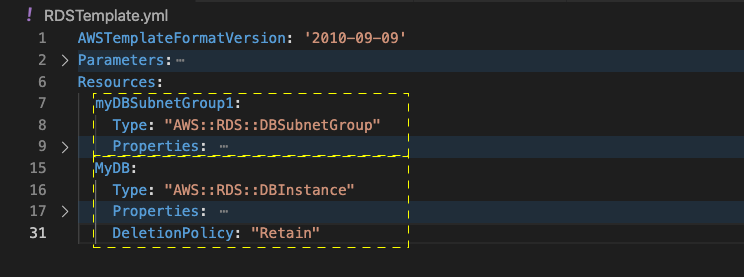

# Storage and Databases

## RDS Databases ##

### Persisting Data

- Most applications need their data to persist and not be lost, which requires a database.
- We don't want a database to be a single point of failure, so we'll use resources that are designed for reliability. For example, RDS for the database, and S3 for the filestore.
- Relational Database Service (RDS): AWS service for creating databases.

### Choosing a database
- AWS Aurora and MySQL have no additional licensing costs. Microsoft SQL Server will have additional licensing costs.
### A single RDS Server can host multiple databases
- Note that you can use a single RDS database that hosts multiple applications, each with different logins and users for those applications. In other words, you don’t need to create a separate RDS service for each application.

If I wanted to store information from my app and make sure it doesn't create a single point of failure for my application, I'd choose... [^RDS]

[^RDS]:All answers are correct. The problem with a database on EC2 is that you are responsible for eliminating that point of failure by creating additional replicas -- but it's certainly possible! Also note-worthy: DynamoDB works but it is a document store and not a relational database, which is great and sufficient for most cases but not all.

- Multi-AZ RDS Database
- Database on EC2 with replicas in another AZ
- DynamoDB Service

### Connectivity
- Subnet groups are needed for deploying in multiple AZs.
- We want to place our RDS in more than one Availability Zone (data center). We can place the RDS in two AZs to eliminate single point of failure and to have high availability.
- We created 4 subnets (2 private and 2 public), so the RDS can potentially be duplicated in all four subnets.
- However, keep in mind that we usually prefer to put databases in a private subnet, for security. There may be use cases where you put a database in a public subnet but generally put it in the private subnets.

### Database Accessibility
Usually, don't make a database public.

- We'll choose "No" for public accessibility" to keep a database private.
- We'd normally use a private IP address to access a database.

### VPC Security Groups
- **Default** means every resource in the VPC can talk to any other resource that is within that same VPC. We'll keep this default, to allow resources in the VPC to reach the database.

### Encryption
- We can use encryption for sensitive production workloads. We can disable encryption for our database here. This will encrypt everything in our database. 
### RDS Running cost notice
- Be sure to **delete any RDS databases** that you don’t need once you are done practicing because it can be very expensive if you forget it and leave it running for a while!

### Questions and Answers
Your database can only be accessed from other resources that have the appropriate ____ assigned to them.
- Security Group

Accessing server and services via TCP ports is a key networking concept that is governed by Security Groups within your private cloud.

## RDS - Create Aurora Database

Sé hacer todo, lo único importante es sobre Conectividad.

Use the following details:

| Field                       | Value                                    |
| -                           | -                                        |
| Virtual private cloud (VPC) | Choose the one available in your account |
| Subnet group                | Create a new subnet group (first-time)   |
| Public. access              | No                                       |
| VPC security group          | Choose existing default                  |

The default implies that everything within the vpc can talk to each other.

If we have the username, password, the endpoint and access to port 3306, you just need to provide this values as environment variables to your app in your server and you should be able to connect to your database.

### Q&A

When should your database have a read replica?
- When you want to accommodate statistical reporting and other read-only queries.

## Using Cloud Formation

- Note that since setting up a database is usually a one-time event, you can just use the console (point and click) to create the database server instead of writing CloudFormation code. Using CloudFormation is still an option if you choose.

### CloudFormation retention policy

- You'll want your data to persist even if your stack of resources is updated or deleted.
- Retention Policy: keeps a service even if the entire stack of infrastructure is marked for removal. In CloudFormation, the syntax is `DeletionPolicy: retain`. This is very useful to assign to your data storage (database, file storage), to make sure that your data is saved even when the stack is updated or deleted.

## S3

When to use Filestores
- Use filestores instead of databases for large files, such as videos and text documents.
- Configuration files and sensitive encrypted data are best stored in specific filestores rather than inside the servers. Autoscaling groups may create or destroy servers, so keep data that you want to persist in separate resources such as a filestore.

Knowing that the server can be discarded by the auto-scaling group, which of these files can I safely place in it anyway? (Pick three below.)
- Intermediate steps generated by a build process
- Temporary calculations leading to a result
- Test files

- Choose a DNS compliant name for the S3 bucket.

### Command line arguments
`aws s3 ls <link to S3 bucket>`

This line above lists files in the S3 bucket.

`aws s3 cp <file name> <link to S3 bucket>`

This line above copies a file from your local machine to the S3 bucket.

### Versioning
- You can keep past versions of your S3 bucket, which means that deleted files will still exist in prior versions of your S3 bucket.

S3 is cheaper because it’s slower and not meant for data processing that requires really fast I/O operations.

### Key Points
- S3 can be used to store your config files, media or log files.
- Your servers don't need credentials to access S3 provided they have a role assigned.
- We recommend you choose RDS as opposed to installing a database in your own servers that you have to manage and back up yourself.

## Exercises

Use the existing stack's resources, such as VPC, Subnets, and Security groups, that you have already created in your previous lessons.

Use the existing resources for the current exercises

### Exercise 1
Deploy a MySQL database
Create a CloudFormation script that deploys a MySQL DB with an associated security group.

- On the EC2 Console, create a security group that you'll associate with EC2 instances and RDS.
- Using CloudFormation, create a script that uses your security group and creates an REDS MySQL DB.

### Hint
- Use the starter code as shown in the snapshot below, and refer to the AWS documentation, AWS::RDS::DBInstance and AWS::RDS::DBSubnetGroup, for choosing the right set of properties.

Template starter code

### Bonus Steps

- Export a few resources, such as private Subnet IDs, from your previous stack. Then only you can cross-reference the resources from another stack, such as using:
`Fn::ImportValue: <Exported_value>`
- Use parameters from a separate file to make your template script reusable. In your new template file, use the substitution function, !Sub "${parameter} to refer to any parameter variable.

### Solution
- A Subnet group created, a Security Group that will control access in and out of your database.
- A user name and a password that will serve as the master for this db server. These should be the parameters in your script.
- You'll also need subnets, ideally 2.

### Best Practice
- Add DeletionPolicy and set it to Retain at the bottom of your DB Creation script. This way you don't lose your database if you accidentally delete your stack. (Keep this in mind if you indeed intend to delete this DB when done practicing)

`aws cloudformation create-stack  --stack-name RDSstack --region us-west-2 --template-body file://RDSTemplate.yml --parameters file://RDSparameters.json --capabilities "CAPABILITY_IAM" "CAPABILITY_NAMED_IAM"`

Don't forget to change the region, security groups, and subnet IDs as applicable to you. The solution files are available in this GitHub repository. Refer to the following files:

RDSparameters.json
RDSTemplate.yml

In the Solutions folder.

### Recommended best practices for S3 Storage

Remember to keep S3 as private as possible, never “Open to the world”

If you need to share files publicly, use expiring pre-signed URLs as recommended

If your web application captures incoming files, such as PDFs or Photos, capture those to local, temporary storage first, --which is really fast -- and then move the data to S3

Finally, when creating IAM Roles, be sure to limit access to a specific bucket and not all of them!.

