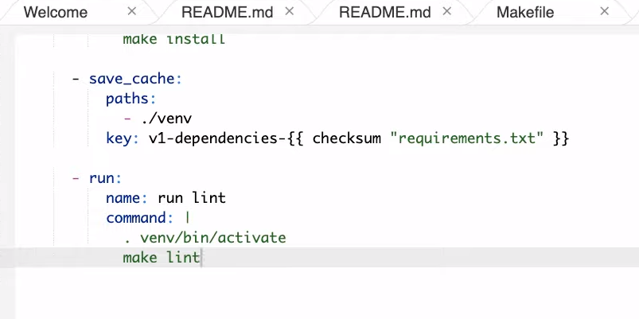

# Containerization of an Existing Application


## Exercise: Docker Based Apps ##

### Instructions
- Navigate to the Lesson-3-Containerization directory in the [Github repo.](https://github.com/udacity/DevOps_Microservices)
- Check out the pre-built Flask app that will be containerized. If you haven't used Flask before, you can check out this free Udacity course, or check out Flask's documentation.
- Look through the Dockerfile for the container (also included below).
- Look through the Makefile to be run within the container.

The only real new thing so far is the inclusion of the Flask app - you got familiar with Dockerfiles and Makefiles in the Using Docker Format Containers Lesson, as well as how to create them. There are some additional steps we still want to go through to get the App up and running, but the important thing to notice here is that it doesn't necessarily matter what the application itself is, you can still easily containerize it.

### Noah's Dockerfile
The Dockerfile in Noah's video is provided below:

```dockerfile
FROM python:3.7.3-stretch

# Working Directory
WORKDIR /app

# Copy source code to working directory
COPY . flask_app/web.py /app/

# Install packages from requirements.txt
# hadolint ignore=DL3013
RUN pip install --upgrade pip &&\
    pip install --trusted-host pypi.python.org -r requirements.txt

# Expose port 80
EXPOSE 80

# Run app.py at container launch
CMD ["python", "web.py"]
```


## Setting up Cloud 9


1. Create Environment in Cloud 9
2. Create repo and link it 
3. Select Python for .gitignore This will make sure that there aren't garbage files that check into your project.
4. Create virtual env and activate it. 
5. Create Makefile

```makefile
setup:
	python3 -m venv ~/.repo

install:
	pip install --upgrade pip &&\
		pip install -r requirements.txt

test:
	#python -m pytest -vv --cov=myrepolib tests/*.py
	#python -m pytest --nbval notebook.ipynb

lint:
	pylint --disable=R,C,W1203,W1202 hello.py

all: install lint test
```
1. Create `requirements.txt`
2. Run `make install`. 
3. Go to circle circle ci -> add project.
4. Create .circleci in cloud9 and config.yml inside this folder.
   - Copy sample config.yml but change to our own installation process with
```yaml
make install 
```

instead of `pip install -r requirements.txt`





We can now add status badge and paste it in README.


## Copying an Application ##


Make sure to add the additional line to your Dockerfile before moving on!

```dockerfile
COPY . nlib /app/
```

The updated Dockerfile should look like this:

```dockerfile
FROM python:3.7.3-stretch

# Working Directory
WORKDIR /app

# Copy source code to working directory
COPY . flask_app/web.py /app/
COPY . nlib /app/

# Install packages from requirements.txt
# hadolint ignore=DL3013
RUN pip install --upgrade pip &&\
    pip install --trusted-host pypi.python.org -r requirements.txt

# Expose port 80
EXPOSE 80

# Run app.py at container launch
CMD ["python", "web.py"]
```


> `CMD ["python", "web.py"]` makes sure that the docker runs web.py with python interpreter at the start.

> One way to reason about Dockerfiles is they contain both code and the environment the code will run in - and how the Docker container may communicate outside the container.


Important steps to consider when copying an application to Docker:
- Libraries may need to be installed
- It is important to have a way to test the application
- Understanding which port to expose from the container
- Understanding which port to expose from the host


Two ports to thing about. The port that the application itself will run and the other one is the port that it's exposed to me on my host `EXPOSE 80` exposes the host port which is port 80.


## App Start ##


### Common Issues Running a Container
There are a few common issues that crop up when starting a container or building one for the first time. Let's walk through each problem and then present a solution for them.

### What Goes in a Dockerfile if You [Need to Write to the Host Filesystem?](https://docs.docker.com/storage/volumes/)
In the following example the docker volume command is used to create a volume and then later it is mounted to the container.

```
>  /tmp docker volume create docker-data
docker-data
>  /tmp docker volume ls
DRIVER              VOLUME NAME
local               docker-data
>  /tmp docker run -d \
  --name devtest \
  --mount source=docker-data,target=/app \
  ubuntu:latest
6cef681d9d3b06788d0f461665919b3bf2d32e6c6cc62e2dbab02b05e77769f4
```

### How Do You [Configure Logging](https://docs.docker.com/config/containers/logging/configure/) for a Docker Container?
You can configure logging for a Docker container by selecting the type of log driver, in this example `json-file`, and whether it is blocking or non-blocking. This example shows a configuration that uses `json-file` and `mode=non-blocking` for an Ubuntu container. The `non-blocking` mode ensures that the application won't fail in a non-deterministic manner. Make sure to read the [Docker logging](https://docs.docker.com/config/containers/logging/configure/) guide on different logging options.


```
>  /tmp docker run -it --log-driver json-file --log-opt mode=non-blocking ubuntu 
root@551f89012f30:/#
```

### How do You Map Ports to the External Host?

The Docker container has an internal set of ports that [must be exposed to the host and mapped.](https://docs.docker.com/engine/reference/commandline/port/) One of the easiest ways to see what ports are exposed to the host is by running the `docker port <container name>` command. Here is an example of what that looks like against a foo named container.

```
$ docker port foo
7000/tcp -> 0.0.0.0:2000
9000/tcp -> 0.0.0.0:3000
```

What about actually mapping the ports? You can do that using the -p flag as shown. You can read more about [Docker run flags here.](https://docs.docker.com/engine/reference/commandline/run/)

`docker run -p 127.0.0.1:80:9999/tcp ubuntu bash` 

### What about Configuring Memory, CPU and GPU?

You can configure docker run to accept flags for setting Memory, CPU and GPU. You can read [more about it here](https://docs.docker.com/config/containers/resource_constraints/) in the official documentation. Here is a brief example of setting the CPU.

`docker run -it --cpus=".25" ubuntu /bin/bash`

This tells this container to use at max only 25% of the CPU every second.

## Exercise: Build and Deploy ##

https://www.youtube.com/watch?v=EmF8l9Ew2i4

### Instructions
- Run `docker build --tag=api .` from the directory containing your Dockerfile. If you want to use a different tag name, feel free to do so.
- Wait for awhile as your Docker image is built (note: you are welcome to get a jump start on the next exercise, if desired, while this completes).
- Use `docker image ls` to make sure your new Docker image is shown. You won't see the other containers in Noah's video - those are all of his other Docker images on his computer.
- Run `docker run -p 8000:5001 api.` If you changed the tag name in the first step, make sure to replace api here with your tag name. Note above that the -p notes port 5001 from the Docker container (as specified in web.py for our flask app) is exposed on port 8000 on the host computer.
- The container will tell us the Flask app is running on port 5001, but since we exposed port 8000 on our host to it, we will actually access the running app using port 8000. We haven't looked at Swagger documentation before here, but you can access it at http://localhost:8000 in your browser when the docker container is running. Note that Swagger is part of the implementation of this specific Flask app - if you make your own Flask app, Swagger won't be included unless you include it in your own code.
- Test out one of the Swagger commands from the running containerized app.
- HINT: Remember that you can access the underlying container by opening up a web browser on your host machine and typing in http://localhost:8000. The host container maps a port to the internal container and this is how the web service is exposed to your browser.

### More on Swagger
Swagger helps provide automated documentation for your APIs using the OpenAPI specifications.

Check out an example of a Swagger-based API here. Udacity actually uses Swagger for its internal-facing APIs!


## Exercise: Containerize an App
Containers are a powerful mechanism to reuse code from experts. Test your knowledge of the power of containers in the following exercise by building a container and containerizing an app from scratch!

### Instructions
- Create an empty Dockerfile using the touch command
- Use the FROM command and reference the latest version of Python here.
- Include the "Hello World" Flask example as an app within your container
  - Copy any relevant directories and libraries in the Dockerfile
  - Make sure any relevant requirements are installed in the Dockerfile
  - Expose the port from the Flask example oin the Dockerfile - make sure you check which one is used by the example!
  - Have your Dockerfile run the relevant commands for your app
- Build your container
- Run the container, opening up a bash shell
- Verify the correct version of Python is installed: python --version

### Tips
Below are potential options for building and running your container.

To build your container, if tagging your container as my-python-app:

- `$ docker build -t my-python-app .`
To run the container, given my-python-app as the image tag and my-running-app as the container name:

- `$ docker run -it --rm --name my-running-app my-python-app` 
