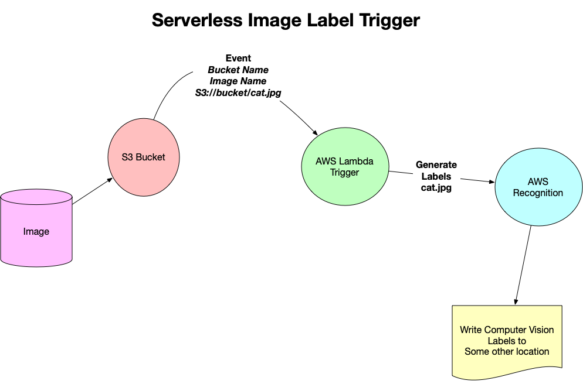

# Deploy an Event-Driven Microservice


## Model for Serverless ##


Though we'll be using AWS cloud tools, there are a number of other providers that you can use to build serverless applications with auto-scaling capabilities. The skills you learn in this lesson will be widely applicable to these other platforms. Some of the larger, cloud providers include:

- Amazon Web Services [ Chalice & Cloud Formation]
- Terraform
- Google Cloud Platform
- Microsoft Azure

And you are welcome to check these out, especially if you have a platform that you already prefer.


Chalice is a decorator based approach where you installed it, you put a decorator on top of a function and that function gets automatically gets deployed as a web service. 


Events can be:
- Uploading a file
- Putting a message in a Queue
- Time


## Benefits of FaaS ##


- Simplicity
- Event Based
- Can be more cost-effective
- Leverage Cloud-Native technologies


### Why FaaS?
- Higher developer ROI because server infrastructure management no longer required.
- More time focused on writing code, which leads to a higher developer velocity.
- Functional programming is a design well suited to distributed computing. Instead of scaling your entire application, you can scale your functions automatically and independently with usage.


## Characteristics of Cloud-Native Systems ##

- Elastic
- Fault-tolerant
- Designed for failure: design principle of cloud based systems. [^failure]

[^failure]:You can deploy your system in 3 availability zones and if one fails, your app is still going to be running. **You plan on things to be constantly failing.**
- Event-driven

### What are Some Characteristics of Cloud-Native Systems?

### Microservice oriented
Microservices more closely map business logic to code. These systems can be updated and developed independently. A good example of a Microservice architecture would be a Python AWS Lambda application that uses API Gateway.

### Elastic
Elastic systems can automatically scale to meet increased load without the involvement of humans. These same systems can then scale down again when load diminishes. By eliminating human touchpoints, which are error-prone, the quality increases. Likewise, because the system can scale up and down for demand, it is more efficient to run and costs less.

### Continuous Delivery
Cloud-native systems leverage IAC (infrastructure as code) to fully define the infrastructure. This means that deployment can target a dynamically created environment and that software can be automatically deployed to a new environment as it is created. Humans again are eliminated from the process of deployment increasing quality.

### DevOps
Cloud-native systems utilize DevOps. DevOps is a combination of automation, processes, and tools that increase automation, collaboration, and operational efficiency. Using Python for DevOps is a common way this automation is achieved.

### Agility
The agility of developing solutions improves. The cloud speeds up development time and increases quality through the use of IaC (Infrastructure as Code) and Continuous Delivery.

### Composable
Cloud-Native solutions are highly composable. The service design is one of integration. At the minimum, each service has an Application Programming Interface (API) that is consistent and discoverable. Other traits include well-defined behaviors for registration, discovery, and request management.

### Pros:
- Ability to leverage near infinite resources of the cloud: Compute, Disk I/O, Storage, and Memory.
- No up-front costs and resources can be metered to meet demand like an electric or water utility.
- Applications are able to “go global” immediately with no extra investment.
- Increased reliability is increased as many cloud services are themselves highly available. A good example is Amazon S3 which has nine nine’s availability or is 99.999999999% reliable.
- Security is improved by consolidating to a centralized security model where there is a shared security partnership with the cloud vendor. They take care of portions of security such as access to the physical data center.
- The speed applications can be developed and tested are dramatically improved. With concepts like IAC (Infrastructure as Code), complete replicas of a production environment can be provisioned, tested, and then destroyed. This leads to increased quality of software and speed in which software can be developed.
### Cons:
- Risk of creating systems that rely on a specific cloud vendor.
- The cost involved in migrating an application to a different architecture.
- A current organization may need to hire a new workforce trained to use the cloud or retrain their workforce.

### What is Fault-Tolerance?
Fault Tolerance - the property that enables a system to continue operating properly in the event of the failure of one or more of its components.

An example is a typical car, which is designed so it will continue to be drivable if one of the tires is punctured or damaged.
In computer systems, a fault-tolerant design enables a system to continue its intended operation, possibly at a reduced level, rather than failing completely, when some part of the system fails.


## AWS Account and Resources

Create a Cloud9 Environment following https://github.com/noahgift/awslambda/blob/master/beginners_guide_aws_lambda.ipynb

## Lambda Functions

### What is AWS Lambda?
AWS Lambda is a new category of computing where business logic can be directly deployed to a production environment without thinking about servers. Another word for this is serverless or FaaS (Function As A Service). Some of the benefits of AWS Lambda include no servers to manage, continuous scaling, and billing at the sub-second level.

Another benefit of AWS Lambda includes being part of an ecosystem designed to exploit the capability. Here are two examples of AWS Lambda. The first example is AWS Step Functions. They build upon AWS Lambda to create more sophisticated workflows like polling for a job to finish and performing an action. The second example is AWS DeepLens (a computer vision device). It uses AWS Lambda to serve out predictions. Finally, if you look closely, almost every service on AWS can utilize AWS Lambda.

The AWS ecosystem allows Lambda functions to respond to events instead of constantly running. This is similar to a motion detector that turns on a light in the garage. The duration the light may run for could be only a few hours per year. If the light switch was manually triggered it is possible the light would be run constantly for 365 days in the year.

The AWS Lambda ecosystem allows integration with other core services in AWS through triggers. An example of a trigger would be a movie file that is uploaded to Amazon S3 storage. An AWS Lambda function could be triggered that uses an AWS API to transcode the movie file to a different code or to add captioning.


**Cloning repo**

1. `ssh-keygen -t rsa`
2. `cat /path/to/file/.ssh/id_rsa.pub`
3. copy the key
4. Add it to github
5. `git clone https://github.com/noahgift/awslambda.git`

**We resized the instance with the following:**


```bash
#!/bin/bash

# Specify the desired volume size in GiB as a command line argument. If not specified, default to 20 GiB.
SIZE=${1:-20}

# Get the ID of the environment host Amazon EC2 instance.
INSTANCEID=$(curl http://169.254.169.254/latest/meta-data/instance-id)

# Get the ID of the Amazon EBS volume associated with the instance.
VOLUMEID=$(aws ec2 describe-instances \
  --instance-id $INSTANCEID \
  --query "Reservations[0].Instances[0].BlockDeviceMappings[0].Ebs.VolumeId" \
  --output text)

# Resize the EBS volume.
aws ec2 modify-volume --volume-id $VOLUMEID --size $SIZE

# Wait for the resize to finish.
while [ \
  "$(aws ec2 describe-volumes-modifications \
    --volume-id $VOLUMEID \
    --filters Name=modification-state,Values="optimizing","completed" \
    --query "length(VolumesModifications)"\
    --output text)" != "1" ]; do
sleep 1
done

#Check if we're on an NVMe filesystem
if [ $(readlink -f /dev/xvda) = "/dev/xvda" ]
then
  # Rewrite the partition table so that the partition takes up all the space that it can.
  sudo growpart /dev/xvda 1

  # Expand the size of the file system.
  # Check if we are on AL2
  STR=$(cat /etc/os-release)
  SUB="VERSION_ID=\"2\""
  if [[ "$STR" == *"$SUB"* ]]
  then
    sudo xfs_growfs -d /
  else
    sudo resize2fs /dev/xvda1
  fi

else
  # Rewrite the partition table so that the partition takes up all the space that it can.
  sudo growpart /dev/nvme0n1 1

  # Expand the size of the file system.
  # Check if we're on AL2
  STR=$(cat /etc/os-release)
  SUB="VERSION_ID=\"2\""
  if [[ "$STR" == *"$SUB"* ]]
  then
    sudo xfs_growfs -d /
  else
    sudo resize2fs /dev/nvme0n1p1
  fi
fi
```


The reason is to get more room to our containers and such. 


**The repo for an example: https://github.com/udacity/DevOps_Microservices/blob/master/Supporting-material/beginners_guide_aws_lambda.ipynb**

**An the example for the helloworld lambda creation and testing is: https://github.com/noahgift/awslambda**


The steps for creating the lambda function are:
1. `sam init` -> We give it a name
2. `cd HelloWorldLambda`
3. `sam build`
4. `sam deploy --guided`
5. Go to Amazon ECR and create a repository.
6. Paste the URI from the repository to the `sam deploy --guided`
7. Follow the instructions. 
8. Once is deployed, you can invoke it.
9. `curl` Value of API Gateway endpoint URL or go to the function and test it in lambda.


## Deploying and Testing ##

1. `sam local invoke` This will test the function
2. `sam local start-api` This will test the api


## Tutorial: Making a Change ##

Now, you're ready to deploy a more complex Function as a Service (FaaS). The next interactive tutorial will be about event-handling for a function that automatically makes the smallest amount of change given an input amount of US currency. For example, given $0.63, the function should output: 2 quarters, 1 dime, 3 pennies.

It's suggested that you copy this tutorial code into your Cloud9 environment in a different, working tab so you can interact with and test the code as you go through the instructional videos in this tab. This way you can toggle between learning new skills and applying new skills.

To copy this code, you have two options:

> Copy the code directly from Github
> Clone the entire repo from Github and open the appropriate tutorial code from the path Lesson-1-Lambda-functions > make-change-tutorial. You can either download the repository with git clone https://github.com/udacity/DevOps_Microservices.git, or download it as a zip file.

### Instructions
- Refer to the previous screenshot in Build Lambda Change Function in AWS Cloud9. Notice that by “right-clicking” on the AWS Lambda function in AWS Cloud9 it can be tested using Lamba(local)

- Create a new AWS Lambda functional locally in AWS Cloud9 and copy/paste the code into the lambda_function file that is created.

- Write a test event, passing in some $ amount as a request to your function, and view the JSON response. Remember this is accomplished by “right-clicking” on the AWS Lambda function. The payload needs to be JSON formatted as shown in the screenshot. For example, `{“amount”:1.45}.`

- Once you get that working, feel free to try new values by putting different amounts into the JSON payload. For example, {“amount”:1.50}.

- Optional Challenge #1: If you want to really challenge yourself, deploy the lambda by right-clicking on it and selecting “deploy”. Now test it out in the AWS Lambda Console and make it give correct change. [You can get inspiration on how to do that here.](https://youtu.be/AlRUeNFuObk)

- Optional Challenge #2: If you want to really challenge yourself, [build your own text translation AWS Lambda as shown here.](https://www.youtube.com/watch?v=TaZqirmuBZM)
This is a tutorial, meant to be demonstrative and educational; you do not need to modify any code here. You only need to “run it”.


Another tutorial: [Semlessly Scale Predictions with AWS Lambda and MXnet](https://aws.amazon.com/blogs/compute/seamlessly-scale-predictions-with-aws-lambda-and-mxnet/)


## Event-Handling ##


> Aquí hay uno bueno de Noah Gift en coursera más bara https://www.coursera.org/specializations/building-cloud-computing-solutions-at-scale#courses


Here we use https://github.com/noahgift/serverless-cookbook/blob/main/aws-lambda-image-label-s3-trigger.py code to trigger an event in a lambda function





## Events & Response ##


 
When a car approaches a traffic light, they can expect signals to output many things: turn left, stop (red), slow (yellow), go (green). Sometimes if there is a problem with the light, it may flash red. Websites and APIs work in a similar fashion. There are codes (signals) that are returned that indicate what a web request is doing:

- 1xx (request received and processing)
- 2xx (request successful)
- 3xx (redirection)
- 4xx (client error
- 5xx (server error)

In practice this comes into play when testing an application or setting up alerts. For monitoring that an error code that had, say 500 would signal a problem and a 200 would be a success.

### Events & Response
Event-handling and creating a response are really important aspects of Functions as a Service. Take these quizzes to gauge how well you understand these aspects.


