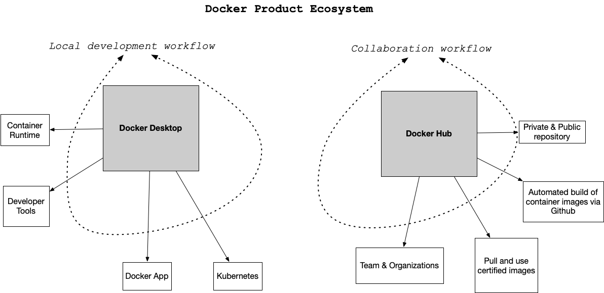
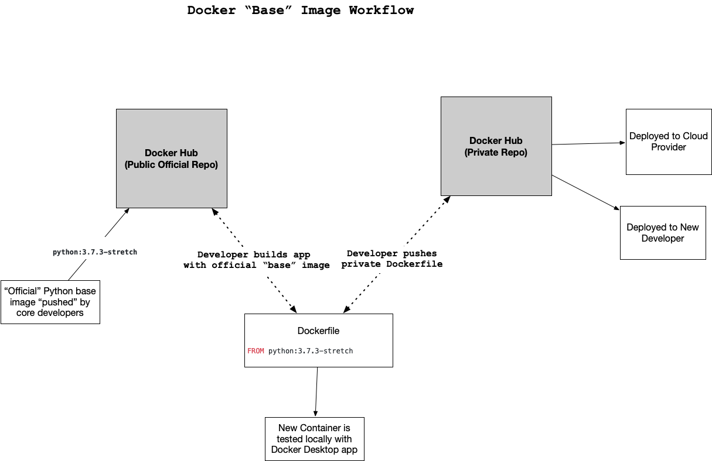
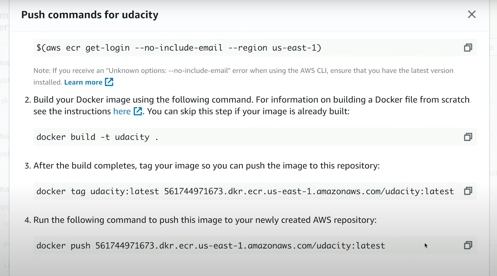

# Using Docker Format Containers




## Docker Container ##

### Docker Desktop Overview
The desktop application contains the container runtime which allows containers to execute. The Docker App itself orchestrates the local development workflow including the ability to use Kubernetes, which is an open-source system for managing containerized applications that came out of Google.

### Docker Hub Overview
So what is Docker Hub and what problem does it solve? Just as the git source code ecosystem has local developer tools like vim, emacs, Visual Studio Code or XCode that work with it, Docker Desktop works with Docker containers and allows for local use and development.

When collaborating with git outside of the local environment, developers often use platforms like Github or Gitlab to communicate with other parties and share code. Docker Hub works in a similar way. Docker Hub allows developers to share docker containers that can serve as a base image for building new solutions.

These base images can be built by experts and certified to be high quality: i.e. the [official Python developers have a base image.](https://hub.docker.com/_/python) This allows a developer to leverage the expertise of the true expert on a particular software component and improve the overall quality of their container. This is a similar concept to using a library developed by another developer versus writing it yourself.


### Real-World Examples of Containers
What problem do Docker format containers solve? In a nutshell, the operating system runtime can be packaged along with the code, and this solves a particularly complicated problem with a long history. There is a famous meme that goes "It works on my machine!". While this is often told as a joke to illustrate the complexity of deploying software, it is also true. Containers solve this exact problem. If the code works in a container, then the container configuration can be checked in as code. Another way to describe this concept is that the actual Infrastructure is treated as code. This is called IaC (Infrastructure as Code).

Here are a few specific examples:

### Developer Shares Local Project
A developer can work on a web application that uses flask (a popular Python web framework). The installation and configuration of the underlying operating system is handled by the Docker container file. Another team member can checkout the code and use `docker run` to run the project. This eliminates what could be a multi-day problem of configuring a laptop correctly to run a software project.

### Data Scientist shares Jupyter Notebook with a Researcher at another University
A data scientist working with jupyter style notebooks wants to share a complex data science project that has multiple dependencies on C, Fortran, R, and Python code. They package up the runtime as a Docker container and eliminate the back and forth over several weeks that occurs when sharing a project like this.

### A Machine Learning Engineer Load Tests a Production Machine Learning Model
A Machine learning engineer has been tasked with taking a new model and deploying it to production. Previously, they were concerned about how to accurately test the accuracy of the new model before committing to it. The model recommends products to paying customers and, if it is inaccurate, it costs the company a lot of money. Using containers, it is possible to deploy the model to a fraction of the customers, only 10%, and if there are problems, it can be quickly reverted. If the model performs well, it can quickly replace the existing models.

### Why Docker Containers vs Virtual Machines?
What is the difference between a container and a virtual machine? Here is a breakdown:

- Size: Containers are much smaller than Virtual Machines (VM) and run as isolated processes versus virtualized hardware. VMs can be GBs while containers can be MBs.
- Speed: Virtual Machines can be slow to boot and take minutes to launch. A container can spawn much more quickly typically in seconds.
- Composability: Containers are designed to be programmatically built and are defined as source code in an Infrastructure as Code project (IaC). Virtual Machines are often replicas of a manually built system. Containers make IaC workflows possible because they are defined as a file and checked into source control alongside the project’s source code.


## Makefiles ##


### Setup Makefile
Just like vim, mastering Makefiles can take years, but a minimalistic approach provides immediate benefits. A main benefit to a Makefile is the ability to enforce a convention. If everytime you work a project you follow a few simple steps, it reduces the possibility of errors in building and testing a project.

A typical Python project can be improved by adding a Makefile with the following steps: make setup, make install, make test, make lint and make all.

### Additional References ###
- [More on Makefiles](https://www.gnu.org/software/make/manual/html_node/Standard-Targets.html#Standard-Targets)
- [Makefile tutorial](http://www.cs.colby.edu/maxwell/courses/tutorials/maketutor/)


## Linting and CircleCI ##

https://www.youtube.com/watch?v=IyBwcaVl1f4

### Extending a Makefile for use with Docker Containers
Beyond the simple Makefile, it is also useful to extend it to do other things. An example of this is as follows:

### Example Makefile for Docker and CircleCI
```makefile
setup:
    python3 -m venv ~/.container-revolution-devops

install:
    pip install --upgrade pip &&\
        pip install -r requirements.txt

test:
    #python -m pytest -vv --cov=myrepolib tests/*.py
    #python -m pytest --nbval notebook.ipynb

validate-circleci:
    # See https://circleci.com/docs/2.0/local-cli/#processing-a-config
    circleci config process .circleci/config.yml

run-circleci-local:
    # See https://circleci.com/docs/2.0/local-cli/#running-a-job
    circleci local execute

lint:
    hadolint demos/flask-sklearn/Dockerfile
    pylint --disable=R,C,W1203,W1202 demos/**/**.py

all: install lint test
```

A `Dockerfile` linter is called `hadolint` checks for bugs in a `Dockerfile`. A [local version of the CircleCI build system](https://circleci.com/docs/2.0/local-cli/) allows for testing in the same environment as the SaaS offering. The minimalist approach is still present. A user only needs to remember to use the same commands: `make install`, `make lint` and `make test`, but the `lint` step is more complete and powerful with the inclusion of `Dockerfile` as well as Python linting.

> Notes about installing `hadolint` and `circleci`: If you are on OS X you can brew install hadolint. If you are on another platform follow the instructions from the hadolint GitHub repo. To install the local version of `circleci` on OS X or Linux you can run `curl -fLSs https://circle.ci/cli | bash` or follow the official instructions for [local version of the CircleCI build system.](https://circleci.com/docs/2.0/local-cli/)


### CricleCI lint workflow ###

https://www.youtube.com/watch?v=IyBwcaVl1f4

The linting is in the code in Lesson2 / class demos.


### Using CircleCI ###

Here are the steps Noah took in the above video:

- Added to the Makefile:

```makefile
validate-circleci:
    circleci config process .circleci/config.yml

run-circleci-local:
    circleci local execute

lint: # This line should already be there with regular pylint
    hadolint path/to/Dockerfile
```

- Runs hadolint Dockerfile
- Uses the config.yml file within a .circleci directory
- In the parent directory, runs make run-circleci-local to simulate what will happen in the remote CircleCI environment
- Uses the CircleCI website (a related blog post is linked below) to test remotely

### Notes about how to run this example
These instructions work the best on a Linux or OS X system or inside a Docker container itself. One way to dramatically simplify installation and configuration in the Cloud is to use a Cloud based development environment like AWS Cloud9. This was shown in the AWS Lambda examples in Lesson 1. This allows you to eliminate a huge portion of the problems you can run into when installing software. If you are expert at installing software on Linux, Windows or OS X, then this may not matter. If you want the easiest path to running these commands, use AWS Cloud9.

### Reference
- [Increase reliability in data science and machine learning projects with CircleCI](https://circleci.com/blog/increase-reliability-in-data-science-and-machine-learning-projects-with-circleci/)
- AWS Cloud9


### Example in Cloud9  ###

https://www.youtube.com/watch?v=v61ZF-UcvGo

1. Create an environment in Cloud9.  
2. `ssh-keygen -t rsa`
3. Create ssh in github. 
4. Create Makefile, requirements.txt, Dockerfile and app.py

**dockerfile**
```dockerfile
FROM python:3.7.3-stretch

# Working directory
WORKDIR /app

# Install packages from requirements.txt
# hadolint ignore-DL3013
RUN pip install --upgrade pip &&\
    pip install --trusted-host pypi.python.org -r requirements.txt
```


**app.py**
```python
#!/user/bin/env python
import click

@click.command()
def hello():
    click.echo('Hello World!')
    
if __name__=='__main__':
    hello()
```


The makefile came from here: https://github.com/noahgift/container-revolution-devops-microservices


```makefile
setup:
	python3 -m venv ~/.container-revolution-devops

install:
	pip install --upgrade pip &&\
		pip install -r requirements.txt

test:
	#python -m pytest -vv --cov=myrepolib tests/*.py
	#python -m pytest --nbval notebook.ipynb

validate-circleci:
	# See https://circleci.com/docs/2.0/local-cli/#processing-a-config
	circleci config process .circleci/config.yml

run-circleci-local:
	# See https://circleci.com/docs/2.0/local-cli/#running-a-job
	circleci local execute

lint:
	hadolint demos/flask-sklearn/Dockerfile
	pylint --disable=R,C,W1203,W1202 demos/**/**.py

all: install lint test
```


The makefile will allow me to use hadolint
We need to get hadolint in this environment:

- `wget -O /bin/hadolint https://github.com/hadolint/hadolint/releases/download/v1.17.5/hadolint-Linux-x86-64 && chmod +x /bin/hadolint`
- `sudo chmod +x /bin/hadolint`
- `make lint`

We create an virtual env and install the `requirements.txt` file.


We now have everything to build.

- `docker build --tag=app .`
- `docker run -it app bash`


We now can use circle ci.

- `mkdir .circleci`
- `touch .circleci/config.yml`


```yaml
# Python CircleCI 2.0 configuration file
#
# Check https://circleci.com/docs/2.0/language-python/ for more details
#
version: 2
jobs:
  build:
    docker:
    # Use the same Docker base as the project
      - image: python:3.7.3-stretch

    working_directory: ~/repo

    steps:
      - checkout

      # Download and cache dependencies
      - restore_cache:
          keys:
            - v1-dependencies-{{ checksum "requirements.txt" }}
            # fallback to using the latest cache if no exact match is found
            - v1-dependencies-

      - run:
          name: install dependencies
          command: |
            python3 -m venv venv
            . venv/bin/activate
            make install
            # Install hadolint
            wget -O /bin/hadolint https://github.com/hadolint/hadolint/releases/download/v1.17.5/hadolint-Linux-x86_64 &&\
                chmod +x /bin/hadolint
      - save_cache:
          paths:
            - ./venv
          key: v1-dependencies-{{ checksum "requirements.txt" }}

      # run lint!
      - run:
          name: run lint
          command: |
            . venv/bin/activate
            make lint           
```


We can run circle ci in local mode to simulate the steps circle ci will do.


## Running Dockerfiles ##

### Using "base" images
One of the advantages of the Docker workflow for developers is the ability to use certified containers from the "official" development teams. In this diagram a developer uses the official Python base image which is developed by the core Python developers. This is accomplished by the FROM statement which loads in a previously created container image.



As the developer makes changes to the Dockerfile, they test locally, then push the changes to a private Docker Hub repo. After this, the changes can be used by a deployment process to a Cloud or by another developer.


You can find Noah's code [here](https://github.com/udacity/DevOps_Microservices/tree/master/Lesson-2-Docker-format-containers/class-demos), within the demos subdirectory. Note that he has begun filling out the Dockerfile and run_docker.sh files in the video.

### Docker Cheat Sheet
- Use `docker image` ls to see all of your created Docker images
- `docker run -it {image name} bash` ran Noah's Docker image

Here is a quick [Docker cheat sheet for your reference.](https://www.docker.com/sites/default/files/Docker_CheatSheet_08.09.2016_0.pdf)

Noah's Dockerfile
Below is Noah's Dockerfile for your reference:

```dockerfile
FROM python:3.7.3-stretch

# Working Directory
WORKDIR /app

# Copy source code to working directory
COPY . app.py /app/

# Install packages from requirements.txt
# hadolint ignore=DL3013
RUN pip install --upgrade pip &&\
    pip install --trusted-host pypi.python.org -r requirements.txt
```


## Exercise: Deploying to Amazon ECR ##


With a build server, local Docker file and lint files, we have everything built for our Python environment. The final step is to get this environment & microservice we've created deployed into an Amazon environment. We'll use Amazon's Elastic Container Registry (ECR) to do so. This allows us to put the whole bundled container and application onto Amazon.

In the below video, Noah walks through the steps necessary to deploy to Amazon ECR. You can follow along with the video, or additionally follow the exercise steps at the bottom of the page.



> Amazon ECR es "container registry" creo. al final del día es para tener tu container de manera local y ponerlo ahí para o hacer *deploy* a muchos nodos o para compartirlo con más personas.

Additional Reference
- [ECR Registry Upload](https://aws.amazon.com/blogs/compute/authenticating-amazon-ecr-repositories-for-docker-cli-with-credential-helper/)


