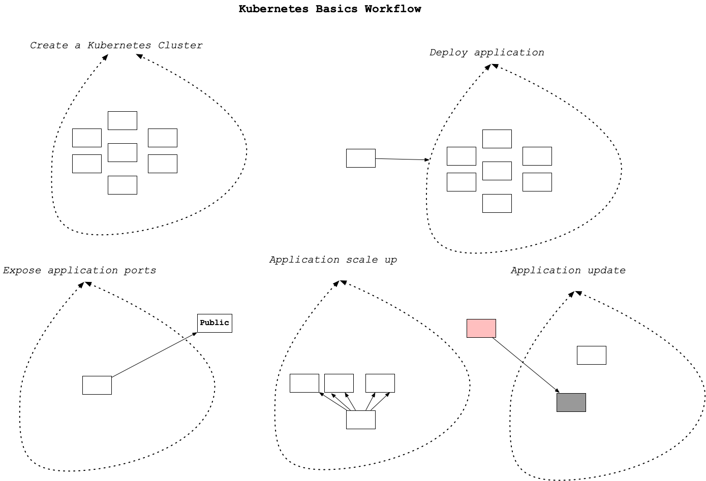
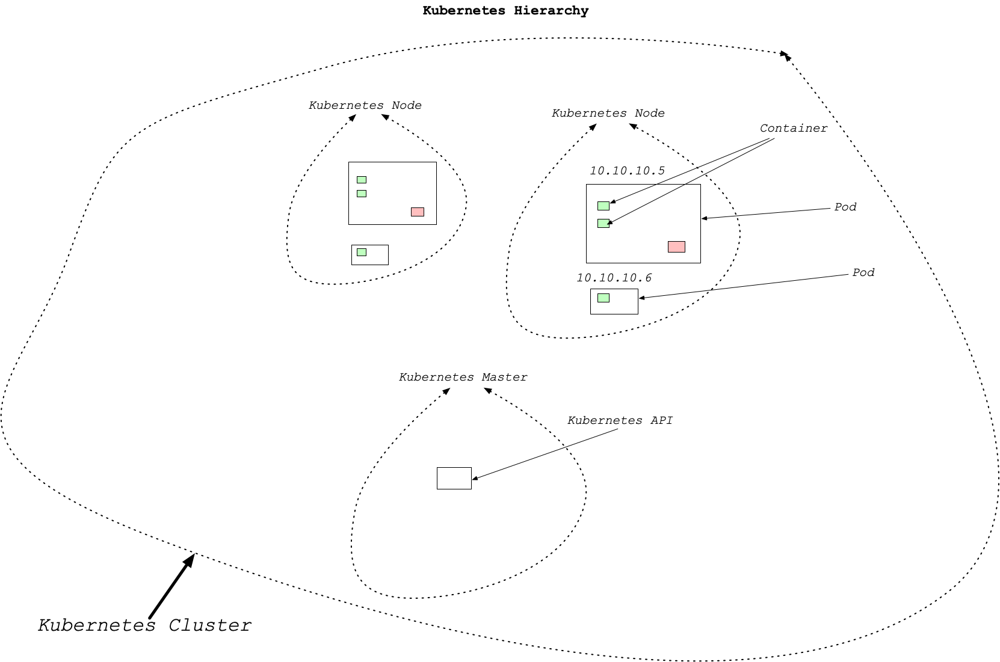

# Container Orchestration with Kubernetes

## Overview of Kubernetes ##

### What are the Basics of Kubernetes?
The core operations involved in Kubernetes include creating a Kubernetes Cluster, deploying an application into the cluster, exposing an application ports, scaling an application and updating an application.




### What is the Kubernetes (Cluster) Architecture?
The core of Kubernetes is the cluster. Containers run in the cluster. The core components of the cluster include a cluster master and nodes. Inside nodes there is another hierarchy. This is shown in the diagram. A Kubernetes node can contain multiple pods, which in turn can contain multiple containers and/or volumes.




### How do you Set Up a Kubernetes Cluster?
There are two main methods:

1. Set up a local cluster (preferably with Docker Desktop)
2. Provision a cloud cluster:
  - Amazon through Amazon EKS
  - Google through Google Kubernetes Engine GKE
  - Microsoft through Azure Kubernetes Service (AKS).

If you are using Docker and have enabled kubernetes then you already have a standalone Kubernetes server running. This would be the recommended way to get started with Kubernetes clusters.

### How do you Launch Containers in a Kubernetes Cluster?
Now that you have Kubernetes running via Docker desktop how do you launch a container? One of the [easiest ways is via](https://docs.docker.com/docker-for-mac/kubernetes/) the `docker stack deploy --compose-file` command.

The yaml example file looks like the following:

```yaml
version: '3.3'

services:
  web:
    image: dockersamples/k8s-wordsmith-web
    ports:
     - "80:80"

  words:
    image: dockersamples/k8s-wordsmith-api
    deploy:
      replicas: 5
      endpoint_mode: dnsrr
      resources:
        limits:
          memory: 50M
        reservations:
          memory: 50M

  db:
    image: dockersamples/k8s-wordsmith-db
```

This could be deployed with the following command:

`docker stack deploy --namespace my-app --compose-file /path/to/docker-compose.yml mystack`

You can follow the demo yourself, or read through a [quick primer](https://kubernetes.io/docs/tutorials/kubernetes-basics/create-cluster/cluster-intro/) beforehand:

Demo is here https://www.youtube.com/watch?v=wLYFNMVDNtc

- [Create a cluster](https://kubernetes.io/docs/tutorials/kubernetes-basics/create-cluster/cluster-interactive/)


### More on Kubernetes
To go more in-depth with Kubernetes, we also suggest going through the remaining starter tutorials on the [Kubernetes website:](https://kubernetes.io/docs/tutorials/kubernetes-basics/)

- [Deploy An App](https://kubernetes.io/docs/tutorials/kubernetes-basics/deploy-app/deploy-intro/)
- [Explore Your App](https://kubernetes.io/docs/tutorials/kubernetes-basics/explore/explore-intro/)
- [Expose Your App Publicly](https://kubernetes.io/docs/tutorials/kubernetes-basics/expose/expose-intro/)
- [Scale Your App](https://kubernetes.io/docs/tutorials/kubernetes-basics/scale/scale-intro/)
- [Update Your App](https://kubernetes.io/docs/tutorials/kubernetes-basics/scale/scale-intro/)


### Additional References
Here is a list of links to concepts in Kubernetes:

- kubectl
- [Pods](https://kubernetes.io/docs/concepts/workloads/pods/pod-overview/)
- [Containers](https://kubernetes.io/docs/concepts/containers/)
- [Clusters](https://kubernetes.io/docs/tutorials/clusters/)


## Monitoring, Logging and Debugging with Kubernetes

We covered Prometheus more in-depth in the previous course, so we'll focus more on how it integrates with Kubernetes here.

The [Prometheus Operator](https://github.com/coreos/prometheus-operator) helps to integrate Prometheus monitoring directly with Kubernetes. There is also the kube-prometheus package which includes additional helpful components (including the Prometheus Operator) for monitoring, as well as the [Prometheus Adapter.](https://github.com/directxman12/k8s-prometheus-adapter)

Prometheus is not the only monitoring tool available for Kubernetes though - if you are interested in other options as well, check out this [link.](https://kubernetes.io/docs/tasks/debug-application-cluster/resource-usage-monitoring/)

On the next page, you'll get to perform an exercise to get monitoring set up with Prometheus, as well as think through designing a monitoring system of your own.

### Reference
- [Prometheus](https://prometheus.io/)
- [Application Introspection and Debugging](https://kubernetes.io/docs/tasks/debug-application-cluster/debug-application-introspection/)

## Exercise: Prometheus Monitoring ##
https://www.youtube.com/watch?v=PStcuwCJtq0

### Exercise: Prometheus Monitoring
Monitoring is an essential component of DevOps best practices. In this exercise, you will set up Prometheus Monitoring.

### Alerting Theory
For this exercise you will:

- Set up Prometheus monitoring.
- Consider a normal distribution, "six sigma" and the 68-95-99.7 rule. Computer systems events are often normally distributed, meaning that all events within three standard deviations from the mean occur with 99.7 of the occurrences.
- Design a process that alerts senior engineers when events are greater than three standard deviations from the mean and write up how the alerts should work, i.e.
  - Who should get a page when an event is more significant than three standard deviants from the mean?
  - Should there be a backup person who gets alerted if the first person doesn’t respond within five minutes?
  - Should an alert wake up a team member at one standard deviation? What about two?
  
### Getting Started with Prometheus

Prometheus is a popular metrics and alerting solution that is often used with containers and Kubernetes. To run this tutorial please do the following.

- Use a local environment or preferably AWS Cloud9. If you use AWS Cloud9, you will need to expose port 9090 via EC2 Security Group.
- [Download, install](https://prometheus.io/download/) and run Prometheus. On AWS Cloud9 you would install the latest release that has `*.linux-amd64.tar.gz` in the name. This would like something like `wget <some release>.linux-amd64.tar.gz.`

```
tar xvfz prometheus-*.tar.gz
cd prometheus-*
```

- Configure Prometheus by creating a prometheus.yml file

```
global:
  scrape_interval:     15s
  evaluation_interval: 15s

rule_files:
  # - "first.rules"
  # - "second.rules"

scrape_configs:
  - job_name: prometheus
    static_configs:
      - targets: ['localhost:9090']
```

- Start Prometheus

Wait about 30 seconds for Prometheus to collect data.

`./prometheus --config.file=prometheus.yml`

- View data through the expression browser

Go to http://localhost:9090/graph. Choose the "console" within the graph. One metric that Prometheus collects is how many times http://localhost:9090/metrics has been called. If you refresh a few times then type the following in the expression console you can see a time series result.

`promhttp_metric_handler_requests_total`

- View data through the graphing interface
Another way to view data is via the graphing interface. Go to http://localhost:9090/graph. Use the "Graph" tab.

`rate(promhttp_metric_handler_requests_total{code="200"}[1m])`

- (OPTIONAL) Going further, feel free to experiment with how that would work by following the example below and changing to suite your needs.

A more sophisticated example would `involve also collecting` data from clients. Next download these go clients using the code below and run them.

```
# Fetch the client library code and compile example.
git clone https://github.com/prometheus/client_golang.git
cd client_golang/examples/random
go get -d
go build

# Start 3 example targets in separate terminals:
./random -listen-address=:8080
./random -listen-address=:8081
./random -listen-address=:8082
```

Next, add these clients in the prometheus.yml

```yaml
scrape_configs:
  - job_name:       'example-random'

    # Override the global default and scrape targets from this job every 5 seconds.
    scrape_interval: 5s

    static_configs:
      - targets: ['localhost:8080', 'localhost:8081']
        labels:
          group: 'production'

      - targets: ['localhost:8082']
        labels:
          group: 'canary'
```

Restart prometheus and view this metric in the expression browser.

`rpc_durations_seconds.`

Based on guide from official Prometheus documentation and guide here


### Example from video: https://www.youtube.com/watch?v=PStcuwCJtq0

1. Download and tar prometheus
2. We need port `9090` to be open so we go to the ec2, find de cloud9 ec2 instance and open inbound `9090` port. 


## Exercise: Logging ##

Logging is an important concept to master for professional software development. Test your skills in this exercise by getting the logs from a running pod.

### Instructions
- Start your kubernetes application
- Grab your application logs for your pod (given a pod named my-pod) by running this command: kubectl logs my-pod

## Exercise: Debugging ##
https://www.youtube.com/watch?v=9FqlLWAbjKs

As with coding itself, once you have launched your app with Kubernetes, it's likely you will need to do some debugging to get everything working properly. Here, you'll do some debugging with an example app to build your skills with Kubernetes.

Take a look at this sample bash script that shows how the kubectl commands would be run in the project root directory. You will want to change the dockerpath to your container name and DockerHub username.

```bash
#!/usr/bin/env bash

dockerpath="noahgift/flasksklearn"

# Run in Docker Hub container with kubernetes
kubectl run flaskskearlndemo\
    --generator=run-pod/v1\
    --image=$dockerpath\
    --port=80 --labels app=flaskskearlndemo

# List kubernetes pods
kubectl get pods

# Forward the container port to host
kubectl port-forward flaskskearlndemo 8000:80
```
> In the last line we forward the container port to the host.


### Instructions - Pod Issues
Let's say you have deployed a Kubernetes app, but have the pod does not seem to be running.

1. First, use `kubectl get pods` to check the names of your running pods. You may notice the pod with an issue is shown as in a `Pending` status instead of `Running.`
2. Using the `NAME` of the specific pod from step 1, use `kubectl describe pod {POD NAME}` to get more information about that pod.
3. From the output of the above command, search until you find the Events header. This should give you a `Reason` and `Message` related to the failure, such as `FailedScheduling`. An issue like this could be due to the necessary resources not being available for the pod, such as CPU limits.
4. From what we have seen before, `kubectl scale` could be used in such a situation to correctly scale up and provide the necessary resources for our `Pending` pod. On the next page, you'll get to see an automated way to scale up your apps which improves on the manual functionality of `kubectl scale.`

### Instructions - Node Issues
In this case, consider a Kubernetes app where the pod is working, but behaving strangely. Alternatively, you may have noticed an issue where no pod will schedule onto a particular node. In this case, there is likely an issue with the specific node that needs to be debugged. While the overall process is fairly similar to debugging issues, the syntax of commands is slightly different, so let's walk through these.

First, use `kubectl get nodes` to check the names of the available nodes. You may notice the node with an issue is shown as in a `NotReady` status instead of `Ready.`
Using the NAME of the specific node from step 1, use `kubectl describe node {NODE NAME}` to get more information about that node.
The outputs here can vary quite a bit, but the issue could be caused by a disconnection from the network, some other negative `Event`, too high of resource usage, etc.


## Auto Scaling with CPU or Memory ##

If you did the Scaling Demo earlier, you already saw one way to scale your apps:

`kubectl scale {deployment name} --replicas={desired number of replicas}`

The Horizontal Pod Autoscaler does this work for you.

One of the "killer" features of Kubernetes is the ability to set up auto-scaling via the `Horizontal Pod Autoscaler`. How does this work? The Kubernetes HPA (Horizontal Pod Autoscaler) will automatically scale the number of pods (remember they can contain multiple containers) in a replication controller, deployment or replica set. The scaling is based on CPU utilization, memory or custom metrics defined in the Kubernetes Metrics Server.


There is a Docker article [Kubernetes autoscaling in UCP](https://success.docker.com/article/kubernetes-autoscaling-in-ucp) that is a good guide to go deeper on this topic and experiment with it yourself.


The Horizontal Pod Autoscaler built into Kubernetes is incredibly useful for expanding the number of Pods available based on processing or memory needs. The underlying algorithm itself, somewhat simplified, is as follows:

`newNumPods = ceil(currentNumPods * (currentMetric / desiredMetric))`

This means, if by some metric, we are currently at 2.5X our desired metric level, we will scale up our number of pods by 2.5X, rounded up to the nearest one pod.


> The Horizontal Pod Autoscaler is implemented as an Kubernetes API. This means that this can tie into some other comercial resources. 


### Reference
- [Autoscale Pod](https://kubernetes.io/docs/tasks/run-application/horizontal-pod-autoscale/)
- [Additional HPA Walkthrough](https://kubernetes.io/docs/tasks/run-application/horizontal-pod-autoscale-walkthrough/)
