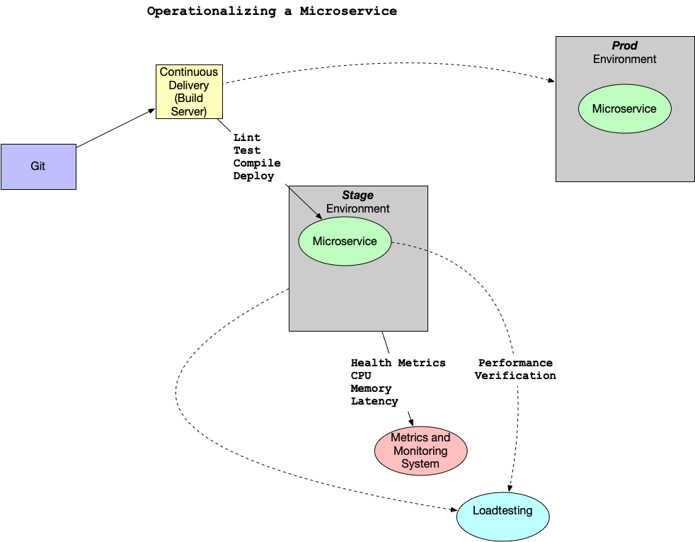
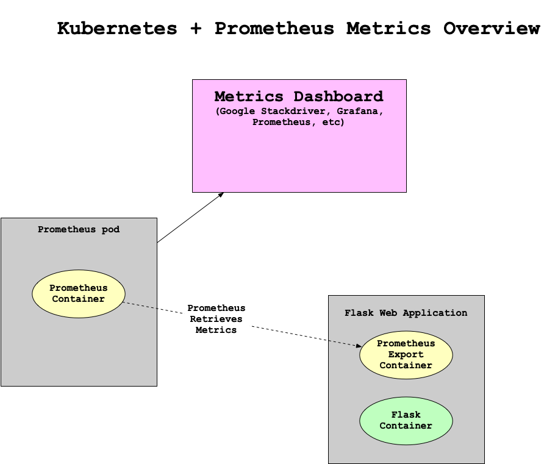
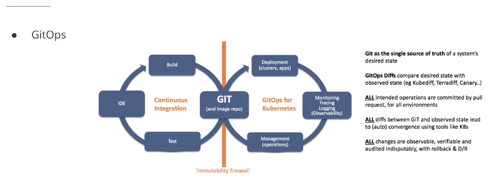

# Operationalizing Microservices

## Alerts and Incidents Response

### Operationalizing a Microservice Overview

One important factor in developing a microservice is to think about the feedback loop. In this diagram, a GitOps style workflow is described.

1. Application is stored in Git.
2. Changes in Git trigger the continuous delivery server which then tests and deploys the code to a new environment. This environment is configured as Infrastructure as Code (IaC).
3. The microservice, which could be a containerized service running in Kubernetes or a FaaS (Function as a Service) running on AWS Lambda, has logging, metrics, and instrumentation.
4. A load test using a tool like [locust.](https://locust.io/)


:qa


5. When the performance and auto-scaling is verified the code is merged to production and deployed

What are some of the items that could be alerted on with Kubernetes?

- Alerting on application layer metrics
- Alerting on services running on Kubernetes
- Alerting on the Kubernetes infrastructure
- Alerting on the host/node layer

How could you collect metrics with Kubernetes and Prometheus? Here is a diagram that walks through a potential workflow. Note that there are two pods. One pod is dedicated to the Prometheus collector and the second pod has a "sidecar" Prometheus container that sits alongside the Flask application. This all propagates up to a centralized monitoring system that visualizes the health of the clusters and trigger alerts.



Another helpful resource is an official sample project from Google Cloud [Monitoring apps running on multiple GKE clusters using Prometheus and Stackdriver.](https://cloud.google.com/solutions/monitoring-apps-running-on-multiple-gke-clusters-using-prometheus-and-stackdriver)

Reference
- [Monitor Node Health](https://kubernetes.io/docs/tasks/debug-application-cluster/monitor-node-health/)

### Creating Effective Alerts
At one company I worked at there was a homegrown monitoring system (again, initially created by the founders) that alerted on average every 3-4 hours, 24 hours a day.

Because everyone in engineering, except the CTO, was on call, most of the engineering staff was always sleep deprived. This system guaranteed that every night there were alerts about the system not working. The "fix" to the alerts was to restart services. I volunteered to be on call for one month straight to allow engineering the time to fix the problem. This sustained period of suffering and lack of sleep led me to realize several things: one, the monitoring system was no better than random; two, I could potentially replace the entire system with a random coin flip.


Even more distressing, when looking at the data, it was clear that engineers had spent YEARS of their lives responding to pages and getting woken up at night. All that, and it was utterly useless. The suffering and sacrifice accomplished nothing and reinforced the sad truth that life is not fair. The unfairness of the situation was quite depressing, and it took quite a bit of convincing to get people to agree to turn off the alerts. There is a built-in bias in human behavior to continue to do what you have always done. Additionally, because the suffering was so severe and sustained, there was a tendency to attribute a deeper meaning to it. Ultimately, it was a false God.

Reference: Gift, Noah (2020) Python for DevOps: pg. 226


## Disaster Recovery ##

An important but often overlooked part of building production software is designing for failure. There is an expression that the only two certainties in life are death and taxes. We can add another certainty to the list, software system failure. In the AWS whitepaper [Serverless Application Lens](https://d1.awsstatic.com/whitepapers/architecture/AWS-Serverless-Applications-Lens.pdf) they discuss five pillars of a well architected serverless system: operational excellence, reliability, performance efficiency and cost optimization. It is highly recommended to read this guide thoroughly.

### Five Pillars of a Well Architected Serverless System

### Operational Excellence
How do you understand the health of a serverless application? One method is to use metrics and alerts. These metrics could include business metrics, customer experience metrics and other metrics. Another method is to have centralized logging. This allows for unique transactions ideas that can narrow down critical failures.

### Security
Have proper controls and using the POLP (Principle of Least Privilege). Only give out the privileges needed to complete a task to a user, service or developer. Protect data at rest and in transit.

### Reliability
Plan on the fact that failure will occur. Have retry logic for key service and build a system that can queue work when a service is unavailable. Use highly available services that store multiple copies of the data like Amazon S3 and then archive key data to services that can store immutable backups. Ensure that you have tested these backups and validated them on a recurring basis (say quarterly)

### Performance
One key way to validate performance is to load test an application that has proper instrumentation and logging. Several load test tools include: Apache Bench, Locust and load test services like loader.io

### Cost
Serverless technologies like AWS Lambda fit well with cost optimization because they are driven by usage. Events trigger the execution of services and this saves a tremendous amount on cost if the architecture is designed to take advantage of this.

### Summary of Serverless Best Practices
One of the advantages of serverless application development is that it encourages the use of IaC and GitOps on top of highly durable infrastructure. This means that entire environments can be spun up to mitigate severe unplanned outages in geographic regions. Additionally, the use of automated load testing alongside comprehensive instrumentation and logging leads to environments that are robust in the face of disasters.

Another component of disaster recovery and working with operationalization with containers is this concept of undestanding how to take backup of your cluster and restore it in a situation when there's actually loss. 

**Disaster Recovery**
- Take backups of your cluster and restore in case of loss
- Copy cluster resources to other clusters
- Replicate your production environment for development and testing environments. 
- More than on copy of critical data
- Test restoring backups regularly

Reference

- Velero [Backup and Micgrate Kubernetes](https://github.com/heptio/velero)


## CI/CD Pipeline Integration ##

https://www.youtube.com/watch?v=zTIbWr_1X2I

Earlier in the course, we briefly touched on CircleCI through its inclusion within a Makefile Noah used.

CircleCI is a great tool to help with continuous integration, and it works well with Kubernetes. You can read some information in this [CircleCI blog post](https://circleci.com/blog/k8s-deployments-with-cloudflare/) on one application combining Kubernetes with CircleCI, and on the next page, it will be your turn to add CircleCI to your build.



With **GitOps** we have a way to track all changes, verify them and audit them all with the pull requests. 


## Exercise: CircleCI
It is easy to look at build servers as a nice to have when they are a must-have for DevOps best practices. One ubiquitous cloud-based build server is CircleCI. In this exercise, you will incorporate many of the concepts from this course: Docker, Makefiles, and build systems.

### Instructions
- Create and use an AWS Cloud9 environment. (We also have a video tutorial in a previous lesson.)
- Change the template below and add to your Makefile (this template is similar to what we used in earlier lessons).
- Install hadolint by downloading it here.
- Run make lint and make sure you are able to lint both Python code and a Dockerfile
- Optional Setup CircleCI integration. Remember you can also refer back to the Docker setup screencast in Lesson 4 to see more ideas on hadolint.

### Makefile template
```
setup:
    python3 -m venv ~/.udacity-devops

install:
    pip install --upgrade pip &&\
        pip install -r requirements.txt

test:
    #python -m pytest -vv --cov=myrepolib tests/*.py
    #python -m pytest --nbval notebook.ipynb


lint:
    hadolint demos/flask-sklearn/Dockerfile
    pylint --disable=R,C,W1203 demos/**/**.py

all: install lint test
```


## Load Testing ##

It allows you to simulate what's going to happen in a production environment. 

Locust:
- Write test in python
- Distributed and scalable
- Can test any system

### Reference
Locust Helm Chart: [LINK](https://github.com/helm/charts/tree/master/stable/locust)


## Exercise: Locust Load Testing ##
- https://www.youtube.com/watch?v=RDmLNEFrq8E

- https://github.com/noahgift/docker-flask-locust


### Creating a Locust Loadtest with Flask
One powerful way to create a simple loadtest is with Locust and Flask. Here is an example of a simple flask hello world app. [The entire source code is found here](https://github.com/noahgift/docker-flask-locust).

```python
from flask import Flask
app = Flask(__name__)

@app.route('/')
def hello_world():
    return 'Hello, World!'

if __name__ == "__main__":
    app.run(host='0.0.0.0', port=8080, debug=True)
```

The loadtest file is very simple to configure. Notice the index function calls into the main, and only flask route.

```python
from locust import HttpLocust, TaskSet, between

def index(l):
    l.client.get("/")

class UserBehavior(TaskSet):
    tasks = {index: 1}

class WebsiteUser(HttpLocust):
    task_set = UserBehavior
    wait_time = between(5.0, 9.0)
```

The login screen requires the number of users and also hostname and port. In our case this will be the port 8080.


The steps are:

1. Enter cloud9
2. clone repo https://github.com/noahgift/docker-flask-locust/issues (add ssh keys)
3. Enable ports 8080, 9090 8089 in the security group of the ec2 instance that's running the cloud9 env. 
4. I've changed the code to run in host 0.0.0.0 and port 8080
5. The locus file is:
```python
from locust import HttpUser, between, task

class WebsiteUser(HttpUser):
    wait_time = between(5, 15)
    
    @task
    def index(self):
        self.client.get("/")
```
6. In another tab run (inside the virtual env) locust.
7. Open page in port 8089 (previously open)
8. Simulate users with host port 8080. 
9. We can then containerize our app and test the container
10. Put container in kubernetes and then have kubernetes automatically do spawning.


