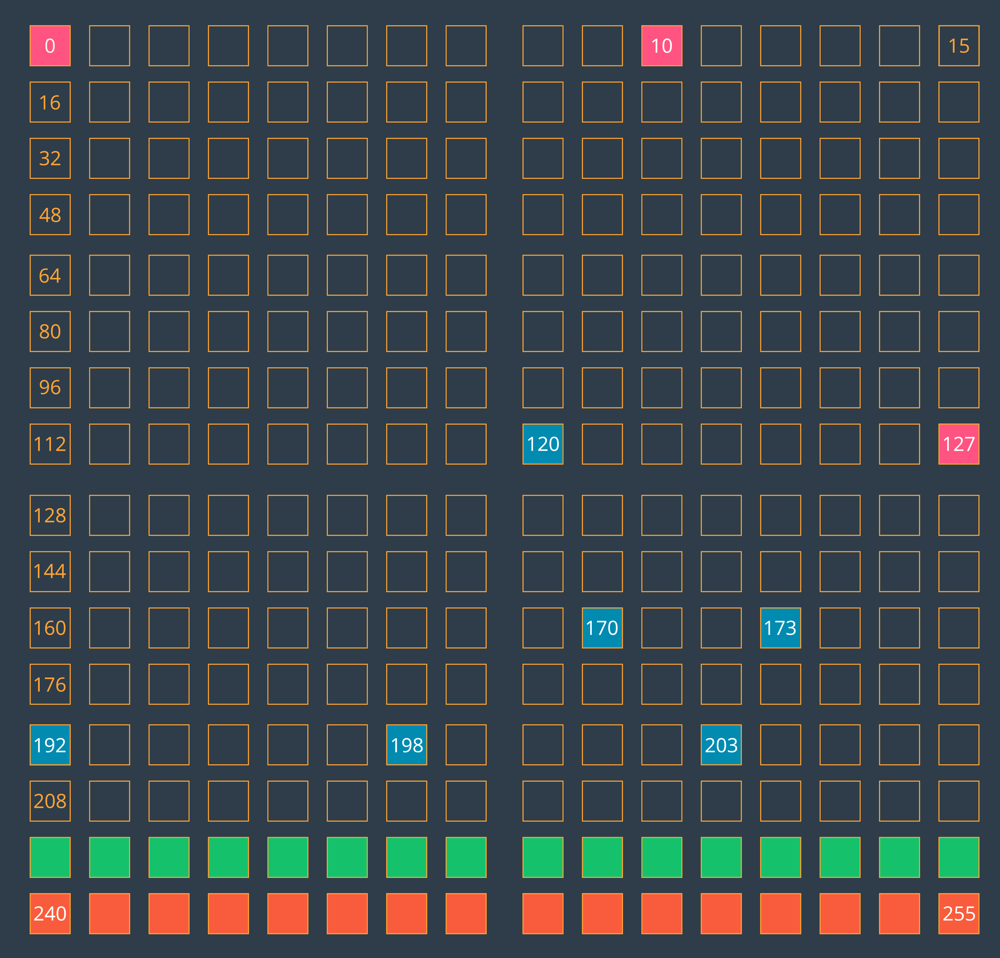
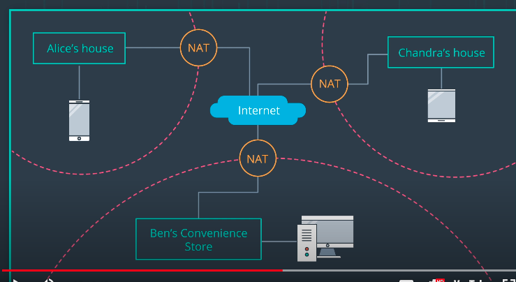

# Networking

Three categories: 
1. Builders
2. Breakers: Auditing and testing your security controls. 
3. Defenders: Responding and looking at security incidents in your system.

As a builder you develop tools and as a breaker you provide scripts and defend or attack your system with this script. 

## Addressing ##

https://www.youtube.com/watch?v=Y84oFJ7DbjM

### Addressing Space

An Ipv4 address is a 32-bit address which is usually written as a dotted quad (four numbers separated with full stops). The format is solely to improve readability for us humans. Computes transfer this value to binary and use the 32-bit long string of ones and zeros. 

How many there are? 

$2^{32} = 4,294,967,296$

Here's a visualization of the entire IPv4 address space. Each square represents one possible value of the first octet of an address. For instance, the square on the top right, labeled 15, represents all the IPv4 addresses that start with 15 as their first octet (e.g. 15.72.9.277).

Visualization of the IPv4 address space. Each square represents the first octet of an IPv4 network address.

- The pink squares (0, 10, and 127) are blocks that are entirely reserved.
- The blue squares are blocks that are partially reserved. For instance, not all of the 192 block is reserved, but some of it is.
- The entire green row (starting at 224) is set aside for [IP multicast.](https://en.wikipedia.org/wiki/IP_multicast)
- And the entire orange bottom row (starting at 240) was [originally set aside for "future use" but was effectively lost due to being blocked as invalid.](http://packetlife.net/blog/2010/oct/14/ipv4-exhaustion-what-about-class-e-addresses/)

### Additional Resources
- [RFC 6890 - Special-Purpose IP Address Registries, April 2013](https://tools.ietf.org/html/rfc6890)
- [RFC 1918 - Address Allocation for Private Internets, February 1996](https://tools.ietf.org/html/rfc1918)
- [Learn more about Wikipedia - IPv4 Address Exhaustion](https://en.wikipedia.org/wiki/IPv4_address_exhaustion)

### Quiz

The following is a public IP Adress:
- `8.8.8.8`. In fact, it's google's DNS server.
- `224.100.0.10` is not because 224 is reserved for ip multicast
- `127.0.0.1` is not because is 127 is port that is reserved
- `192.168.0.1` is marked in blue so is *partially* reserved.

## Addressing and Networks ##

https://www.youtube.com/watch?v=oO_mJEet-uo

The devices on the same network have ip addresses that share a prefix. Devices on the same network have the convenience of communicating with each other without needing to use a router. 

Because each network needs different size of users, each network can accommodate in an appropriate prefix length. 

To state the size of a network is common to write the bits in a prefix after the ip address.

`192.168.112` On a `/24` network, **with 24-bit taking by the prefix**, 8 bits are left for addresses. 

- Of the 256 addresses, the first and last are usually reserved.
- The second address commonly belongs to the router.
- That leaves us with 253 addresses.

If we look to a `/16`-bit network.  16 bits of the address are dedicated towards the prefix and 16 for unique hosts addresses.

A `/16` network has

$2^{16}=65,536$ addresses. 

### Review of Binary Conversion and the AND operator

https://www.youtube.com/watch?v=YxamxHBVJkQ

The `/24` at the end of the ip address is a notation called **CIDR**. It contains the IP Address and a Subnet Mask.

If we want to know what network the device is on, we can perform the following:

If you watched that video and wondered, "How do I convert to binary?" and "What's an AND operation?", don't worry because the following resources will explain the basics to you.

If you'd like to learn how to convert decimal to binary by hand, read [this tutorial on the subject.](https://www.electronics-tutorials.ws/binary/bin_2.html)

Once you understand how the math works and have practiced a conversion or two, you'll probably want to use an online conversion tool for efficiency's sake. The following two tools were used to perform the conversions seen in the video,

- [IP Address to Binary](https://www.browserling.com/tools/ip-to-bin)
- [Binary to IP Address](https://www.browserling.com/tools/bin-to-ip)

Additionally, the process of determining the network address given an address of a host on the network and the subnet mask requires you to perform a logical AND operation. The AND operator compares two inputs to produce an output. In the case of the address and mask, it compared each bit position individually.

The following truth table summarizes which inputs produce what output.

| Input 1 | Input 2 | Output |
| -       | -       | -      |
| 0       | 0       | 0      |
| 0       | 1       | 0      |
| 1       | 0       | 0      |
| 1       | 1       | 1      |

You read the table above from left to right. In the first row, Input 1 is 0, Input 2 is also a 0. If you do a logical AND of 0 and 0, you'll get another 0. The second and third rows are both doing a logical and of a zero and a one (albeit, in different orders) and both result in 0. The last row is the interesting one; a logical AND of 1 and 1 equals 1! So the logical AND is actually very simple - the output is only 1 when both inputs have values of 1.

Happy Converting!

### Quiz

Which of the following IP addresses are on the same subnet as 122.48.253.2/18?
- `122.48.200.200` and `122.48.193.61` that is, all IP addresses in the range `122.48.192.0` - `122.48.255.255`

### Reserved Addresses on a Netblock
If you recall, the number of addresses that are available for use in a netblock were reduced by three, because those three addresses are reserved for something. Well, what are they?

- The first address (.0) is used for identification of the network,
- the follow address (.1) is often assigned to the router,
- the last address (.255) is called the broadcast address. Anything sent to the broadcast address will be sent out to all devices on the network.

### Additional Resources
Some basic reading on subnetworks and Classless Inter-Domain Routing (CIDR):

- [Subnetworks,](https://en.wikipedia.org/wiki/Subnetwork)
- A good read on [CIDR](https://en.wikipedia.org/wiki/Classless_Inter-Domain_Routing) with a helpful table on all IPv4 CIDR blocks.

And several technical reports on the following subjects:

- [RFC IPv4](https://tools.ietf.org/html/rfc1878),
- [RFC IPv6](https://tools.ietf.org/html/rfc5942),
- [RFC CIDR](https://www.rfc-editor.org/rfc/rfc1519.txt).

## OSI Model ##

Open Systems Interconnection

There are 7 layers in the OSI model. We'll start at the top-most layer, layer 7, and work our way down to layer 1.

1. **Layer 7 - Application**

2. **Layer 6 - Presentation**

3. **Layer 5 - Session**

4. **Layer 4 - Transport**

5. **Layer 3 - Network**

6. **Layer 2 - Data Link**

7. **Layer 1 - Physical**

Remember that the OSI model is a conceptual model of how network communication occurs. For network communication to happen, the layers must work together to transmit a message from one device to another.

https://www.youtube.com/watch?v=MKDhdo2hDWE

Each layer just need to be aware of the layer above and the layer below itself.

For example TCP is a protocol in Layer 4

The OSI Model also helps group network protocols together. Here are some of the most common protocols at each layer:

1. Layer 7 = HTTP
2. Layer 6 = SSL and TLS
3. Layer 5 = socket
4. Layer 4 = TCP and UDP
5. Layer 3 = IP and ICMP
6. Layer 2 = ARP
7. Layer 1 = 1000BASE-T, DSL, DOCSIS, 802.11a/b/g/n

When does data move down the layers from Layer 4 to Layer 3 to Layer 2 and when does the data move up the layers from Layer 2 to Layer 3 to Layer 4? These two processes are called encapsulation and decapsulation. Let's take a look at them in more detail.

### Encapsulation and Decapsulation
Remember that the OSI model is a conceptual model of how data is packaged and sent across a network to another device. In this scenario, let's assume that there are only two devices that are trying to communicate with each other. The OSI model is used on both devices.

As the data is being packaged up on a sending device, the data moves down the OSI model; this process of the data moving down the OSI model is called **encapsulation.**

When the data is being unpacked on a receiving device, the data moves _up_ OSI model; this process of the data moving up the OSI model is called **decapsulation.**

Let's see each of these in more detail. First, we'll start with encapsulation.

https://www.youtube.com/watch?v=ak2ioSGU01g

https://www.youtube.com/watch?v=rHwtPAAhT4s

To recap, when data travels down the OSI model, the data from a higher layer becomes the "payload" for a lower layer. When the data moves from a higher layer to a lower layer, the data is wrapped in new information called a "header" and a "footer". This is where it gets the name "encapsulation"; because the data is wrapped (or encapsulated) with new header/footer layers.

Conversely, the opposite happens when traveling up the OSI model. As the data moves up the OSI model, these header/footer layers are removed. This is where it gets the name "decapsulation".

## Network Transmission
Hopefully you're seeing how the OSI model can helps us to understand how network communication happens across a network. You saw how encapsulation works on the sending device. Then you saw how decapsulation works on the destination device. We looked at both of these in isolation so that we could zoom in on exactly what's going on with encapsulation and decapsulation. But now, let's zoom back out a bit and see how data moves from one device to another in a network.

We're going to look at one device sending data from one network to another device in a different network. We'll be using all of the information that we've covered up to this point, so this video might be a bit complicated. You might need to rewatch the video once or twice to let these concepts sink in.

https://www.youtube.com/watch?v=hl2xa7Ahy0E

To recap, as data moves across a network, each devices looks at specific header information to determine if the data belongs to itself or if it should forward the data on to another device. One thing to note here is that this process of moving up and down the OSI model (the process of encapsulation and decapsulation) happens over and over as the data moves from one device to another. To clarify, though, the information doesn't move all the way up through all of the OSI layers at each device, it only does that at the final (target) device.

### Summary
In this section we looked at the layers of the OSI model, how data moves down the OSI model on a device, how it moves across a network, and how data moves _up_ the OSI model on the target device.

The OSI Model layers are:

- Layer 7 - Application
- Layer 6 - Presentation
- Layer 5 - Session
- Layer 4 - Transport
- Layer 3 - Network
- Layer 2 - Data Link
- Layer 1 - Physical

The process of data moving down the layers is called encapsulation. The process of data moving up the layers is called decapsulation.

### Further Research
- [OSI model](https://en.wikipedia.org/wiki/OSI_model)
- [The OSI Model Demystified](https://www.youtube.com/watch?v=HEEnLZV2wGI)
- [The 7 Layers of the OSI Model](https://www.webopedia.com/quick_ref/OSI_Layers.asp)
- [Packet Switching](https://en.wikipedia.org/wiki/Packet_switching)

## Switching ##

https://www.youtube.com/watch?v=xZRur0Qk8L8&t=1s

For multiple devices to communicate with one another, we add a network switch between them. A **switch** manages the flow of data in a LAN (local area network). 

- [Network Switches](https://en.wikipedia.org/wiki/Network_switch)
- [Spanning Tree Protocol](https://en.wikipedia.org/wiki/Spanning_Tree_Protocol)

## Frame Structure ##

https://www.youtube.com/watch?v=0OzGSs6HghQ

### Further Reading
- [Wikipedia article on Ethernet frames](https://en.wikipedia.org/wiki/Ethernet_frame)
- [A Networking Frame](https://en.wikipedia.org/wiki/Frame_(networking)

## Switching at Scale ##

https://www.youtube.com/watch?v=V6iC5Q6nD2w

## Virtual LANs ##

https://www.youtube.com/watch?v=rWDnm-SSazo

## Routing ##

https://www.youtube.com/watch?v=IOwZiH2LaGE

https://www.youtube.com/watch?v=WK6QLjORF7Q

There are likely million of devices with the ip address 192.168.0.13 all residing on private networks around the world. 

### Further Reading
- [TCP/IP and Subnet Masking](https://www.youtube.com/watch?v=EkNq4TrHP_U)
- [Wikipedia article on NAT](https://en.wikipedia.org/wiki/Network_address_translation)

## Wireshark ##

https://www.youtube.com/watch?v=7amCyeLNq2A
https://www.youtube.com/watch?v=QbFYsvir2d4
https://www.youtube.com/watch?v=EdjzzwdDfXE

Following are a few useful links related to Wireshark:

- [Wireshark User Guide]()
- [Wireshark Wiki]()
- [Wireshark link for download]() (available for Windows and macOS)

## Domain Name System ##

### Fully Qualified Domain Name (FQDN)
A Fully Qualified Domain Name (FQDN) consists of three parts - the hostname, domain, and top-level domain (TLD). The format looks like so,

[host name].[domain].[tld]

For the FQDN www.udacity.com - www is the hostname, udacity is the domain, and com is the top-level domain.

Other examples of FQDNs include:

- www.wikipedia.org
- www.baidu.com
- maps.google.com
- news.yandex.ru

Further Research
- [FQDN](http://www.rfc-base.org/rfc-4703.html)
- [Domain Name System IANA Considerations 2011](http://www.rfc-archive.org/getrfc.php?rfc=6195)

## Types of DNS Records ##

https://www.youtube.com/watch?v=nP26VKugAWU

What happens after you put a website address into a web browser, it first looks into its cache to check if it knows which ip address corresponds to this **FQDNs**.

If no such relation exist, the browser checks into an authority dns server for the ip address assocaited with that FQDNs. 

When querying for and ip address, the dns servers return a **PTR record** which points to a CNAME (Canonical Name record).

CNAME records are simply aliases for **A Record** or **AAAA Record**. (www.datomico.com to datomico.com)

**NS** states which DNS server is authoritative for that domain. 

**MX** which server will handle an email request on behalf **(¿?)**

## DNS Hierarchy

https://www.youtube.com/watch?v=X88Nz8Tuydc

**DNS Hierarchy**

**DNS in Wireshark**
https://www.youtube.com/watch?v=Pn-CmJPmLdw

## Load Balancing

https://www.youtube.com/watch?v=OBjOoiaKkFU&t=3s

## Load Balancing Approaches - Summary
Different load balancing approaches provide different benefits. These different approaches are explained below. This is, however, not an exhaustive list, just a list of some of the most common approaches.

Round Robin - Requests are distributed across the group of servers sequentially.

BGP Anycast - BGP Anycast allows multiple servers to advertise the same IP address. DNS servers respond to queries with the same IP address. The routing infrastructure of the internet, using BGP, then routes internet traffic to different web servers over the shortest route possible.

Policy-based DNS load balancing - Uses policies to load balance traffic requests. For example, the IP address of the client’s resolver may be used to determine which server receives the request.

Dedicated Load Balancing - Enables you to deploy and configure one or more custom load-balancers within a VPC.
